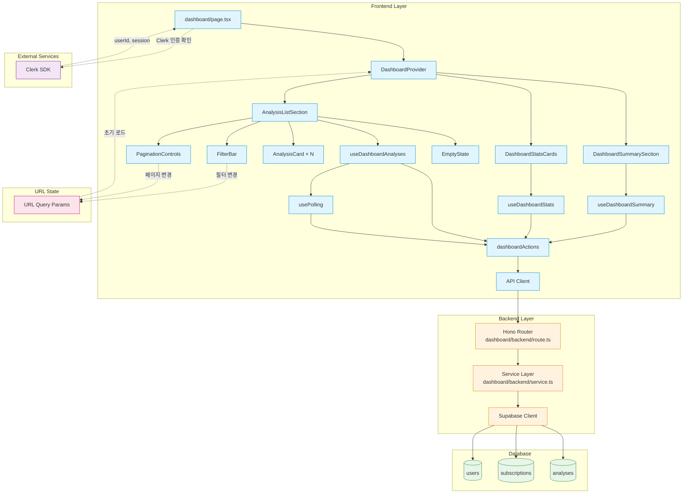

# 대시보드 페이지 (Dashboard) 구현 계획

## 개요

대시보드 페이지(`/dashboard`)는 사용자가 로그인 후 가장 먼저 접하는 중심 허브 페이지로, 사용자 정보, 구독 상태, 통계, 분석 이력을 통합 제공합니다. 3개의 독립적인 API를 병렬로 호출하며, 처리 중인 분석에 대한 실시간 폴링 메커니즘을 포함합니다.

### 주요 기능
- 사용자 정보 및 구독 상태 표시
- 통계 정보 표시 (총 분석 횟수, 이번 달 분석 횟수)
- 분석 이력 목록 조회 (필터, 정렬, 페이지네이션)
- 처리 중인 분석 실시간 업데이트 (5초 간격 폴링, 최대 60초)
- 빈 상태 처리 (신규 사용자)
- URL 쿼리 파라미터와 필터 상태 동기화

### 관련 Use Cases
- [UC-005] 대시보드 (분석 이력 조회) (`/docs/usecases/005/spec.md`)

### 외부 서비스 연동
- **Clerk SDK** (`@clerk/nextjs`): 사용자 인증 및 세션 관리
  - Frontend: `useAuth()` 훅 사용
  - Backend: JWT 토큰 검증 (미들웨어)

---

## 모듈 구조

### Frontend 모듈

#### 1. Context & State Management
- **위치**: `src/features/dashboard/context/DashboardContext.tsx`
- **설명**: Context + useReducer를 사용한 복잡한 상태 관리 (Level 3)
- **상태**:
  - `userSummary`: 사용자 정보 및 구독 상태
  - `stats`: 통계 정보
  - `analyses`: 분석 목록 및 페이지네이션
  - `filters`: 기간/정렬 필터
  - `pagination`: 현재 페이지 정보
  - `polling`: 폴링 상태 관리
- **참고**: `/docs/pages/dashboard/state_management.md`

#### 2. Hooks
- **위치**: `src/features/dashboard/hooks/`
- **파일**:
  - `useDashboardContext.ts`: Context 접근 hook
  - `useDashboardSummary.ts`: 사용자 정보만 구독
  - `useDashboardStats.ts`: 통계만 구독
  - `useDashboardAnalyses.ts`: 분석 목록만 구독
  - `usePolling.ts`: 폴링 로직 관리
  - `useUrlSync.ts`: URL 쿼리 파라미터 동기화

#### 3. Components
- **위치**: `src/features/dashboard/components/`
- **파일**:
  - `DashboardSummarySection.tsx`: 사용자 정보 및 구독 상태 카드
  - `DashboardStatsCards.tsx`: 통계 카드 2개 (총 분석, 이번 달 분석)
  - `AnalysisListSection.tsx`: 분석 이력 목록 컨테이너
  - `AnalysisCard.tsx`: 개별 분석 카드
  - `FilterBar.tsx`: 필터 및 정렬 옵션
  - `PaginationControls.tsx`: 페이지네이션 버튼
  - `EmptyState.tsx`: 빈 상태 UI (분석 없음)
  - `DashboardSkeleton.tsx`: 로딩 스켈레톤 UI

#### 4. Actions
- **위치**: `src/features/dashboard/actions/`
- **파일**:
  - `dashboardActions.ts`: 비동기 액션 함수들
    - `fetchSummary()`: 사용자 정보 조회
    - `fetchStats()`: 통계 조회
    - `fetchAnalyses()`: 분석 목록 조회
    - `startPolling()`: 폴링 시작
    - `stopPolling()`: 폴링 중단

#### 5. Types & Constants
- **위치**: `src/features/dashboard/lib/`
- **파일**:
  - `dto.ts`: Backend schema 재노출
  - `types.ts`: Frontend 전용 타입
  - `constants.ts`: 상수 (폴링 간격, 캐시 시간 등)

### Backend 모듈

#### 6. Hono Routes
- **위치**: `src/features/dashboard/backend/route.ts`
- **엔드포인트**:
  - `GET /api/dashboard/summary`: 사용자 정보 및 구독 상태 조회
  - `GET /api/dashboard/stats`: 통계 정보 조회
  - `GET /api/analyses`: 분석 목록 조회 (필터, 정렬, 페이지네이션)

#### 7. Service Layer
- **위치**: `src/features/dashboard/backend/service.ts`
- **함수**:
  - `getDashboardSummary()`: 사용자 정보 및 구독 상태 조회
  - `getDashboardStats()`: 통계 계산 (총 횟수, 월별 횟수)
  - `getAnalysesList()`: 분석 목록 조회 (필터링, 정렬, 페이지네이션)

#### 8. Schemas (Zod)
- **위치**: `src/features/dashboard/backend/schema.ts`
- **스키마**:
  - `DashboardSummaryResponseSchema`: 사용자 정보 및 구독 상태 응답
  - `DashboardStatsResponseSchema`: 통계 응답
  - `AnalysesListRequestSchema`: 분석 목록 요청 (쿼리 파라미터)
  - `AnalysesListResponseSchema`: 분석 목록 응답 (목록 + 페이지네이션)
  - `AnalysisItemSchema`: 개별 분석 항목

#### 9. Error Codes
- **위치**: `src/features/dashboard/backend/error.ts`
- **에러 코드**:
  - `USER_NOT_FOUND`: 사용자 없음
  - `UNAUTHORIZED`: 인증 실패
  - `VALIDATION_ERROR`: 유효성 검증 실패
  - `DATABASE_ERROR`: 데이터베이스 오류

### 공통 모듈

#### 10. API Client 사용
- **위치**: `src/lib/remote/api-client.ts`
- **설명**: 기존 API 클라이언트 사용 (수정 불필요)

#### 11. 상대 시간 표시 유틸
- **위치**: `src/lib/utils/date.ts`
- **함수**: `formatRelativeTime(date: string): string` (예: "3시간 전", "2일 전")
- **라이브러리**: `date-fns`의 `formatDistanceToNow` 사용

### Pages

#### 12. 대시보드 메인 페이지
- **위치**: `src/app/dashboard/page.tsx`
- **설명**: DashboardProvider로 감싸진 메인 페이지, Clerk 인증 확인

---

## 모듈 관계도 (Mermaid Diagram)



---

## 구현 계획

### Phase 1: 기본 인프라 구축

#### Task 1.1: 상대 시간 유틸 함수 생성
- **파일**: `src/lib/utils/date.ts`
- **구현 내용**:

```typescript
import { formatDistanceToNow } from 'date-fns';
import { ko } from 'date-fns/locale';

/**
 * ISO 날짜 문자열을 상대 시간으로 변환
 * 예: "2025-10-27T10:00:00Z" -> "3시간 전"
 */
export function formatRelativeTime(dateString: string): string {
  const date = new Date(dateString);
  return formatDistanceToNow(date, { addSuffix: true, locale: ko });
}

/**
 * 날짜를 "YYYY-MM-DD" 형식으로 포맷
 */
export function formatDate(dateString: string): string {
  const date = new Date(dateString);
  const year = date.getFullYear();
  const month = String(date.getMonth() + 1).padStart(2, '0');
  const day = String(date.getDate()).padStart(2, '0');
  return `${year}-${month}-${day}`;
}
```

**Unit Test**:
```typescript
describe('formatRelativeTime', () => {
  it('should format date to relative time', () => {
    const now = new Date();
    const threeHoursAgo = new Date(now.getTime() - 3 * 60 * 60 * 1000);
    const result = formatRelativeTime(threeHoursAgo.toISOString());
    expect(result).toContain('시간 전');
  });
});
```

---

### Phase 2: Backend API 구현

#### Task 2.1: Zod Schema 정의
- **파일**: `src/features/dashboard/backend/schema.ts`

```typescript
import { z } from 'zod';

// 요청 스키마
export const AnalysesListRequestSchema = z.object({
  period: z.enum(['all', '7days', '30days', '90days']).default('all'),
  sort: z.enum(['latest', 'oldest']).default('latest'),
  page: z.coerce.number().int().min(1).default(1),
  limit: z.coerce.number().int().min(1).max(50).default(10),
});

// 응답 스키마
export const DashboardSummaryResponseSchema = z.object({
  user: z.object({
    id: z.string().uuid(),
    name: z.string(),
    email: z.string().email(),
    subscription_tier: z.enum(['free', 'pro']),
  }),
  subscription: z.object({
    status: z.enum(['active', 'pending_cancellation', 'suspended']).nullable(),
    next_payment_date: z.string().nullable(),
    card_last_4digits: z.string().nullable(),
    remaining_count: z.number(),
  }),
});

export const DashboardStatsResponseSchema = z.object({
  total_count: z.number(),
  monthly_count: z.number(),
  this_week_count: z.number(),
});

export const AnalysisItemSchema = z.object({
  id: z.string().uuid(),
  subject_name: z.string(),
  birth_date: z.string(),
  gender: z.enum(['male', 'female']),
  ai_model: z.string(),
  status: z.enum(['processing', 'completed', 'failed']),
  created_at: z.string(),
  view_count: z.number(),
});

export const PaginationSchema = z.object({
  current_page: z.number(),
  total_pages: z.number(),
  total_count: z.number(),
  per_page: z.number(),
});

export const AnalysesListResponseSchema = z.object({
  analyses: z.array(AnalysisItemSchema),
  pagination: PaginationSchema,
});

// 타입 추출
export type AnalysesListRequest = z.infer<typeof AnalysesListRequestSchema>;
export type DashboardSummaryResponse = z.infer<typeof DashboardSummaryResponseSchema>;
export type DashboardStatsResponse = z.infer<typeof DashboardStatsResponseSchema>;
export type AnalysisItem = z.infer<typeof AnalysisItemSchema>;
export type Pagination = z.infer<typeof PaginationSchema>;
export type AnalysesListResponse = z.infer<typeof AnalysesListResponseSchema>;
```

#### Task 2.2: Error Codes 정의
- **파일**: `src/features/dashboard/backend/error.ts`

```typescript
export const dashboardErrorCodes = {
  userNotFound: 'USER_NOT_FOUND',
  unauthorized: 'UNAUTHORIZED',
  validationError: 'VALIDATION_ERROR',
  databaseError: 'DATABASE_ERROR',
} as const;

export type DashboardServiceError = typeof dashboardErrorCodes[keyof typeof dashboardErrorCodes];
```

#### Task 2.3: Service Layer 구현
- **파일**: `src/features/dashboard/backend/service.ts`

**주요 함수 구현**:

```typescript
import type { SupabaseClient } from '@supabase/supabase-js';
import { success, failure, type HandlerResult } from '@/backend/http/response';
import type {
  DashboardSummaryResponse,
  DashboardStatsResponse,
  AnalysesListRequest,
  AnalysesListResponse,
} from './schema';
import { dashboardErrorCodes, type DashboardServiceError } from './error';

// 1. 사용자 정보 및 구독 상태 조회
export async function getDashboardSummary(
  client: SupabaseClient,
  userId: string,
): Promise<HandlerResult<DashboardSummaryResponse, DashboardServiceError, unknown>> {
  const { data, error } = await client
    .from('users')
    .select(`
      id,
      name,
      email,
      subscription_tier,
      free_analysis_count,
      monthly_analysis_count,
      subscriptions (
        subscription_status,
        next_payment_date,
        card_last_4digits
      )
    `)
    .eq('id', userId)
    .maybeSingle();

  if (error) {
    return failure(500, dashboardErrorCodes.databaseError, error.message);
  }

  if (!data) {
    return failure(404, dashboardErrorCodes.userNotFound, '사용자를 찾을 수 없습니다');
  }

  const subscription = data.subscriptions?.[0] || null;
  const isFree = data.subscription_tier === 'free';
  const remainingCount = isFree ? data.free_analysis_count : data.monthly_analysis_count;

  return success({
    user: {
      id: data.id,
      name: data.name,
      email: data.email,
      subscription_tier: data.subscription_tier,
    },
    subscription: {
      status: subscription?.subscription_status || null,
      next_payment_date: subscription?.next_payment_date || null,
      card_last_4digits: subscription?.card_last_4digits || null,
      remaining_count: remainingCount,
    },
  });
}

// 2. 통계 정보 조회
export async function getDashboardStats(
  client: SupabaseClient,
  userId: string,
): Promise<HandlerResult<DashboardStatsResponse, DashboardServiceError, unknown>> {
  // 총 분석 횟수
  const { count: totalCount, error: totalError } = await client
    .from('analyses')
    .select('*', { count: 'exact', head: true })
    .eq('user_id', userId);

  if (totalError) {
    return failure(500, dashboardErrorCodes.databaseError, totalError.message);
  }

  // 이번 달 분석 횟수
  const { count: monthlyCount, error: monthlyError } = await client
    .from('analyses')
    .select('*', { count: 'exact', head: true })
    .eq('user_id', userId)
    .gte('created_at', new Date(new Date().getFullYear(), new Date().getMonth(), 1).toISOString());

  if (monthlyError) {
    return failure(500, dashboardErrorCodes.databaseError, monthlyError.message);
  }

  // 이번 주 분석 횟수
  const startOfWeek = new Date();
  startOfWeek.setDate(startOfWeek.getDate() - startOfWeek.getDay());
  startOfWeek.setHours(0, 0, 0, 0);

  const { count: weeklyCount, error: weeklyError } = await client
    .from('analyses')
    .select('*', { count: 'exact', head: true })
    .eq('user_id', userId)
    .gte('created_at', startOfWeek.toISOString());

  if (weeklyError) {
    return failure(500, dashboardErrorCodes.databaseError, weeklyError.message);
  }

  return success({
    total_count: totalCount || 0,
    monthly_count: monthlyCount || 0,
    this_week_count: weeklyCount || 0,
  });
}

// 3. 분석 목록 조회
export async function getAnalysesList(
  client: SupabaseClient,
  userId: string,
  params: AnalysesListRequest,
): Promise<HandlerResult<AnalysesListResponse, DashboardServiceError, unknown>> {
  const { period, sort, page, limit } = params;

  // 기간 필터 계산
  let createdAtFilter: Date | null = null;
  if (period === '7days') {
    createdAtFilter = new Date(Date.now() - 7 * 24 * 60 * 60 * 1000);
  } else if (period === '30days') {
    createdAtFilter = new Date(Date.now() - 30 * 24 * 60 * 60 * 1000);
  } else if (period === '90days') {
    createdAtFilter = new Date(Date.now() - 90 * 24 * 60 * 60 * 1000);
  }

  // 전체 개수 조회
  let countQuery = client
    .from('analyses')
    .select('*', { count: 'exact', head: true })
    .eq('user_id', userId);

  if (createdAtFilter) {
    countQuery = countQuery.gte('created_at', createdAtFilter.toISOString());
  }

  const { count: totalCount, error: countError } = await countQuery;

  if (countError) {
    return failure(500, dashboardErrorCodes.databaseError, countError.message);
  }

  // 목록 조회
  let listQuery = client
    .from('analyses')
    .select('id, subject_name, birth_date, gender, ai_model, status, created_at, view_count')
    .eq('user_id', userId);

  if (createdAtFilter) {
    listQuery = listQuery.gte('created_at', createdAtFilter.toISOString());
  }

  listQuery = listQuery.order('created_at', { ascending: sort === 'oldest' });
  listQuery = listQuery.range((page - 1) * limit, page * limit - 1);

  const { data, error } = await listQuery;

  if (error) {
    return failure(500, dashboardErrorCodes.databaseError, error.message);
  }

  const totalPages = Math.ceil((totalCount || 0) / limit);

  return success({
    analyses: data || [],
    pagination: {
      current_page: page,
      total_pages: totalPages,
      total_count: totalCount || 0,
      per_page: limit,
    },
  });
}
```

**Unit Test (Service Layer)**:
```typescript
describe('getDashboardSummary', () => {
  it('should return user summary successfully', async () => {
    const mockSupabase = {
      from: jest.fn().mockReturnThis(),
      select: jest.fn().mockReturnThis(),
      eq: jest.fn().mockReturnThis(),
      maybeSingle: jest.fn().mockResolvedValue({
        data: {
          id: 'user_123',
          name: '홍길동',
          email: 'test@example.com',
          subscription_tier: 'free',
          free_analysis_count: 3,
          monthly_analysis_count: 0,
          subscriptions: [],
        },
        error: null,
      }),
    };

    const result = await getDashboardSummary(mockSupabase as any, 'user_123');

    expect(result.ok).toBe(true);
    expect(result.data.user.name).toBe('홍길동');
    expect(result.data.subscription.remaining_count).toBe(3);
  });
});

describe('getAnalysesList', () => {
  it('should return paginated analyses list', async () => {
    const mockSupabase = {
      from: jest.fn().mockReturnThis(),
      select: jest.fn().mockReturnThis(),
      eq: jest.fn().mockReturnThis(),
      order: jest.fn().mockReturnThis(),
      range: jest.fn().mockReturnThis(),
      gte: jest.fn().mockReturnThis(),
    };

    mockSupabase.select
      .mockResolvedValueOnce({ count: 25, error: null }) // count query
      .mockResolvedValueOnce({
        data: [
          {
            id: 'analysis_1',
            subject_name: '홍길동',
            birth_date: '1990-01-15',
            gender: 'male',
            ai_model: 'gemini-2.0-flash',
            status: 'completed',
            created_at: '2025-10-27T10:00:00Z',
            view_count: 5,
          },
        ],
        error: null,
      }); // list query

    const result = await getAnalysesList(mockSupabase as any, 'user_123', {
      period: 'all',
      sort: 'latest',
      page: 1,
      limit: 10,
    });

    expect(result.ok).toBe(true);
    expect(result.data.analyses.length).toBe(1);
    expect(result.data.pagination.total_pages).toBe(3);
  });
});
```

#### Task 2.4: Hono Routes 구현
- **파일**: `src/features/dashboard/backend/route.ts`

```typescript
import type { Hono } from 'hono';
import { respond, failure } from '@/backend/http/response';
import { getSupabase, getLogger, type AppEnv } from '@/backend/hono/context';
import { AnalysesListRequestSchema } from './schema';
import {
  getDashboardSummary,
  getDashboardStats,
  getAnalysesList,
} from './service';
import { dashboardErrorCodes } from './error';

export const registerDashboardRoutes = (app: Hono<AppEnv>) => {
  // GET /api/dashboard/summary - 사용자 정보 및 구독 상태
  app.get('/dashboard/summary', async (c) => {
    const supabase = getSupabase(c);
    const logger = getLogger(c);

    // TODO: Clerk JWT에서 user_id 추출 (미들웨어로 구현)
    const userId = c.get('userId'); // 가정

    const result = await getDashboardSummary(supabase, userId);

    if (!result.ok) {
      logger.error('Failed to fetch dashboard summary', result.error);
    }

    return respond(c, result);
  });

  // GET /api/dashboard/stats - 통계 정보
  app.get('/dashboard/stats', async (c) => {
    const supabase = getSupabase(c);
    const logger = getLogger(c);

    const userId = c.get('userId');

    const result = await getDashboardStats(supabase, userId);

    if (!result.ok) {
      logger.error('Failed to fetch dashboard stats', result.error);
    }

    return respond(c, result);
  });

  // GET /api/analyses - 분석 목록
  app.get('/analyses', async (c) => {
    const queryParams = c.req.query();
    const parsedParams = AnalysesListRequestSchema.safeParse(queryParams);

    if (!parsedParams.success) {
      return respond(
        c,
        failure(
          400,
          dashboardErrorCodes.validationError,
          '잘못된 요청 파라미터입니다',
          parsedParams.error.format(),
        ),
      );
    }

    const supabase = getSupabase(c);
    const logger = getLogger(c);
    const userId = c.get('userId');

    const result = await getAnalysesList(supabase, userId, parsedParams.data);

    if (!result.ok) {
      logger.error('Failed to fetch analyses list', result.error);
    }

    return respond(c, result);
  });
};
```

---

### Phase 3: Frontend State Management

#### Task 3.1: Context & Reducer 구현
- **파일**: `src/features/dashboard/context/DashboardContext.tsx`
- **참고**: `/docs/pages/dashboard/state_management.md`의 Flux 패턴 구현
- **구현 내용**: 6개 상태 관리 (userSummary, stats, analyses, filters, pagination, polling), 27개 Action 처리

*(상태 관리 문서에 이미 상세히 정의되어 있으므로 전체 코드는 생략, 문서 참조)*

**핵심 구현 포인트**:
1. `useReducer`로 전역 상태 관리
2. 초기 로드 시 3개 API 병렬 호출
3. 필터/페이지 변경 시 analyses API만 재호출
4. 처리 중인 분석 감지 시 자동 폴링 시작 (5초 간격, 최대 60초)
5. URL 쿼리 파라미터 동기화

#### Task 3.2: Custom Hooks 구현
- **파일**: `src/features/dashboard/hooks/`

**주요 Hooks**:

```typescript
// useDashboardContext.ts
export function useDashboardContext() {
  const context = useContext(DashboardContext);
  if (!context) {
    throw new Error('useDashboardContext must be used within DashboardProvider');
  }
  return context;
}

// useDashboardSummary.ts
export function useDashboardSummary() {
  const { state } = useDashboardContext();
  return state.userSummary;
}

// useDashboardStats.ts
export function useDashboardStats() {
  const { state } = useDashboardContext();
  return state.stats;
}

// useDashboardAnalyses.ts
export function useDashboardAnalyses() {
  const { state } = useDashboardContext();
  return {
    analyses: state.analyses.analyses,
    pagination: state.analyses.pagination,
    isLoading: state.analyses.isLoading,
    error: state.analyses.error,
  };
}

// useUrlSync.ts (URL 동기화)
export function useUrlSync() {
  const { state, actions } = useDashboardContext();
  const router = useRouter();
  const searchParams = useSearchParams();

  useEffect(() => {
    const period = searchParams.get('period') as any || 'all';
    const sort = searchParams.get('sort') as any || 'latest';
    const page = Number(searchParams.get('page')) || 1;

    actions.setPeriod(period);
    actions.setSort(sort);
    actions.setPage(page);
  }, []);

  useEffect(() => {
    const params = new URLSearchParams();
    params.set('period', state.filters.period);
    params.set('sort', state.filters.sort);
    params.set('page', String(state.pagination.current_page));

    router.push(`/dashboard?${params.toString()}`, { scroll: false });
  }, [state.filters, state.pagination]);
}
```

#### Task 3.3: Actions 구현
- **파일**: `src/features/dashboard/actions/dashboardActions.ts`

```typescript
import { apiClient } from '@/lib/remote/api-client';
import type { DashboardAction } from '../context/types';

export async function fetchSummary(dispatch: React.Dispatch<DashboardAction>) {
  dispatch({ type: 'FETCH_SUMMARY_START' });

  try {
    const response = await apiClient.get('/api/dashboard/summary');
    dispatch({
      type: 'FETCH_SUMMARY_SUCCESS',
      payload: response.data,
    });
  } catch (error: any) {
    dispatch({
      type: 'FETCH_SUMMARY_ERROR',
      payload: { error: error.message },
    });
  }
}

export async function fetchStats(dispatch: React.Dispatch<DashboardAction>) {
  dispatch({ type: 'FETCH_STATS_START' });

  try {
    const response = await apiClient.get('/api/dashboard/stats');
    dispatch({
      type: 'FETCH_STATS_SUCCESS',
      payload: response.data,
    });
  } catch (error: any) {
    dispatch({
      type: 'FETCH_STATS_ERROR',
      payload: { error: error.message },
    });
  }
}

export async function fetchAnalyses(
  dispatch: React.Dispatch<DashboardAction>,
  params: { period: string; sort: string; page: number; limit: number },
) {
  dispatch({ type: 'FETCH_ANALYSES_START' });

  try {
    const response = await apiClient.get('/api/analyses', { params });
    dispatch({
      type: 'FETCH_ANALYSES_SUCCESS',
      payload: response.data,
    });

    // 처리 중인 분석 감지 시 폴링 시작
    const hasProcessing = response.data.analyses.some((a: any) => a.status === 'processing');
    if (hasProcessing) {
      dispatch({ type: 'START_POLLING' });
    }
  } catch (error: any) {
    dispatch({
      type: 'FETCH_ANALYSES_ERROR',
      payload: { error: error.message },
    });
  }
}
```

---

### Phase 4: Frontend Components

#### Task 4.1: 메인 컴포넌트들
1. **DashboardSummarySection.tsx**: 사용자 정보 및 구독 상태 카드
2. **DashboardStatsCards.tsx**: 통계 카드 2개
3. **AnalysisListSection.tsx**: 분석 목록 컨테이너
4. **AnalysisCard.tsx**: 개별 분석 카드
5. **FilterBar.tsx**: 필터 및 정렬 옵션
6. **PaginationControls.tsx**: 페이지네이션
7. **EmptyState.tsx**: 빈 상태 UI
8. **DashboardSkeleton.tsx**: 스켈레톤 UI

**QA Sheet (DashboardSummarySection)**:
- [ ] Free 회원일 때 "무료 체험" 뱃지가 표시되는가?
- [ ] Pro 회원일 때 "Pro" 골드 뱃지가 표시되는가?
- [ ] 남은 분석 횟수가 올바르게 표시되는가?
- [ ] Pro 회원의 다음 결제일이 올바르게 표시되는가?
- [ ] "새 분석하기" 버튼 클릭 시 `/analysis/new` 페이지로 이동하는가?
- [ ] 로딩 중일 때 스켈레톤 UI가 표시되는가?

**QA Sheet (AnalysisListSection)**:
- [ ] 필터 변경 시 분석 목록이 새로고침되는가?
- [ ] 정렬 변경 시 분석 목록 순서가 바뀌는가?
- [ ] 페이지 변경 시 해당 페이지 데이터가 로드되는가?
- [ ] 분석 카드 클릭 시 `/analysis/:id` 페이지로 이동하는가?
- [ ] 처리 중인 분석이 있을 때 5초마다 자동 새로고침되는가?
- [ ] 분석이 완료되면 "처리 중" → "완료" 상태로 변경되는가?
- [ ] 분석 이력이 없을 때 빈 상태 UI가 표시되는가?

**QA Sheet (FilterBar)**:
- [ ] 기간 필터 선택 시 URL 쿼리 파라미터가 업데이트되는가?
- [ ] 정렬 옵션 선택 시 URL 쿼리 파라미터가 업데이트되는가?
- [ ] 필터 변경 시 페이지가 1로 초기화되는가?
- [ ] URL에서 초기 필터 값을 읽어와 선택 상태를 복원하는가?

#### Task 4.2: Pages 구현
1. **src/app/dashboard/page.tsx**: 메인 페이지

```typescript
'use client';

import { useAuth } from '@clerk/nextjs';
import { redirect } from 'next/navigation';
import { DashboardProvider } from '@/features/dashboard/context/DashboardContext';
import { DashboardSummarySection } from '@/features/dashboard/components/DashboardSummarySection';
import { DashboardStatsCards } from '@/features/dashboard/components/DashboardStatsCards';
import { AnalysisListSection } from '@/features/dashboard/components/AnalysisListSection';
import { DashboardSkeleton } from '@/features/dashboard/components/DashboardSkeleton';

export default function DashboardPage() {
  const { userId, isLoaded, isSignedIn } = useAuth();

  if (!isLoaded) {
    return <DashboardSkeleton />;
  }

  if (!isSignedIn) {
    redirect('/sign-in');
  }

  return (
    <DashboardProvider>
      <div className="container mx-auto px-4 py-8 max-w-7xl">
        {/* 사용자 정보 및 구독 상태 */}
        <DashboardSummarySection />

        {/* 통계 카드 */}
        <DashboardStatsCards />

        {/* 분석 이력 목록 */}
        <AnalysisListSection />
      </div>
    </DashboardProvider>
  );
}
```

---

### Phase 5: Integration & Testing

#### Task 5.1: Hono App에 라우터 등록
- **파일**: `src/backend/hono/app.ts`

```typescript
import { registerDashboardRoutes } from '@/features/dashboard/backend/route';

export function createHonoApp() {
  const app = new Hono<AppEnv>();

  // 기존 미들웨어...

  registerExampleRoutes(app);
  registerDashboardRoutes(app); // 추가

  return app;
}
```

#### Task 5.2: 통합 테스트
1. **초기 로딩 플로우** (E2E):
   - [ ] 페이지 진입 → 3개 API 병렬 호출
   - [ ] 스켈레톤 UI 표시 → 실제 데이터 렌더링
   - [ ] 사용자 정보, 통계, 분석 목록 모두 표시

2. **필터/정렬 변경 플로우** (E2E):
   - [ ] "최근 7일" 필터 선택 → URL 업데이트
   - [ ] API 재호출 → 필터링된 목록 표시
   - [ ] "오래된순" 정렬 선택 → 목록 순서 변경
   - [ ] 페이지가 1로 초기화

3. **페이지네이션 플로우** (E2E):
   - [ ] "2" 페이지 클릭 → URL 업데이트
   - [ ] 2페이지 데이터 로드 → 목록 표시
   - [ ] 스크롤 최상단 이동

4. **폴링 플로우** (E2E):
   - [ ] 처리 중인 분석 감지 → 폴링 시작
   - [ ] 5초마다 API 호출 → 상태 확인
   - [ ] 분석 완료 시 폴링 중단 → UI 업데이트
   - [ ] 60초 초과 시 폴링 자동 중단

5. **빈 상태 플로우** (E2E):
   - [ ] 분석 이력 없는 사용자 → 빈 상태 UI 표시
   - [ ] "새 분석하기" 버튼 클릭 → `/analysis/new` 이동

---

## 필요한 Shadcn-ui 컴포넌트

```bash
npx shadcn@latest add card
npx shadcn@latest add button
npx shadcn@latest add badge
npx shadcn@latest add skeleton
npx shadcn@latest add select
npx shadcn@latest add separator
```

---

## Database Migration

이 페이지는 기존 테이블들을 사용하므로 추가 마이그레이션이 필요 없습니다.

필요한 테이블 (이미 존재):
- `users`
- `subscriptions`
- `analyses`

---

## 보안 고려사항

1. **인증/인가**:
   - 모든 API는 Clerk JWT 토큰 검증 필수
   - 사용자는 본인의 데이터만 조회 가능
   - Backend에서 user_id 검증

2. **Rate Limiting**:
   - 동일 사용자 분당 최대 60회 요청 제한

3. **데이터 검증**:
   - 쿼리 파라미터 Zod 스키마 검증
   - SQL Injection 방지 (Supabase ORM 사용)

---

## 성능 최적화

1. **React Query 캐싱**:
   - 요약 정보: 5분 캐시
   - 통계 정보: 5분 캐시
   - 분석 목록: 1분 캐시
   - 필터/페이지 변경 시 캐시 무효화

2. **병렬 API 호출**:
   - 초기 로드 시 3개 API 동시 호출
   - 각 API는 독립적으로 로딩/에러 상태 관리

3. **메모이제이션**:
   - Derived state는 `useMemo`로 캐싱
   - 이벤트 핸들러는 `useCallback`으로 메모이제이션

4. **Debouncing**:
   - 필터 변경 시: 500ms debounce

5. **이미지 최적화**:
   - 분석 카드 이미지 lazy loading
   - Next.js Image 컴포넌트 사용

---

## 모니터링 & 로깅

1. **대시보드 로딩 시간 추적** (목표: 1초 이내)
2. **API 응답 시간 로깅**
3. **에러 발생률 모니터링** (5% 이하 목표)
4. **사용자 활동 로그** (방문 빈도, 체류 시간)
5. **폴링 효율성 추적** (평균 폴링 횟수, 성공률)

---

## 향후 확장 고려사항

1. **분석 결과 통계 차트**: 월별 분석 횟수 그래프
2. **자주 분석한 날짜/시간대**: 히트맵 시각화
3. **추천 분석 시간**: AI 기반 추천
4. **분석 결과 공유 기능**: 링크 생성 및 공유
5. **검색 기능**: 성함, 생년월일로 검색
6. **분석 결과 비교 기능**: 2개 분석 나란히 비교

---

## 구현 순서 요약

1. **Phase 1**: 유틸 함수 생성 (상대 시간 포맷)
2. **Phase 2**: Backend API 구현 (Service Layer, Routes, Schemas)
3. **Phase 3**: Frontend State Management (Context, Reducer, Actions)
4. **Phase 4**: Frontend Components (UI 컴포넌트, Pages)
5. **Phase 5**: Integration & Testing (E2E 테스트, 통합 테스트)

각 Phase는 순차적으로 진행하되, Phase 1과 Phase 2는 병렬로 진행 가능합니다.

---

## 충돌 방지 체크리스트

### 기존 코드베이스와의 충돌 확인

- [ ] `src/backend/hono/app.ts`에 `registerDashboardRoutes()` 추가 (기존 라우터와 충돌 없음)
- [ ] API 엔드포인트 경로 중복 없음 확인:
  - `/api/dashboard/summary` (신규)
  - `/api/dashboard/stats` (신규)
  - `/api/analyses` (신규, 다른 analyses 엔드포인트와 구분 필요)
- [ ] `users`, `subscriptions`, `analyses` 테이블이 `database.md`와 일치하는지 확인

### 공통 모듈 재사용

- [ ] `src/backend/http/response.ts`의 `success()`, `failure()`, `respond()` 사용
- [ ] `src/backend/hono/context.ts`의 `getSupabase()`, `getLogger()` 사용
- [ ] `src/lib/remote/api-client.ts`의 HTTP 클라이언트 사용
- [ ] `date-fns` 라이브러리 사용 (상대 시간 포맷)

### DRY 원칙 준수

- [ ] 상대 시간 포맷 로직을 공통 유틸 함수로 분리
- [ ] 페이지네이션 컴포넌트는 재사용 가능하도록 설계
- [ ] 스켈레톤 UI는 패턴화하여 다른 페이지에서도 재사용
- [ ] 에러 처리 로직은 공통 헬퍼 함수로 분리

---

## 최종 체크리스트

- [ ] Shadcn-ui 컴포넌트가 모두 설치되었는가?
- [ ] Backend API가 올바르게 동작하는가?
- [ ] Frontend 3개 API 병렬 호출이 올바르게 동작하는가?
- [ ] 필터/정렬/페이지네이션이 올바르게 동작하는가?
- [ ] URL 쿼리 파라미터 동기화가 동작하는가?
- [ ] 폴링 메커니즘이 올바르게 동작하는가?
- [ ] 빈 상태 처리가 올바르게 동작하는가?
- [ ] 모든 에러 케이스가 처리되는가?
- [ ] E2E 테스트가 통과하는가?
- [ ] TypeScript 타입 오류가 없는가?
- [ ] ESLint 오류가 없는가?

---

이 계획에 따라 구현하면 대시보드 페이지의 모든 기능이 완성됩니다.
