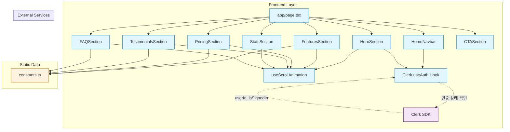

# 홈(랜딩페이지) 구현 계획

## 개요

홈(랜딩페이지)(`/`)는 서비스를 처음 방문한 사용자에게 서비스의 가치를 전달하고 회원가입/로그인을 유도하는 핵심 진입점 페이지입니다. 비로그인 사용자 포함 모두 접근 가능하며, Framer Motion을 활용한 인터랙티브 애니메이션으로 사용자 경험을 강화합니다.

### 주요 기능
- Hero 섹션 (서비스 소개, CTA 버튼)
- 주요 기능 소개 섹션 (3가지 핵심 가치)
- 요금제 비교 테이블 (Free vs Pro)
- 사용자 후기/통계 섹션
- FAQ 섹션
- 로그인/회원가입 버튼
- 반응형 디자인 (모바일 최적화)

### 관련 Use Cases
- [UC-003] 회원가입 (`/docs/usecases/003/spec.md`)
- [UC-008] 로그인 (`/docs/usecases/008/spec.md`)

### 외부 서비스 연동
- **Clerk SDK** (`@clerk/nextjs`): 인증 상태 확인 및 로그인/회원가입 버튼 표시
  - Frontend: `useAuth()` 훅 사용
  - 비로그인 상태: "회원가입" 및 "로그인" 버튼 표시
  - 로그인 상태: "대시보드로 이동" 버튼 표시

---

## 모듈 구조

### Frontend 모듈

#### 1. Components (Presentational)
- **위치**: `src/features/home/components/`
- **파일**:
  - `HeroSection.tsx`: Hero 섹션 (타이틀, 설명, CTA 버튼)
  - `FeaturesSection.tsx`: 주요 기능 소개 섹션 (카드 3개)
  - `PricingSection.tsx`: 요금제 비교 테이블
  - `TestimonialsSection.tsx`: 사용자 후기 섹션
  - `StatsSection.tsx`: 통계 섹션 (총 분석 횟수 등)
  - `FAQSection.tsx`: FAQ 아코디언
  - `CTASection.tsx`: 최종 CTA 섹션
  - `HomeNavbar.tsx`: 랜딩페이지 전용 네비게이션 바

#### 2. Lib & Constants
- **위치**: `src/features/home/lib/`
- **파일**:
  - `constants.ts`: 상수 (섹션 데이터, 요금제 정보, FAQ 데이터)
  - `types.ts`: Frontend 전용 타입 (Feature, PricingPlan, FAQ 등)

### 공통 모듈

#### 3. Scroll Animation Hook
- **위치**: `src/hooks/useScrollAnimation.ts`
- **설명**: Intersection Observer API를 활용한 스크롤 애니메이션 훅
- **기능**: 섹션이 뷰포트에 들어올 때 애니메이션 트리거

### Pages

#### 4. 홈 메인 페이지
- **위치**: `src/app/page.tsx`
- **설명**: 랜딩페이지 메인 컴포넌트, Clerk 인증 상태에 따라 CTA 버튼 변경

---

## 모듈 관계도 (Mermaid Diagram)



---

## 구현 계획

### Phase 1: 기본 인프라 구축

#### Task 1.1: Framer Motion 설치
```bash
npm install framer-motion --save
```

#### Task 1.2: Scroll Animation Hook 생성
- **파일**: `src/hooks/useScrollAnimation.ts`
- **구현 내용**:

```typescript
import { useEffect, useRef, useState } from 'react';

interface UseScrollAnimationOptions {
  threshold?: number;
  triggerOnce?: boolean;
}

export function useScrollAnimation(options: UseScrollAnimationOptions = {}) {
  const { threshold = 0.2, triggerOnce = true } = options;
  const [isVisible, setIsVisible] = useState(false);
  const ref = useRef<HTMLDivElement>(null);

  useEffect(() => {
    const observer = new IntersectionObserver(
      ([entry]) => {
        if (entry.isIntersecting) {
          setIsVisible(true);
          if (triggerOnce && ref.current) {
            observer.unobserve(ref.current);
          }
        } else if (!triggerOnce) {
          setIsVisible(false);
        }
      },
      { threshold }
    );

    const currentRef = ref.current;
    if (currentRef) {
      observer.observe(currentRef);
    }

    return () => {
      if (currentRef) {
        observer.unobserve(currentRef);
      }
    };
  }, [threshold, triggerOnce]);

  return { ref, isVisible };
}
```

**Unit Test**:
```typescript
describe('useScrollAnimation', () => {
  it('should trigger animation when element enters viewport', () => {
    const { result } = renderHook(() => useScrollAnimation());

    expect(result.current.isVisible).toBe(false);

    // Simulate IntersectionObserver
    act(() => {
      const callback = (IntersectionObserver as any).mock.calls[0][0];
      callback([{ isIntersecting: true }]);
    });

    expect(result.current.isVisible).toBe(true);
  });
});
```

---

### Phase 2: 정적 데이터 및 타입 정의

#### Task 2.1: 타입 정의
- **파일**: `src/features/home/lib/types.ts`

```typescript
export interface Feature {
  id: string;
  icon: string; // lucide-react icon name
  title: string;
  description: string;
}

export interface PricingPlan {
  id: 'free' | 'pro';
  name: string;
  price: number;
  currency: string;
  period: string;
  description: string;
  features: string[];
  isPopular?: boolean;
}

export interface Testimonial {
  id: string;
  name: string;
  role: string;
  content: string;
  rating: number;
  avatar?: string;
}

export interface FAQ {
  id: string;
  question: string;
  answer: string;
}

export interface Stat {
  id: string;
  label: string;
  value: string;
  suffix?: string;
}
```

#### Task 2.2: Constants 정의
- **파일**: `src/features/home/lib/constants.ts`

```typescript
import type { Feature, PricingPlan, Testimonial, FAQ, Stat } from './types';

export const FEATURES: Feature[] = [
  {
    id: 'ai-analysis',
    icon: 'Sparkles',
    title: 'AI 기반 정확한 분석',
    description: 'Google Gemini AI를 활용해 전통 사주팔자를 과학적으로 분석합니다.',
  },
  {
    id: 'flexible-subscription',
    icon: 'CreditCard',
    title: '유연한 구독 시스템',
    description: '무료 체험부터 Pro 구독까지 단계별 서비스를 제공합니다.',
  },
  {
    id: 'secure-payment',
    icon: 'Shield',
    title: '안전한 결제 처리',
    description: '토스페이먼츠를 통한 정기결제 자동화로 안전하게 이용하세요.',
  },
];

export const PRICING_PLANS: PricingPlan[] = [
  {
    id: 'free',
    name: '무료 체험',
    price: 0,
    currency: '원',
    period: '월',
    description: '서비스를 처음 경험해보세요',
    features: [
      '회원가입 시 3회 무료 분석',
      '기본 AI 모델 (gemini-2.0-flash)',
      '천간지지, 오행분석',
      '대운/세운 흐름도',
      '종합 분석 결과',
    ],
  },
  {
    id: 'pro',
    name: 'Pro 구독',
    price: 9900,
    currency: '원',
    period: '월',
    description: '더욱 정확한 프리미엄 분석',
    features: [
      '월 10회 프리미엄 분석',
      '고급 AI 모델 (gemini-2.0-pro)',
      '천간지지, 오행분석',
      '대운/세운 흐름도',
      '종합 분석 결과',
      '우선 고객 지원',
    ],
    isPopular: true,
  },
];

export const TESTIMONIALS: Testimonial[] = [
  {
    id: 'testimonial-1',
    name: '김민수',
    role: '직장인',
    content: '무료 체험으로 시작했는데 결과가 너무 정확해서 Pro 구독했어요. AI 분석이라 빠르고 정확해요!',
    rating: 5,
  },
  {
    id: 'testimonial-2',
    name: '이지은',
    role: '사업가',
    content: '대운과 세운 흐름을 보고 사업 타이밍을 잡는 데 도움이 되었습니다. 추천합니다!',
    rating: 5,
  },
  {
    id: 'testimonial-3',
    name: '박준호',
    role: '대학생',
    content: '저렴한 가격에 전문적인 사주 분석을 받을 수 있어서 좋아요. 친구들에게도 추천했습니다.',
    rating: 4,
  },
];

export const FAQS: FAQ[] = [
  {
    id: 'faq-1',
    question: '무료 체험은 어떻게 받나요?',
    answer: 'Google 계정으로 회원가입하시면 자동으로 3회 무료 분석 횟수가 제공됩니다. 별도 신청 없이 바로 이용하실 수 있어요.',
  },
  {
    id: 'faq-2',
    question: 'Pro 구독은 언제든 해지할 수 있나요?',
    answer: '네, 언제든 해지 가능합니다. 해지하셔도 다음 결제일까지는 Pro 혜택이 유지되며, 결제일 이후 자동으로 무료 회원으로 전환됩니다.',
  },
  {
    id: 'faq-3',
    question: '분석 결과는 얼마나 정확한가요?',
    answer: 'Google Gemini AI가 전통 사주팔자 이론을 기반으로 분석합니다. 무료 회원은 gemini-2.0-flash, Pro 회원은 gemini-2.0-pro 모델을 사용해 더욱 정확한 분석을 제공합니다.',
  },
  {
    id: 'faq-4',
    question: '출생시간을 모르는 경우에도 분석 가능한가요?',
    answer: '네, 출생시간은 선택사항입니다. 시간을 모르셔도 생년월일과 성별만으로 기본 분석이 가능합니다. 단, 시간을 입력하시면 더욱 정확한 분석을 받으실 수 있습니다.',
  },
  {
    id: 'faq-5',
    question: '환불 정책은 어떻게 되나요?',
    answer: 'Pro 구독 후 7일 이내에 분석을 사용하지 않으신 경우 전액 환불 가능합니다. 자세한 내용은 이용약관을 참조해주세요.',
  },
];

export const STATS: Stat[] = [
  {
    id: 'total-analyses',
    label: '총 분석 횟수',
    value: '10,000',
    suffix: '+',
  },
  {
    id: 'active-users',
    label: '활성 사용자',
    value: '2,500',
    suffix: '+',
  },
  {
    id: 'satisfaction',
    label: '만족도',
    value: '4.8',
    suffix: '/5.0',
  },
];
```

---

### Phase 3: Components 구현

#### Task 3.1: HomeNavbar 구현
- **파일**: `src/features/home/components/HomeNavbar.tsx`

```typescript
'use client';

import Link from 'next/link';
import { useAuth } from '@clerk/nextjs';
import { Button } from '@/components/ui/button';

export function HomeNavbar() {
  const { isSignedIn } = useAuth();

  return (
    <nav className="fixed top-0 left-0 right-0 z-50 bg-white/80 backdrop-blur-md border-b">
      <div className="container mx-auto px-4 py-4 flex items-center justify-between">
        <Link href="/" className="text-2xl font-bold">
          사주풀이 AI
        </Link>

        <div className="flex items-center gap-4">
          <Link href="/#features" className="text-sm font-medium hover:text-primary">
            주요 기능
          </Link>
          <Link href="/#pricing" className="text-sm font-medium hover:text-primary">
            요금제
          </Link>
          <Link href="/#faq" className="text-sm font-medium hover:text-primary">
            FAQ
          </Link>

          {isSignedIn ? (
            <Button asChild>
              <Link href="/dashboard">대시보드</Link>
            </Button>
          ) : (
            <>
              <Button variant="ghost" asChild>
                <Link href="/sign-in">로그인</Link>
              </Button>
              <Button asChild>
                <Link href="/sign-up">회원가입</Link>
              </Button>
            </>
          )}
        </div>
      </div>
    </nav>
  );
}
```

#### Task 3.2: HeroSection 구현
- **파일**: `src/features/home/components/HeroSection.tsx`

```typescript
'use client';

import Link from 'next/link';
import { useAuth } from '@clerk/nextjs';
import { motion } from 'framer-motion';
import { Button } from '@/components/ui/button';

export function HeroSection() {
  const { isSignedIn } = useAuth();

  return (
    <section className="pt-32 pb-20 bg-gradient-to-b from-blue-50 to-white">
      <div className="container mx-auto px-4 text-center">
        <motion.h1
          className="text-5xl md:text-6xl font-bold mb-6"
          initial={{ opacity: 0, y: 20 }}
          animate={{ opacity: 1, y: 0 }}
          transition={{ duration: 0.6 }}
        >
          AI가 분석하는
          <br />
          <span className="text-primary">정확한 사주팔자</span>
        </motion.h1>

        <motion.p
          className="text-xl text-gray-600 mb-8 max-w-2xl mx-auto"
          initial={{ opacity: 0, y: 20 }}
          animate={{ opacity: 1, y: 0 }}
          transition={{ duration: 0.6, delay: 0.2 }}
        >
          Google Gemini AI를 활용한 전통 사주팔자 분석.
          <br />
          천간지지, 오행분석부터 대운/세운까지 상세하게 알려드립니다.
        </motion.p>

        <motion.div
          className="flex items-center justify-center gap-4"
          initial={{ opacity: 0, y: 20 }}
          animate={{ opacity: 1, y: 0 }}
          transition={{ duration: 0.6, delay: 0.4 }}
        >
          {isSignedIn ? (
            <Button size="lg" asChild>
              <Link href="/analysis/new">분석 시작하기</Link>
            </Button>
          ) : (
            <>
              <Button size="lg" asChild>
                <Link href="/sign-up">무료로 시작하기</Link>
              </Button>
              <Button size="lg" variant="outline" asChild>
                <Link href="/sign-in">로그인</Link>
              </Button>
            </>
          )}
        </motion.div>

        <motion.p
          className="text-sm text-gray-500 mt-4"
          initial={{ opacity: 0 }}
          animate={{ opacity: 1 }}
          transition={{ duration: 0.6, delay: 0.6 }}
        >
          회원가입 시 무료 분석 3회 제공
        </motion.p>
      </div>
    </section>
  );
}
```

#### Task 3.3: FeaturesSection 구현
- **파일**: `src/features/home/components/FeaturesSection.tsx`

```typescript
'use client';

import { motion } from 'framer-motion';
import * as Icons from 'lucide-react';
import { Card, CardHeader, CardTitle, CardDescription } from '@/components/ui/card';
import { FEATURES } from '../lib/constants';
import { useScrollAnimation } from '@/hooks/useScrollAnimation';

export function FeaturesSection() {
  const { ref, isVisible } = useScrollAnimation();

  return (
    <section id="features" ref={ref} className="py-20 bg-white">
      <div className="container mx-auto px-4">
        <motion.div
          className="text-center mb-12"
          initial={{ opacity: 0, y: 20 }}
          animate={isVisible ? { opacity: 1, y: 0 } : {}}
          transition={{ duration: 0.6 }}
        >
          <h2 className="text-4xl font-bold mb-4">주요 기능</h2>
          <p className="text-xl text-gray-600">
            AI 기반 사주 분석 서비스의 핵심 가치
          </p>
        </motion.div>

        <div className="grid grid-cols-1 md:grid-cols-3 gap-8">
          {FEATURES.map((feature, index) => {
            const Icon = (Icons as any)[feature.icon];

            return (
              <motion.div
                key={feature.id}
                initial={{ opacity: 0, y: 20 }}
                animate={isVisible ? { opacity: 1, y: 0 } : {}}
                transition={{ duration: 0.6, delay: index * 0.2 }}
              >
                <Card className="h-full hover:shadow-lg transition-shadow">
                  <CardHeader>
                    <div className="w-12 h-12 bg-primary/10 rounded-lg flex items-center justify-center mb-4">
                      <Icon className="w-6 h-6 text-primary" />
                    </div>
                    <CardTitle>{feature.title}</CardTitle>
                    <CardDescription className="text-base">
                      {feature.description}
                    </CardDescription>
                  </CardHeader>
                </Card>
              </motion.div>
            );
          })}
        </div>
      </div>
    </section>
  );
}
```

#### Task 3.4: PricingSection 구현
- **파일**: `src/features/home/components/PricingSection.tsx`

```typescript
'use client';

import Link from 'next/link';
import { motion } from 'framer-motion';
import { Check } from 'lucide-react';
import { Button } from '@/components/ui/button';
import { Card, CardHeader, CardTitle, CardDescription, CardContent, CardFooter } from '@/components/ui/card';
import { Badge } from '@/components/ui/badge';
import { PRICING_PLANS } from '../lib/constants';
import { useScrollAnimation } from '@/hooks/useScrollAnimation';

export function PricingSection() {
  const { ref, isVisible } = useScrollAnimation();

  return (
    <section id="pricing" ref={ref} className="py-20 bg-gray-50">
      <div className="container mx-auto px-4">
        <motion.div
          className="text-center mb-12"
          initial={{ opacity: 0, y: 20 }}
          animate={isVisible ? { opacity: 1, y: 0 } : {}}
          transition={{ duration: 0.6 }}
        >
          <h2 className="text-4xl font-bold mb-4">요금제</h2>
          <p className="text-xl text-gray-600">
            무료 체험부터 Pro 구독까지
          </p>
        </motion.div>

        <div className="grid grid-cols-1 md:grid-cols-2 gap-8 max-w-4xl mx-auto">
          {PRICING_PLANS.map((plan, index) => (
            <motion.div
              key={plan.id}
              initial={{ opacity: 0, y: 20 }}
              animate={isVisible ? { opacity: 1, y: 0 } : {}}
              transition={{ duration: 0.6, delay: index * 0.2 }}
            >
              <Card className={`h-full ${plan.isPopular ? 'border-primary shadow-lg' : ''}`}>
                <CardHeader>
                  <div className="flex items-center justify-between mb-2">
                    <CardTitle>{plan.name}</CardTitle>
                    {plan.isPopular && (
                      <Badge variant="default">인기</Badge>
                    )}
                  </div>
                  <div className="flex items-baseline gap-1 mb-2">
                    <span className="text-4xl font-bold">
                      {plan.price.toLocaleString()}
                    </span>
                    <span className="text-gray-600">{plan.currency}</span>
                    <span className="text-gray-600">/ {plan.period}</span>
                  </div>
                  <CardDescription>{plan.description}</CardDescription>
                </CardHeader>

                <CardContent>
                  <ul className="space-y-3">
                    {plan.features.map((feature, featureIndex) => (
                      <li key={featureIndex} className="flex items-start gap-2">
                        <Check className="w-5 h-5 text-primary shrink-0 mt-0.5" />
                        <span className="text-sm">{feature}</span>
                      </li>
                    ))}
                  </ul>
                </CardContent>

                <CardFooter>
                  <Button
                    className="w-full"
                    variant={plan.isPopular ? 'default' : 'outline'}
                    asChild
                  >
                    <Link href={plan.id === 'free' ? '/sign-up' : '/subscription'}>
                      {plan.id === 'free' ? '무료로 시작하기' : 'Pro 구독하기'}
                    </Link>
                  </Button>
                </CardFooter>
              </Card>
            </motion.div>
          ))}
        </div>
      </div>
    </section>
  );
}
```

#### Task 3.5: TestimonialsSection 구현
- **파일**: `src/features/home/components/TestimonialsSection.tsx`

```typescript
'use client';

import { motion } from 'framer-motion';
import { Star } from 'lucide-react';
import { Card, CardContent } from '@/components/ui/card';
import { TESTIMONIALS } from '../lib/constants';
import { useScrollAnimation } from '@/hooks/useScrollAnimation';

export function TestimonialsSection() {
  const { ref, isVisible } = useScrollAnimation();

  return (
    <section ref={ref} className="py-20 bg-white">
      <div className="container mx-auto px-4">
        <motion.div
          className="text-center mb-12"
          initial={{ opacity: 0, y: 20 }}
          animate={isVisible ? { opacity: 1, y: 0 } : {}}
          transition={{ duration: 0.6 }}
        >
          <h2 className="text-4xl font-bold mb-4">사용자 후기</h2>
          <p className="text-xl text-gray-600">
            실제 사용자들의 생생한 경험담
          </p>
        </motion.div>

        <div className="grid grid-cols-1 md:grid-cols-3 gap-8">
          {TESTIMONIALS.map((testimonial, index) => (
            <motion.div
              key={testimonial.id}
              initial={{ opacity: 0, y: 20 }}
              animate={isVisible ? { opacity: 1, y: 0 } : {}}
              transition={{ duration: 0.6, delay: index * 0.2 }}
            >
              <Card className="h-full">
                <CardContent className="pt-6">
                  <div className="flex items-center gap-1 mb-4">
                    {Array.from({ length: testimonial.rating }).map((_, i) => (
                      <Star key={i} className="w-4 h-4 fill-yellow-400 text-yellow-400" />
                    ))}
                  </div>
                  <p className="text-gray-700 mb-4">{testimonial.content}</p>
                  <div className="border-t pt-4">
                    <p className="font-semibold">{testimonial.name}</p>
                    <p className="text-sm text-gray-500">{testimonial.role}</p>
                  </div>
                </CardContent>
              </Card>
            </motion.div>
          ))}
        </div>
      </div>
    </section>
  );
}
```

#### Task 3.6: StatsSection 구현
- **파일**: `src/features/home/components/StatsSection.tsx`

```typescript
'use client';

import { motion } from 'framer-motion';
import { STATS } from '../lib/constants';
import { useScrollAnimation } from '@/hooks/useScrollAnimation';

export function StatsSection() {
  const { ref, isVisible } = useScrollAnimation();

  return (
    <section ref={ref} className="py-20 bg-primary text-white">
      <div className="container mx-auto px-4">
        <div className="grid grid-cols-1 md:grid-cols-3 gap-8 text-center">
          {STATS.map((stat, index) => (
            <motion.div
              key={stat.id}
              initial={{ opacity: 0, scale: 0.8 }}
              animate={isVisible ? { opacity: 1, scale: 1 } : {}}
              transition={{ duration: 0.6, delay: index * 0.2 }}
            >
              <div className="text-5xl font-bold mb-2">
                {stat.value}
                {stat.suffix}
              </div>
              <div className="text-xl opacity-90">{stat.label}</div>
            </motion.div>
          ))}
        </div>
      </div>
    </section>
  );
}
```

#### Task 3.7: FAQSection 구현
- **파일**: `src/features/home/components/FAQSection.tsx`

```typescript
'use client';

import { motion } from 'framer-motion';
import { Accordion, AccordionContent, AccordionItem, AccordionTrigger } from '@/components/ui/accordion';
import { FAQS } from '../lib/constants';
import { useScrollAnimation } from '@/hooks/useScrollAnimation';

export function FAQSection() {
  const { ref, isVisible } = useScrollAnimation();

  return (
    <section id="faq" ref={ref} className="py-20 bg-gray-50">
      <div className="container mx-auto px-4 max-w-3xl">
        <motion.div
          className="text-center mb-12"
          initial={{ opacity: 0, y: 20 }}
          animate={isVisible ? { opacity: 1, y: 0 } : {}}
          transition={{ duration: 0.6 }}
        >
          <h2 className="text-4xl font-bold mb-4">자주 묻는 질문</h2>
          <p className="text-xl text-gray-600">
            궁금하신 점을 확인해보세요
          </p>
        </motion.div>

        <motion.div
          initial={{ opacity: 0, y: 20 }}
          animate={isVisible ? { opacity: 1, y: 0 } : {}}
          transition={{ duration: 0.6, delay: 0.2 }}
        >
          <Accordion type="single" collapsible className="w-full">
            {FAQS.map((faq) => (
              <AccordionItem key={faq.id} value={faq.id}>
                <AccordionTrigger className="text-left">
                  {faq.question}
                </AccordionTrigger>
                <AccordionContent className="text-gray-600">
                  {faq.answer}
                </AccordionContent>
              </AccordionItem>
            ))}
          </Accordion>
        </motion.div>
      </div>
    </section>
  );
}
```

#### Task 3.8: CTASection 구현
- **파일**: `src/features/home/components/CTASection.tsx`

```typescript
'use client';

import Link from 'next/link';
import { useAuth } from '@clerk/nextjs';
import { motion } from 'framer-motion';
import { Button } from '@/components/ui/button';
import { useScrollAnimation } from '@/hooks/useScrollAnimation';

export function CTASection() {
  const { isSignedIn } = useAuth();
  const { ref, isVisible } = useScrollAnimation();

  return (
    <section ref={ref} className="py-20 bg-white">
      <div className="container mx-auto px-4 text-center">
        <motion.div
          initial={{ opacity: 0, y: 20 }}
          animate={isVisible ? { opacity: 1, y: 0 } : {}}
          transition={{ duration: 0.6 }}
        >
          <h2 className="text-4xl font-bold mb-4">
            지금 바로 시작하세요
          </h2>
          <p className="text-xl text-gray-600 mb-8 max-w-2xl mx-auto">
            Google 계정으로 간편하게 가입하고
            <br />
            AI가 분석하는 정확한 사주팔자를 경험해보세요
          </p>
          <Button size="lg" asChild>
            <Link href={isSignedIn ? '/analysis/new' : '/sign-up'}>
              {isSignedIn ? '분석 시작하기' : '무료로 시작하기'}
            </Link>
          </Button>
        </motion.div>
      </div>
    </section>
  );
}
```

---

### Phase 4: Pages 구현

#### Task 4.1: 홈 메인 페이지
- **파일**: `src/app/page.tsx`

```typescript
import { HomeNavbar } from '@/features/home/components/HomeNavbar';
import { HeroSection } from '@/features/home/components/HeroSection';
import { FeaturesSection } from '@/features/home/components/FeaturesSection';
import { PricingSection } from '@/features/home/components/PricingSection';
import { TestimonialsSection } from '@/features/home/components/TestimonialsSection';
import { StatsSection } from '@/features/home/components/StatsSection';
import { FAQSection } from '@/features/home/components/FAQSection';
import { CTASection } from '@/features/home/components/CTASection';

export default function HomePage() {
  return (
    <div className="min-h-screen">
      <HomeNavbar />
      <HeroSection />
      <FeaturesSection />
      <PricingSection />
      <TestimonialsSection />
      <StatsSection />
      <FAQSection />
      <CTASection />

      {/* Footer */}
      <footer className="bg-gray-900 text-white py-8">
        <div className="container mx-auto px-4 text-center">
          <p className="text-sm text-gray-400">
            © 2025 사주풀이 AI. All rights reserved.
          </p>
        </div>
      </footer>
    </div>
  );
}
```

---

### Phase 5: QA & Testing

#### Task 5.1: QA Sheet (HeroSection)
- [ ] 비로그인 상태일 때 "무료로 시작하기" 및 "로그인" 버튼이 표시되는가?
- [ ] 로그인 상태일 때 "분석 시작하기" 버튼이 표시되는가?
- [ ] 각 버튼 클릭 시 올바른 페이지로 이동하는가?
- [ ] 애니메이션이 순차적으로 재생되는가?
- [ ] 모바일에서 타이틀과 설명이 올바르게 표시되는가?

#### Task 5.2: QA Sheet (FeaturesSection)
- [ ] 스크롤 시 애니메이션이 트리거되는가?
- [ ] 3개 카드가 모바일에서 세로로 정렬되는가?
- [ ] 각 카드에 아이콘, 타이틀, 설명이 올바르게 표시되는가?
- [ ] hover 시 그림자 효과가 적용되는가?

#### Task 5.3: QA Sheet (PricingSection)
- [ ] Free와 Pro 플랜이 나란히 표시되는가?
- [ ] Pro 플랜에 "인기" 뱃지가 표시되는가?
- [ ] Free 플랜 버튼 클릭 시 회원가입 페이지로 이동하는가?
- [ ] Pro 플랜 버튼 클릭 시 구독 페이지로 이동하는가?
- [ ] 모바일에서 2개 플랜이 세로로 정렬되는가?

#### Task 5.4: QA Sheet (FAQSection)
- [ ] 아코디언 클릭 시 답변이 펼쳐지는가?
- [ ] 한 번에 하나의 FAQ만 펼쳐지는가?
- [ ] 모든 FAQ 데이터가 올바르게 표시되는가?

#### Task 5.5: 통합 테스트 (E2E)
1. **비로그인 사용자 플로우**:
   - [ ] 랜딩페이지 진입 → Hero 섹션 표시
   - [ ] "무료로 시작하기" 버튼 클릭 → 회원가입 페이지 이동
   - [ ] 회원가입 완료 → 대시보드로 리다이렉트

2. **로그인 사용자 플로우**:
   - [ ] 랜딩페이지 진입 → "대시보드" 버튼 표시
   - [ ] "분석 시작하기" 버튼 클릭 → 새 분석 페이지 이동

3. **스크롤 애니메이션 플로우**:
   - [ ] 각 섹션으로 스크롤 → 순차적 애니메이션 재생
   - [ ] 다시 위로 스크롤 → 애니메이션 재생 안 됨 (triggerOnce)

---

## 필요한 Shadcn-ui 컴포넌트

```bash
npx shadcn@latest add card
npx shadcn@latest add button
npx shadcn@latest add badge
npx shadcn@latest add accordion
```

---

## Database Migration

이 페이지는 정적 콘텐츠만 표시하므로 추가 마이그레이션이 필요 없습니다.

---

## 보안 고려사항

1. **인증 상태 확인**:
   - Clerk SDK의 `useAuth()` 훅으로 클라이언트 측 인증 상태 확인
   - 서버 컴포넌트에서는 `auth()` 사용

2. **외부 링크**:
   - 외부 링크 사용 시 `rel="noopener noreferrer"` 속성 추가
   - SEO를 위한 적절한 meta 태그 설정

---

## 성능 최적화

1. **이미지 최적화**:
   - Next.js Image 컴포넌트 사용
   - Placeholder 블러 적용
   - Lazy loading 활성화

2. **코드 스플리팅**:
   - 섹션별 동적 import 고려
   - Framer Motion은 필요한 컴포넌트에서만 import

3. **애니메이션 최적화**:
   - `will-change` CSS 속성 최소화
   - GPU 가속 활용 (transform, opacity)
   - `useReducedMotion` 훅으로 모션 감소 설정 존중

4. **폰트 최적화**:
   - `next/font`를 사용한 폰트 로딩
   - FOUT (Flash of Unstyled Text) 방지

---

## 접근성 (Accessibility)

1. **Semantic HTML**:
   - `<section>`, `<nav>`, `<footer>` 등 시맨틱 태그 사용
   - 적절한 heading 계층 구조 (h1 → h2 → h3)

2. **키보드 네비게이션**:
   - 모든 버튼과 링크가 키보드로 접근 가능
   - Focus 상태 명확히 표시

3. **스크린 리더 지원**:
   - `aria-label` 속성 추가
   - 이미지에 `alt` 텍스트 제공

4. **색상 대비**:
   - WCAG AA 기준 준수 (4.5:1 이상)
   - 중요 정보는 색상 외 다른 방법으로도 전달

---

## SEO 최적화

1. **메타 태그 설정**:
   - `src/app/layout.tsx`에 기본 메타 태그 추가
   - Open Graph 및 Twitter Card 태그 설정

```typescript
// src/app/layout.tsx
export const metadata: Metadata = {
  title: '사주풀이 AI - AI 기반 사주팔자 분석',
  description: 'Google Gemini AI를 활용한 정확한 사주팔자 분석. 천간지지, 오행분석부터 대운/세운까지 상세하게 알려드립니다.',
  keywords: ['사주', '사주팔자', 'AI 사주', '사주 분석', '대운', '세운'],
  openGraph: {
    title: '사주풀이 AI',
    description: 'AI 기반 사주팔자 분석 서비스',
    type: 'website',
    locale: 'ko_KR',
  },
};
```

2. **구조화된 데이터**:
   - JSON-LD 스키마 추가 (Organization, Product)
   - FAQ 페이지에 FAQPage 스키마 추가

3. **성능 메트릭**:
   - Lighthouse 점수 90 이상 목표
   - Core Web Vitals 최적화

---

## 향후 확장 고려사항

1. **다국어 지원**: i18n 라이브러리 통합 (next-intl)
2. **다크 모드**: Tailwind CSS의 dark: 클래스 활용
3. **블로그 섹션**: 사주 관련 콘텐츠 제공
4. **라이브 채팅**: 고객 지원 채팅 위젯
5. **A/B 테스팅**: CTA 버튼 문구, 색상 등 테스트

---

## 구현 순서 요약

1. **Phase 1**: Framer Motion 설치 + Scroll Animation Hook 생성
2. **Phase 2**: 정적 데이터 및 타입 정의 (constants.ts, types.ts)
3. **Phase 3**: Components 구현 (섹션별 컴포넌트 8개)
4. **Phase 4**: Pages 구현 (app/page.tsx)
5. **Phase 5**: QA & Testing (E2E 테스트, 접근성 테스트)

각 Phase는 순차적으로 진행하며, Phase 2와 Phase 3은 병렬로 진행 가능합니다.

---

## 충돌 방지 체크리스트

### 기존 코드베이스와의 충돌 확인

- [ ] `src/app/page.tsx`가 기존에 없는지 확인 (신규 생성)
- [ ] 네비게이션 바가 다른 페이지와 중복되지 않는지 확인
- [ ] Clerk SDK의 `useAuth()` 훅 사용법이 다른 페이지와 일치하는지 확인
- [ ] Shadcn-ui 컴포넌트가 이미 설치되어 있는지 확인

### 공통 모듈 재사용

- [ ] `src/hooks/useScrollAnimation.ts` 생성 (다른 페이지에서도 재사용 가능)
- [ ] Clerk SDK 설정이 `src/app/layout.tsx`에 존재하는지 확인
- [ ] Tailwind CSS 설정이 올바른지 확인

### DRY 원칙 준수

- [ ] 스크롤 애니메이션 로직을 공통 훅으로 분리
- [ ] 정적 데이터를 constants.ts로 분리 (하드코딩 방지)
- [ ] 섹션별 컴포넌트 분리 (재사용 가능)

---

## 최종 체크리스트

- [ ] Framer Motion이 설치되었는가?
- [ ] Shadcn-ui 컴포넌트가 모두 설치되었는가?
- [ ] 모든 섹션 컴포넌트가 올바르게 동작하는가?
- [ ] 스크롤 애니메이션이 올바르게 동작하는가?
- [ ] 비로그인/로그인 상태에 따라 버튼이 올바르게 표시되는가?
- [ ] 모바일 반응형이 올바르게 동작하는가?
- [ ] 접근성 기준을 만족하는가?
- [ ] SEO 메타 태그가 설정되었는가?
- [ ] Lighthouse 점수가 90 이상인가?
- [ ] E2E 테스트가 통과하는가?

---

이 계획에 따라 구현하면 홈(랜딩페이지)의 모든 기능이 완성됩니다.
