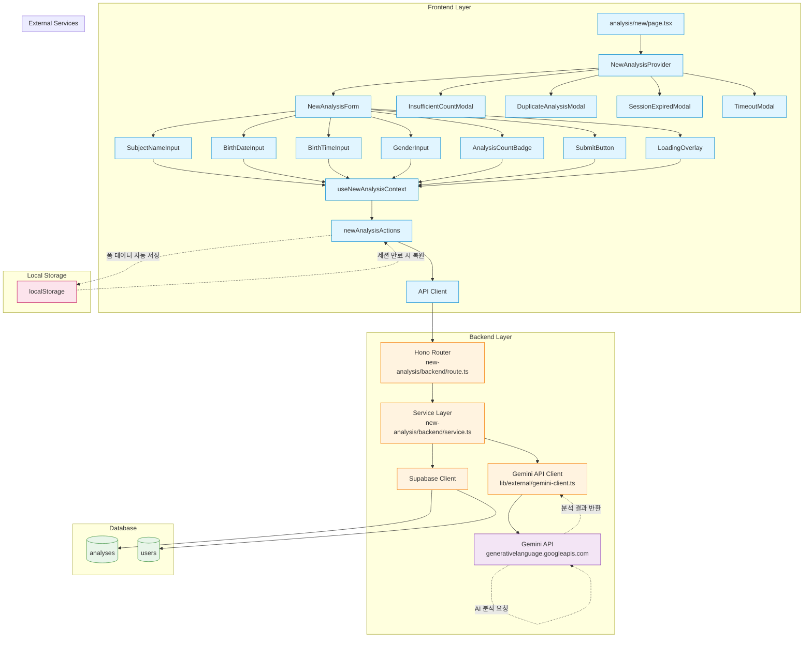

# 새 분석하기 페이지 (New Analysis) 구현 계획

## 개요

새 분석하기 페이지(`/analysis/new`)는 사용자로부터 사주 분석에 필요한 정보를 입력받아 Gemini API를 통해 분석을 수행하는 핵심 기능 페이지입니다. 복잡한 폼 검증, 비동기 API 호출, 폴링 메커니즘, 에러 처리 등을 포함합니다.

### 주요 기능
- 사주 분석 정보 입력 (성함, 생년월일, 출생시간, 성별)
- 실시간 입력값 검증 및 피드백
- 남은 분석 횟수 표시 및 관리
- Gemini API 비동기 호출 및 폴링
- 분석 결과 자동 리다이렉트
- 로컬 스토리지 자동 저장 (세션 만료 대비)

### 관련 Use Cases
- [UC-001] 새 사주 분석하기 (`/docs/usecases/001/spec.md`)

### 외부 서비스 연동
- **Gemini API** (Google AI Studio): 사주 분석 AI 모델
  - 무료 회원: `gemini-2.0-flash`
  - Pro 회원: `gemini-2.0-pro`
  - 타임아웃: 30초
  - 재시도: 최대 3회 (exponential backoff)

---

## 모듈 구조

### Frontend 모듈

#### 1. Context & State Management
- **위치**: `src/features/new-analysis/context/NewAnalysisContext.tsx`
- **설명**: Context + useReducer를 사용한 복잡한 상태 관리 (Level 3)
- **상태**: 폼 데이터, 검증, 분석 횟수, API 요청, 로딩, 모달, 로컬 저장, 타이머
- **참고**: `/docs/pages/new-analysis/state_management.md`

#### 2. Hooks
- **위치**: `src/features/new-analysis/hooks/`
- **파일**:
  - `useNewAnalysisContext.ts`: Context 접근 hook
  - `useFormData.ts`: 폼 데이터만 구독
  - `useValidation.ts`: 검증 상태만 구독
  - `useAnalysisCount.ts`: 분석 횟수 상태만 구독
  - `useCanSubmit.ts`: 폼 제출 가능 여부 (Derived State)
  - `useProgressMessage.ts`: 진행 메시지 (Derived State)

#### 3. Components
- **위치**: `src/features/new-analysis/components/`
- **파일**:
  - `NewAnalysisForm.tsx`: 폼 컨테이너
  - `SubjectNameInput.tsx`: 성함 입력 필드
  - `BirthDateInput.tsx`: 생년월일 입력 필드
  - `BirthTimeInput.tsx`: 출생시간 입력 필드 (선택)
  - `GenderInput.tsx`: 성별 입력 필드
  - `AnalysisCountBadge.tsx`: 남은 횟수 표시 뱃지
  - `SubmitButton.tsx`: 분석 시작 버튼
  - `LoadingOverlay.tsx`: 로딩 오버레이
  - `InsufficientCountModal.tsx`: 횟수 부족 모달
  - `DuplicateAnalysisModal.tsx`: 중복 분석 모달
  - `SessionExpiredModal.tsx`: 세션 만료 모달
  - `TimeoutModal.tsx`: 타임아웃 모달
  - `NewAnalysisSkeleton.tsx`: 로딩 스켈레톤 UI

#### 4. Actions
- **위치**: `src/features/new-analysis/actions/`
- **파일**:
  - `newAnalysisActions.ts`: 비동기 액션 함수들
    - `fetchAnalysisCount()`: 분석 횟수 조회
    - `submitAnalysis()`: 분석 요청 제출
    - `pollAnalysisStatus()`: 분석 상태 폴링
    - `saveFormToLocalStorage()`: 로컬 저장
    - `restoreFormFromLocalStorage()`: 로컬 복원

#### 5. Types & Constants
- **위치**: `src/features/new-analysis/lib/`
- **파일**:
  - `dto.ts`: Backend schema 재노출
  - `types.ts`: Frontend 전용 타입
  - `constants.ts`: 상수 (타임아웃, 재시도 횟수 등)
  - `validation.ts`: 검증 로직 헬퍼 함수

### Backend 모듈

#### 6. Hono Routes
- **위치**: `src/features/new-analysis/backend/route.ts`
- **엔드포인트**:
  - `GET /api/analyses/count`: 사용자 분석 횟수 조회
  - `POST /api/analyses/new`: 새 분석 생성 및 Gemini API 호출
  - `GET /api/analyses/:id/status`: 분석 상태 조회 (폴링용)

#### 7. Service Layer
- **위치**: `src/features/new-analysis/backend/service.ts`
- **함수**:
  - `getUserAnalysisCount()`: 사용자 분석 가능 횟수 조회
  - `checkDuplicateAnalysis()`: 진행 중인 분석 여부 확인
  - `createAnalysisRecord()`: 분석 레코드 생성 (status: processing)
  - `requestGeminiAnalysis()`: Gemini API 호출
  - `updateAnalysisResult()`: 분석 결과 저장 (status: completed)
  - `decrementAnalysisCount()`: 분석 횟수 차감 (트랜잭션)
  - `refundAnalysisCount()`: 분석 횟수 복구 (실패 시)
  - `getAnalysisStatus()`: 분석 상태 조회

#### 8. Schemas (Zod)
- **위치**: `src/features/new-analysis/backend/schema.ts`
- **스키마**:
  - `NewAnalysisRequestSchema`: 분석 요청 (성함, 생년월일, 출생시간, 성별)
  - `AnalysisCountResponseSchema`: 분석 횟수 응답
  - `NewAnalysisResponseSchema`: 분석 생성 응답 (analysis_id, status, remaining_count)
  - `AnalysisStatusResponseSchema`: 분석 상태 응답 (status, analysis_result)

#### 9. Error Codes
- **위치**: `src/features/new-analysis/backend/error.ts`
- **에러 코드**:
  - `INSUFFICIENT_ANALYSIS_COUNT`: 분석 횟수 부족
  - `ANALYSIS_IN_PROGRESS`: 이미 진행 중인 분석
  - `GEMINI_API_ERROR`: Gemini API 호출 실패
  - `ANALYSIS_TIMEOUT`: 분석 타임아웃
  - `INAPPROPRIATE_INPUT`: 부적절한 입력
  - `VALIDATION_ERROR`: 유효성 검증 실패
  - `DATABASE_ERROR`: 데이터베이스 오류
  - `UNAUTHORIZED`: 인증 실패

### 외부 서비스 통합 모듈

#### 10. Gemini API 클라이언트
- **위치**: `src/lib/external/gemini-client.ts`
- **설명**: Gemini API 호출을 캡슐화한 클라이언트 모듈
- **함수**:
  - `generateSajuAnalysis()`: Gemini API 호출 (프롬프트 생성 포함)
  - `parseGeminiResponse()`: Gemini 응답 파싱 (JSON 추출)
- **기능**:
  - API 키 인증
  - 에러 처리 및 재시도 로직 (3회, exponential backoff)
  - 타임아웃 설정 (30초)
  - Rate Limiting 체크

### 공통 모듈

#### 11. 프롬프트 생성 함수
- **위치**: `src/lib/prompts/saju-prompt.ts`
- **설명**: `requirements.md`의 `generateSajuPrompt()` 구현
- **입력**: 성함, 생년월일, 출생시간, 성별
- **출력**: Gemini API에 전달할 프롬프트 문자열

#### 12. 환경 변수 타입
- **위치**: `src/backend/config/env.ts`
- **추가 변수**:
  - `GEMINI_API_KEY`: Gemini API 키 (서버 전용)

### Pages

#### 13. 새 분석하기 메인 페이지
- **위치**: `src/app/analysis/new/page.tsx`
- **설명**: NewAnalysisProvider로 감싸진 메인 페이지

#### 14. 분석 결과 페이지
- **위치**: `src/app/analysis/[id]/page.tsx`
- **설명**: 분석 완료 후 리다이렉트되는 페이지 (별도 구현 계획 필요)

---

## 모듈 관계도 (Mermaid Diagram)



---

## 구현 계획

### Phase 1: 기본 인프라 구축

#### Task 1.1: 환경 변수 설정
- `src/backend/config/env.ts`에 Gemini API 키 추가
- `.env.local` 예시:
  ```env
  GEMINI_API_KEY=your_gemini_api_key_here
  ```

**구현 내용**:
```typescript
// src/backend/config/env.ts
import { z } from 'zod';

export const envSchema = z.object({
  // 기존 환경 변수들...
  GEMINI_API_KEY: z.string().min(1, 'Gemini API key is required'),
});

export type Env = z.infer<typeof envSchema>;

let cachedEnv: Env | null = null;

export function getEnv(): Env {
  if (cachedEnv) return cachedEnv;

  const parsed = envSchema.safeParse(process.env);

  if (!parsed.success) {
    console.error('Environment validation failed:', parsed.error.format());
    throw new Error('Invalid environment variables');
  }

  cachedEnv = parsed.data;
  return cachedEnv;
}
```

#### Task 1.2: Gemini SDK 설치
```bash
npm install @google/generative-ai --save
```

#### Task 1.3: Gemini API 클라이언트 모듈 생성
- **파일**: `src/lib/external/gemini-client.ts`
- **구현 내용**:

```typescript
import { GoogleGenerativeAI } from '@google/generative-ai';
import { z } from 'zod';

const TIMEOUT = 30000; // 30초
const MAX_RETRIES = 3;

// Gemini 응답 스키마
const GeminiAnalysisResultSchema = z.object({
  heavenly_stems: z.object({
    year: z.string(),
    month: z.string(),
    day: z.string(),
    hour: z.string().optional(),
  }),
  five_elements: z.object({
    wood: z.number(),
    fire: z.number(),
    earth: z.number(),
    metal: z.number(),
    water: z.number(),
  }),
  fortune_flow: z.object({
    major_fortune: z.string(),
    yearly_fortune: z.string(),
  }),
  interpretation: z.object({
    personality: z.string(),
    wealth: z.string(),
    health: z.string(),
    love: z.string(),
  }),
});

export type GeminiAnalysisResult = z.infer<typeof GeminiAnalysisResultSchema>;

// 에러 타입
export class GeminiAPIError extends Error {
  constructor(
    public code: string,
    message: string,
    public statusCode?: number,
  ) {
    super(message);
    this.name = 'GeminiAPIError';
  }
}

// 재시도 로직
async function withRetry<T>(
  fn: () => Promise<T>,
  retries = MAX_RETRIES,
): Promise<T> {
  for (let i = 0; i < retries; i++) {
    try {
      return await fn();
    } catch (error: any) {
      if (i === retries - 1) throw error;

      // 5xx 에러만 재시도
      if (error.statusCode && error.statusCode >= 500) {
        // Exponential backoff: 1s, 2s, 4s
        await new Promise(resolve => setTimeout(resolve, 1000 * Math.pow(2, i)));
        continue;
      }

      throw error;
    }
  }
  throw new Error('Retry failed');
}

// Gemini 분석 요청
export async function generateSajuAnalysis(
  prompt: string,
  model: 'gemini-2.0-flash' | 'gemini-2.0-pro',
  apiKey: string,
): Promise<GeminiAnalysisResult> {
  const genAI = new GoogleGenerativeAI(apiKey);
  const geminiModel = genAI.getGenerativeModel({ model });

  return withRetry(async () => {
    // 타임아웃 처리
    const timeoutPromise = new Promise<never>((_, reject) => {
      setTimeout(() => reject(new GeminiAPIError('TIMEOUT', 'Request timeout')), TIMEOUT);
    });

    const analysisPromise = geminiModel.generateContent(prompt);

    try {
      const result = await Promise.race([analysisPromise, timeoutPromise]);
      const response = await result.response;
      const text = response.text();

      // JSON 추출 (마크다운 코드 블록 제거)
      const jsonMatch = text.match(/```json\n([\s\S]*?)\n```/);
      const jsonText = jsonMatch ? jsonMatch[1] : text;

      const parsed = JSON.parse(jsonText);
      const validated = GeminiAnalysisResultSchema.parse(parsed);

      return validated;
    } catch (error: any) {
      if (error instanceof GeminiAPIError) {
        throw error;
      }

      if (error.message?.includes('timeout')) {
        throw new GeminiAPIError('TIMEOUT', 'Gemini API timeout');
      }

      if (error.message?.includes('API key')) {
        throw new GeminiAPIError('INVALID_API_KEY', 'Invalid Gemini API key', 401);
      }

      throw new GeminiAPIError(
        'GEMINI_API_ERROR',
        error.message || 'Gemini API error',
        error.statusCode,
      );
    }
  });
}
```

#### Task 1.4: 프롬프트 생성 함수 구현
- **파일**: `src/lib/prompts/saju-prompt.ts`

```typescript
export interface SajuInput {
  subject_name: string;
  birth_date: string; // YYYY-MM-DD
  birth_time?: string; // HH:mm
  gender: 'male' | 'female';
}

export function generateSajuPrompt(input: SajuInput): string {
  return `당신은 20년 경력의 전문 사주팔자 상담사입니다.

**입력 정보**:
- 성함: ${input.subject_name}
- 생년월일: ${input.birth_date}
- 출생시간: ${input.birth_time || '미상'}
- 성별: ${input.gender === 'male' ? '남성' : '여성'}

**분석 요구사항**:
1️⃣ 천간(天干)과 지지(地支) 계산
2️⃣ 오행(五行) 분석 (목, 화, 토, 금, 수)
3️⃣ 대운(大運)과 세운(歲運) 해석
4️⃣ 전반적인 성격, 재운, 건강운, 연애운 분석

**출력 형식**: 다음 JSON 스키마로 응답해주세요.
\`\`\`json
{
  "heavenly_stems": {
    "year": "갑자",
    "month": "을축",
    "day": "병인",
    "hour": "정묘" // 출생시간이 없으면 생략
  },
  "five_elements": {
    "wood": 2,
    "fire": 1,
    "earth": 3,
    "metal": 0,
    "water": 2
  },
  "fortune_flow": {
    "major_fortune": "대운 해석...",
    "yearly_fortune": "세운 해석..."
  },
  "interpretation": {
    "personality": "성격 분석...",
    "wealth": "재운 분석...",
    "health": "건강운 분석...",
    "love": "연애운 분석..."
  }
}
\`\`\`

**금지 사항**:
- 의료·법률 조언
- 확정적 미래 예측
- 부정적·공격적 표현`;
}
```

**Unit Test (Gemini Client)**:
```typescript
// src/lib/external/__tests__/gemini-client.test.ts
describe('Gemini Client', () => {
  it('should generate saju analysis successfully', async () => {
    const mockResult = {
      heavenly_stems: { year: '갑자', month: '을축', day: '병인' },
      five_elements: { wood: 2, fire: 1, earth: 3, metal: 0, water: 2 },
      fortune_flow: { major_fortune: 'test', yearly_fortune: 'test' },
      interpretation: { personality: 'test', wealth: 'test', health: 'test', love: 'test' },
    };

    // Mock GoogleGenerativeAI
    jest.mock('@google/generative-ai', () => ({
      GoogleGenerativeAI: jest.fn().mockImplementation(() => ({
        getGenerativeModel: jest.fn().mockReturnValue({
          generateContent: jest.fn().mockResolvedValue({
            response: {
              text: () => JSON.stringify(mockResult),
            },
          }),
        }),
      })),
    }));

    const result = await generateSajuAnalysis('test prompt', 'gemini-2.0-flash', 'test-key');
    expect(result.heavenly_stems.year).toBe('갑자');
  });

  it('should retry on 5xx errors', async () => {
    let attempts = 0;
    const mockFn = jest.fn().mockImplementation(async () => {
      attempts++;
      if (attempts < 3) {
        throw { statusCode: 500, message: 'Internal Server Error' };
      }
      return { response: { text: () => '{}' } };
    });

    await withRetry(mockFn);
    expect(attempts).toBe(3);
  });

  it('should throw GeminiAPIError on timeout', async () => {
    jest.useFakeTimers();

    const promise = generateSajuAnalysis('test', 'gemini-2.0-flash', 'test-key');

    jest.advanceTimersByTime(31000);

    await expect(promise).rejects.toThrow(GeminiAPIError);

    jest.useRealTimers();
  });
});
```

---

### Phase 2: Backend API 구현

#### Task 2.1: Zod Schema 정의
- **파일**: `src/features/new-analysis/backend/schema.ts`

```typescript
import { z } from 'zod';

// 요청 스키마
export const NewAnalysisRequestSchema = z.object({
  subject_name: z.string().min(2, '성함은 2자 이상 입력해주세요').max(50, '성함은 50자 이하로 입력해주세요'),
  birth_date: z.string().regex(/^\d{4}-\d{2}-\d{2}$/, '올바른 날짜 형식이 아닙니다 (YYYY-MM-DD)')
    .refine((date) => {
      const d = new Date(date);
      const now = new Date();
      const minDate = new Date('1900-01-01');
      return d >= minDate && d <= now;
    }, '1900년 이후 ~ 오늘 날짜만 입력 가능합니다'),
  birth_time: z.string().regex(/^\d{2}:\d{2}$/, '올바른 시간 형식이 아닙니다 (HH:mm)').optional().nullable(),
  gender: z.enum(['male', 'female'], { errorMap: () => ({ message: '성별을 선택해주세요' }) }),
});

// 응답 스키마
export const AnalysisCountResponseSchema = z.object({
  subscription_tier: z.enum(['free', 'pro']),
  remaining_count: z.number(),
  max_count: z.number(),
  is_insufficient: z.boolean(),
});

export const NewAnalysisResponseSchema = z.object({
  analysis_id: z.string().uuid(),
  status: z.enum(['processing', 'completed', 'failed']),
  remaining_count: z.number(),
});

export const AnalysisStatusResponseSchema = z.object({
  id: z.string().uuid(),
  status: z.enum(['processing', 'completed', 'failed']),
  analysis_result: z.any().nullable(),
  created_at: z.string(),
  updated_at: z.string(),
});

// DB Row 스키마
export const AnalysisRowSchema = z.object({
  id: z.string().uuid(),
  user_id: z.string().uuid(),
  subject_name: z.string(),
  birth_date: z.string(),
  birth_time: z.string().nullable(),
  gender: z.string(),
  ai_model: z.string(),
  analysis_result: z.any().nullable(),
  status: z.string(),
  created_at: z.string(),
  updated_at: z.string(),
});

export type NewAnalysisRequest = z.infer<typeof NewAnalysisRequestSchema>;
export type AnalysisCountResponse = z.infer<typeof AnalysisCountResponseSchema>;
export type NewAnalysisResponse = z.infer<typeof NewAnalysisResponseSchema>;
export type AnalysisStatusResponse = z.infer<typeof AnalysisStatusResponseSchema>;
export type AnalysisRow = z.infer<typeof AnalysisRowSchema>;
```

#### Task 2.2: Error Codes 정의
- **파일**: `src/features/new-analysis/backend/error.ts`

```typescript
export const newAnalysisErrorCodes = {
  insufficientAnalysisCount: 'INSUFFICIENT_ANALYSIS_COUNT',
  analysisInProgress: 'ANALYSIS_IN_PROGRESS',
  geminiApiError: 'GEMINI_API_ERROR',
  analysisTimeout: 'ANALYSIS_TIMEOUT',
  inappropriateInput: 'INAPPROPRIATE_INPUT',
  validationError: 'VALIDATION_ERROR',
  databaseError: 'DATABASE_ERROR',
  unauthorized: 'UNAUTHORIZED',
  analysisNotFound: 'ANALYSIS_NOT_FOUND',
} as const;

export type NewAnalysisServiceError = typeof newAnalysisErrorCodes[keyof typeof newAnalysisErrorCodes];
```

#### Task 2.3: Service Layer 구현
- **파일**: `src/features/new-analysis/backend/service.ts`

**주요 함수 구현**:

```typescript
import type { SupabaseClient } from '@supabase/supabase-js';
import { success, failure, type HandlerResult } from '@/backend/http/response';
import { generateSajuAnalysis, type GeminiAnalysisResult } from '@/lib/external/gemini-client';
import { generateSajuPrompt, type SajuInput } from '@/lib/prompts/saju-prompt';
import type {
  NewAnalysisRequest,
  NewAnalysisResponse,
  AnalysisCountResponse,
  AnalysisStatusResponse,
} from './schema';
import { newAnalysisErrorCodes, type NewAnalysisServiceError } from './error';

// 1. 사용자 분석 횟수 조회
export async function getUserAnalysisCount(
  client: SupabaseClient,
  userId: string,
): Promise<HandlerResult<AnalysisCountResponse, NewAnalysisServiceError, unknown>> {
  const { data, error } = await client
    .from('users')
    .select('subscription_tier, free_analysis_count, monthly_analysis_count')
    .eq('id', userId)
    .maybeSingle();

  if (error) {
    return failure(500, newAnalysisErrorCodes.databaseError, error.message);
  }

  if (!data) {
    return failure(404, newAnalysisErrorCodes.unauthorized, 'User not found');
  }

  const isFree = data.subscription_tier === 'free';
  const remainingCount = isFree ? data.free_analysis_count : data.monthly_analysis_count;
  const maxCount = isFree ? 3 : 10;

  return success({
    subscription_tier: data.subscription_tier,
    remaining_count: remainingCount,
    max_count: maxCount,
    is_insufficient: remainingCount === 0,
  });
}

// 2. 진행 중인 분석 확인
export async function checkDuplicateAnalysis(
  client: SupabaseClient,
  userId: string,
): Promise<string | null> {
  const { data } = await client
    .from('analyses')
    .select('id')
    .eq('user_id', userId)
    .eq('status', 'processing')
    .maybeSingle();

  return data?.id || null;
}

// 3. 분석 레코드 생성
async function createAnalysisRecord(
  client: SupabaseClient,
  userId: string,
  request: NewAnalysisRequest,
  aiModel: string,
): Promise<HandlerResult<string, NewAnalysisServiceError, unknown>> {
  const { data, error } = await client
    .from('analyses')
    .insert({
      user_id: userId,
      subject_name: request.subject_name,
      birth_date: request.birth_date,
      birth_time: request.birth_time || null,
      gender: request.gender,
      ai_model: aiModel,
      status: 'processing',
    })
    .select('id')
    .single();

  if (error) {
    return failure(500, newAnalysisErrorCodes.databaseError, error.message);
  }

  return success(data.id);
}

// 4. Gemini API 호출 및 결과 저장
async function requestGeminiAnalysis(
  client: SupabaseClient,
  analysisId: string,
  request: NewAnalysisRequest,
  aiModel: 'gemini-2.0-flash' | 'gemini-2.0-pro',
  apiKey: string,
): Promise<HandlerResult<GeminiAnalysisResult, NewAnalysisServiceError, unknown>> {
  const prompt = generateSajuPrompt({
    subject_name: request.subject_name,
    birth_date: request.birth_date,
    birth_time: request.birth_time || undefined,
    gender: request.gender,
  });

  try {
    const result = await generateSajuAnalysis(prompt, aiModel, apiKey);
    return success(result);
  } catch (error: any) {
    // 분석 실패 시 status 업데이트
    await client
      .from('analyses')
      .update({ status: 'failed', updated_at: new Date().toISOString() })
      .eq('id', analysisId);

    if (error.name === 'GeminiAPIError') {
      if (error.code === 'TIMEOUT') {
        return failure(408, newAnalysisErrorCodes.analysisTimeout, error.message);
      }
      return failure(500, newAnalysisErrorCodes.geminiApiError, error.message);
    }

    return failure(500, newAnalysisErrorCodes.geminiApiError, '분석 처리 중 오류가 발생했습니다');
  }
}

// 5. 분석 결과 저장
async function updateAnalysisResult(
  client: SupabaseClient,
  analysisId: string,
  result: GeminiAnalysisResult,
): Promise<HandlerResult<void, NewAnalysisServiceError, unknown>> {
  const { error } = await client
    .from('analyses')
    .update({
      analysis_result: result,
      status: 'completed',
      updated_at: new Date().toISOString(),
    })
    .eq('id', analysisId);

  if (error) {
    return failure(500, newAnalysisErrorCodes.databaseError, error.message);
  }

  return success(undefined);
}

// 6. 분석 횟수 차감 (트랜잭션)
async function decrementAnalysisCount(
  client: SupabaseClient,
  userId: string,
  subscriptionTier: 'free' | 'pro',
): Promise<HandlerResult<number, NewAnalysisServiceError, unknown>> {
  const column = subscriptionTier === 'free' ? 'free_analysis_count' : 'monthly_analysis_count';

  const { data, error } = await client.rpc('decrement_analysis_count', {
    p_user_id: userId,
    p_column: column,
  });

  if (error) {
    return failure(500, newAnalysisErrorCodes.databaseError, error.message);
  }

  return success(data.remaining_count);
}

// 7. 분석 횟수 복구 (실패 시)
export async function refundAnalysisCount(
  client: SupabaseClient,
  userId: string,
  subscriptionTier: 'free' | 'pro',
): Promise<void> {
  const column = subscriptionTier === 'free' ? 'free_analysis_count' : 'monthly_analysis_count';

  await client.rpc('increment_analysis_count', {
    p_user_id: userId,
    p_column: column,
  });
}

// 8. 통합 함수: 새 분석 생성
export async function createNewAnalysis(
  client: SupabaseClient,
  userId: string,
  subscriptionTier: 'free' | 'pro',
  request: NewAnalysisRequest,
  apiKey: string,
): Promise<HandlerResult<NewAnalysisResponse, NewAnalysisServiceError, unknown>> {
  // 1. 횟수 확인
  const countResult = await getUserAnalysisCount(client, userId);
  if (!countResult.ok) return countResult;

  if (countResult.data.is_insufficient) {
    return failure(
      400,
      newAnalysisErrorCodes.insufficientAnalysisCount,
      '분석 가능 횟수가 부족합니다',
    );
  }

  // 2. 중복 분석 확인
  const duplicateId = await checkDuplicateAnalysis(client, userId);
  if (duplicateId) {
    return failure(
      409,
      newAnalysisErrorCodes.analysisInProgress,
      '이미 진행 중인 분석이 있습니다',
      { existing_analysis_id: duplicateId },
    );
  }

  // 3. AI 모델 선택
  const aiModel = subscriptionTier === 'free' ? 'gemini-2.0-flash' : 'gemini-2.0-pro';

  // 4. 분석 레코드 생성
  const recordResult = await createAnalysisRecord(client, userId, request, aiModel);
  if (!recordResult.ok) return recordResult;

  const analysisId = recordResult.data;

  // 5. Gemini API 호출
  const analysisResult = await requestGeminiAnalysis(
    client,
    analysisId,
    request,
    aiModel,
    apiKey,
  );

  if (!analysisResult.ok) {
    // 실패 시 횟수 복구 없이 반환 (사용자 책임 아님)
    return analysisResult;
  }

  // 6. 결과 저장
  const updateResult = await updateAnalysisResult(client, analysisId, analysisResult.data);
  if (!updateResult.ok) {
    // 저장 실패 시 횟수 복구
    await refundAnalysisCount(client, userId, subscriptionTier);
    return updateResult;
  }

  // 7. 횟수 차감
  const decrementResult = await decrementAnalysisCount(client, userId, subscriptionTier);
  if (!decrementResult.ok) {
    // 차감 실패는 로그만 남기고 성공 처리 (이미 분석 완료)
    console.error('Failed to decrement count:', decrementResult.error);
  }

  return success({
    analysis_id: analysisId,
    status: 'completed',
    remaining_count: decrementResult.ok ? decrementResult.data : countResult.data.remaining_count - 1,
  });
}

// 9. 분석 상태 조회 (폴링용)
export async function getAnalysisStatus(
  client: SupabaseClient,
  analysisId: string,
  userId: string,
): Promise<HandlerResult<AnalysisStatusResponse, NewAnalysisServiceError, unknown>> {
  const { data, error } = await client
    .from('analyses')
    .select('id, status, analysis_result, created_at, updated_at')
    .eq('id', analysisId)
    .eq('user_id', userId)
    .maybeSingle();

  if (error) {
    return failure(500, newAnalysisErrorCodes.databaseError, error.message);
  }

  if (!data) {
    return failure(404, newAnalysisErrorCodes.analysisNotFound, '분석을 찾을 수 없습니다');
  }

  return success({
    id: data.id,
    status: data.status as 'processing' | 'completed' | 'failed',
    analysis_result: data.analysis_result,
    created_at: data.created_at,
    updated_at: data.updated_at,
  });
}
```

**Supabase RPC 함수** (decrement_analysis_count, increment_analysis_count):
```sql
-- supabase/migrations/0009_analysis_count_functions.sql
CREATE OR REPLACE FUNCTION decrement_analysis_count(
  p_user_id UUID,
  p_column TEXT
) RETURNS TABLE(remaining_count INTEGER) AS $$
DECLARE
  v_remaining INTEGER;
BEGIN
  EXECUTE format('UPDATE users SET %I = %I - 1 WHERE id = $1 RETURNING %I', p_column, p_column, p_column)
  USING p_user_id INTO v_remaining;

  RETURN QUERY SELECT v_remaining;
END;
$$ LANGUAGE plpgsql;

CREATE OR REPLACE FUNCTION increment_analysis_count(
  p_user_id UUID,
  p_column TEXT
) RETURNS VOID AS $$
BEGIN
  EXECUTE format('UPDATE users SET %I = %I + 1 WHERE id = $1', p_column, p_column)
  USING p_user_id;
END;
$$ LANGUAGE plpgsql;
```

**Unit Test (Service Layer)**:
```typescript
describe('createNewAnalysis', () => {
  it('should create analysis successfully', async () => {
    const mockSupabase = {
      from: jest.fn().mockReturnThis(),
      select: jest.fn().mockReturnThis(),
      eq: jest.fn().mockReturnThis(),
      maybeSingle: jest.fn()
        .mockResolvedValueOnce({ data: { subscription_tier: 'free', free_analysis_count: 3 }, error: null })
        .mockResolvedValueOnce({ data: null, error: null }), // no duplicate
      insert: jest.fn().mockReturnThis(),
      single: jest.fn().mockResolvedValue({ data: { id: 'analysis_123' }, error: null }),
      update: jest.fn().mockReturnThis(),
      rpc: jest.fn().mockResolvedValue({ data: { remaining_count: 2 }, error: null }),
    };

    jest.spyOn(geminiClient, 'generateSajuAnalysis').mockResolvedValue({
      heavenly_stems: { year: '갑자', month: '을축', day: '병인' },
      five_elements: { wood: 2, fire: 1, earth: 3, metal: 0, water: 2 },
      fortune_flow: { major_fortune: 'test', yearly_fortune: 'test' },
      interpretation: { personality: 'test', wealth: 'test', health: 'test', love: 'test' },
    });

    const result = await createNewAnalysis(
      mockSupabase as any,
      'user_123',
      'free',
      {
        subject_name: '홍길동',
        birth_date: '1990-01-15',
        birth_time: '14:30',
        gender: 'male',
      },
      'test-api-key',
    );

    expect(result.ok).toBe(true);
    expect(result.data.status).toBe('completed');
  });

  it('should return INSUFFICIENT_ANALYSIS_COUNT if count is 0', async () => {
    const mockSupabase = {
      from: jest.fn().mockReturnThis(),
      select: jest.fn().mockReturnThis(),
      eq: jest.fn().mockReturnThis(),
      maybeSingle: jest.fn().mockResolvedValue({
        data: { subscription_tier: 'free', free_analysis_count: 0 },
        error: null,
      }),
    };

    const result = await createNewAnalysis(
      mockSupabase as any,
      'user_123',
      'free',
      {
        subject_name: '홍길동',
        birth_date: '1990-01-15',
        birth_time: null,
        gender: 'male',
      },
      'test-api-key',
    );

    expect(result.ok).toBe(false);
    expect(result.error.code).toBe('INSUFFICIENT_ANALYSIS_COUNT');
  });
});
```

#### Task 2.4: Hono Routes 구현
- **파일**: `src/features/new-analysis/backend/route.ts`

```typescript
import type { Hono } from 'hono';
import { respond, failure } from '@/backend/http/response';
import { getSupabase, getLogger, type AppEnv } from '@/backend/hono/context';
import {
  NewAnalysisRequestSchema,
} from './schema';
import {
  getUserAnalysisCount,
  createNewAnalysis,
  getAnalysisStatus,
} from './service';
import { newAnalysisErrorCodes } from './error';

export const registerNewAnalysisRoutes = (app: Hono<AppEnv>) => {
  // GET /api/analyses/count - 분석 횟수 조회
  app.get('/analyses/count', async (c) => {
    const supabase = getSupabase(c);
    const logger = getLogger(c);

    // TODO: Clerk JWT에서 user_id 추출 (미들웨어로 구현)
    const userId = c.get('userId'); // 가정

    const result = await getUserAnalysisCount(supabase, userId);

    if (!result.ok) {
      logger.error('Failed to fetch analysis count', result.error);
    }

    return respond(c, result);
  });

  // POST /api/analyses/new - 새 분석 생성
  app.post('/analyses/new', async (c) => {
    const body = await c.req.json();
    const parsedBody = NewAnalysisRequestSchema.safeParse(body);

    if (!parsedBody.success) {
      return respond(
        c,
        failure(
          400,
          newAnalysisErrorCodes.validationError,
          '입력값이 올바르지 않습니다',
          parsedBody.error.format(),
        ),
      );
    }

    const supabase = getSupabase(c);
    const logger = getLogger(c);
    const config = c.get('config');

    const userId = c.get('userId');
    const subscriptionTier = c.get('subscriptionTier'); // 'free' | 'pro'

    const result = await createNewAnalysis(
      supabase,
      userId,
      subscriptionTier,
      parsedBody.data,
      config.GEMINI_API_KEY,
    );

    if (!result.ok) {
      logger.error('Failed to create analysis', result.error);
    }

    return respond(c, result);
  });

  // GET /api/analyses/:id/status - 분석 상태 조회
  app.get('/analyses/:id/status', async (c) => {
    const analysisId = c.req.param('id');
    const supabase = getSupabase(c);
    const userId = c.get('userId');

    const result = await getAnalysisStatus(supabase, analysisId, userId);

    return respond(c, result);
  });
};
```

---

### Phase 3: Frontend State Management

#### Task 3.1: Context & Reducer 구현
- **파일**: `src/features/new-analysis/context/NewAnalysisContext.tsx`
- **참고**: `/docs/pages/new-analysis/state_management.md` 문서의 Flux 패턴 구현
- **구현 내용**: 8개 상태 관리 (formData, validation, analysisCount, apiRequest, loading, modals, localStorage, timer), 27개 Action 처리

*(상태 관리 문서에 이미 상세히 정의되어 있으므로 전체 코드는 생략, 문서 참조)*

**핵심 구현 포인트**:
1. `useReducer`로 전역 상태 관리
2. `useEffect`로 초기 분석 횟수 조회, 타이머 업데이트, 로컬 저장
3. Context Provider로 하위 컴포넌트에 상태 및 dispatch 제공

#### Task 3.2: Custom Hooks 구현
- **파일**: `src/features/new-analysis/hooks/`

**주요 Hooks**:

```typescript
// useNewAnalysisContext.ts
export function useNewAnalysisContext() {
  const context = useContext(NewAnalysisContext);
  if (!context) {
    throw new Error('useNewAnalysisContext must be used within NewAnalysisProvider');
  }
  return context;
}

// useFormData.ts
export function useFormData() {
  const { state } = useNewAnalysisContext();
  return state.formData;
}

// useCanSubmit.ts (Derived State)
export function useCanSubmit() {
  const { state } = useNewAnalysisContext();
  const { validation, analysisCount, loading } = state;

  return useMemo(() => {
    return (
      validation.isValid &&
      !analysisCount.is_insufficient &&
      !loading.is_loading
    );
  }, [validation.isValid, analysisCount.is_insufficient, loading.is_loading]);
}
```

#### Task 3.3: Actions 구현
- **파일**: `src/features/new-analysis/actions/newAnalysisActions.ts`

```typescript
import { apiClient } from '@/lib/remote/api-client';
import type { NewAnalysisAction } from '../context/types';
import type { FormDataState, APIError } from '../lib/types';

export async function submitAnalysis(
  dispatch: React.Dispatch<NewAnalysisAction>,
  formData: FormDataState,
) {
  dispatch({ type: 'SUBMIT_ANALYSIS_START' });
  dispatch({ type: 'START_TIMER' });

  try {
    const response = await apiClient.post('/api/analyses/new', {
      subject_name: formData.subject_name,
      birth_date: formData.birth_date,
      birth_time: formData.birth_time,
      gender: formData.gender,
    });

    const { analysis_id, status, remaining_count } = response.data;

    dispatch({
      type: 'SUBMIT_ANALYSIS_SUCCESS',
      payload: { analysis_id, status, remaining_count },
    });

    if (status === 'completed') {
      dispatch({ type: 'STOP_TIMER' });
      dispatch({ type: 'CLEAR_LOCAL_STORAGE' });
      window.location.href = `/analysis/${analysis_id}`;
    } else if (status === 'processing') {
      dispatch({
        type: 'START_POLLING',
        payload: { analysis_id },
      });
      pollAnalysisStatus(dispatch, analysis_id);
    }

    return { success: true };
  } catch (error: any) {
    dispatch({ type: 'STOP_TIMER' });

    const apiError: APIError = parseAPIError(error);

    dispatch({
      type: 'SUBMIT_ANALYSIS_FAILURE',
      payload: { error: apiError },
    });

    // 에러 유형별 모달 표시
    if (apiError.code === 'INSUFFICIENT_ANALYSIS_COUNT') {
      dispatch({
        type: 'OPEN_MODAL',
        payload: {
          modal_type: 'insufficient_count',
          data: { message: apiError.message },
        },
      });
    } else if (apiError.code === 'ANALYSIS_IN_PROGRESS') {
      dispatch({
        type: 'OPEN_MODAL',
        payload: {
          modal_type: 'duplicate_analysis',
          data: { existing_analysis_id: error.response?.data?.existing_analysis_id },
        },
      });
    }

    return { success: false, error: apiError };
  }
}

async function pollAnalysisStatus(
  dispatch: React.Dispatch<NewAnalysisAction>,
  analysis_id: string,
) {
  const maxPollingTime = 30000; // 30초
  const pollingInterval = 2000; // 2초
  const startTime = Date.now();

  const poll = async () => {
    try {
      const response = await apiClient.get(`/api/analyses/${analysis_id}/status`);
      const { status } = response.data;

      if (status === 'completed') {
        dispatch({
          type: 'POLLING_SUCCESS',
          payload: { analysis_id },
        });
        dispatch({ type: 'STOP_TIMER' });
        dispatch({ type: 'CLEAR_LOCAL_STORAGE' });
        window.location.href = `/analysis/${analysis_id}`;
        return;
      }

      if (Date.now() - startTime >= maxPollingTime) {
        dispatch({
          type: 'POLLING_TIMEOUT',
          payload: { analysis_id },
        });
        return;
      }

      setTimeout(poll, pollingInterval);
    } catch (error) {
      console.error('Polling error:', error);
      setTimeout(poll, pollingInterval);
    }
  };

  poll();
}

function parseAPIError(error: any): APIError {
  const errorCode = error.response?.data?.error?.code || 'UNKNOWN_ERROR';
  const errorMessage =
    error.response?.data?.error?.message || '알 수 없는 오류가 발생했습니다';

  const recoverableErrors = [
    'NETWORK_ERROR',
    'TIMEOUT',
    'GEMINI_API_ERROR',
  ];

  return {
    code: errorCode,
    message: errorMessage,
    is_recoverable: recoverableErrors.includes(errorCode),
  };
}
```

---

### Phase 4: Frontend Components

#### Task 4.1: 메인 컴포넌트들
1. **NewAnalysisForm.tsx** (폼 컨테이너)
2. **SubjectNameInput.tsx** (성함 입력)
3. **BirthDateInput.tsx** (생년월일 입력)
4. **BirthTimeInput.tsx** (출생시간 입력, 선택)
5. **GenderInput.tsx** (성별 입력)
6. **AnalysisCountBadge.tsx** (남은 횟수 표시)
7. **LoadingOverlay.tsx** (로딩 오버레이)
8. **InsufficientCountModal.tsx** (횟수 부족 모달)
9. **NewAnalysisSkeleton.tsx** (스켈레톤 UI)

**QA Sheet (NewAnalysisForm)**:
- [ ] 페이지 로딩 시 남은 분석 횟수가 표시되는가?
- [ ] 모든 필수 필드가 유효할 때만 "분석 시작" 버튼이 활성화되는가?
- [ ] "분석 시작" 버튼 클릭 시 버튼이 비활성화되고 로딩 상태가 표시되는가?
- [ ] 분석 성공 시 결과 페이지로 자동 리다이렉트되는가?
- [ ] 횟수 부족 시 Pro 구독 유도 모달이 표시되는가?

**QA Sheet (SubjectNameInput)**:
- [ ] 2자 미만 입력 시 에러 메시지가 표시되는가?
- [ ] 50자 초과 입력 시 에러 메시지가 표시되는가?
- [ ] 입력 중 debounce(300ms)가 적용되는가?
- [ ] blur 시 검증이 실행되고 touched 상태가 업데이트되는가?
- [ ] 검증 통과 시 초록색 체크마크가 표시되는가?

**QA Sheet (LoadingOverlay)**:
- [ ] 로딩 중 전체 페이지 오버레이가 표시되는가?
- [ ] 경과 시간이 실시간으로 표시되는가?
- [ ] 15초 미만: "약 5-15초 소요됩니다" 메시지가 표시되는가?
- [ ] 15-30초: "조금만 더 기다려주세요..." 메시지가 표시되는가?
- [ ] 30초 초과 시 타임아웃 모달이 표시되는가?
- [ ] 프로그레스 바가 0%에서 100%까지 진행되는가?

#### Task 4.2: Pages 구현
1. **src/app/analysis/new/page.tsx**: 메인 페이지

```typescript
'use client';

import { NewAnalysisProvider } from '@/features/new-analysis/context/NewAnalysisContext';
import { NewAnalysisForm } from '@/features/new-analysis/components/NewAnalysisForm';
import { InsufficientCountModal } from '@/features/new-analysis/components/InsufficientCountModal';
import { DuplicateAnalysisModal } from '@/features/new-analysis/components/DuplicateAnalysisModal';
import { SessionExpiredModal } from '@/features/new-analysis/components/SessionExpiredModal';
import { TimeoutModal } from '@/features/new-analysis/components/TimeoutModal';

export default function NewAnalysisPage() {
  return (
    <NewAnalysisProvider>
      <div className="container mx-auto px-4 py-8 max-w-2xl">
        <header className="mb-8 text-center">
          <h1 className="text-3xl font-bold">새 분석하기</h1>
          <p className="text-gray-600 mt-2">
            AI가 사주팔자를 분석해드립니다
          </p>
        </header>

        <NewAnalysisForm />

        {/* 모달들 */}
        <InsufficientCountModal />
        <DuplicateAnalysisModal />
        <SessionExpiredModal />
        <TimeoutModal />
      </div>
    </NewAnalysisProvider>
  );
}
```

---

### Phase 5: Integration & Testing

#### Task 5.1: Hono App에 라우터 등록
- **파일**: `src/backend/hono/app.ts`

```typescript
import { registerNewAnalysisRoutes } from '@/features/new-analysis/backend/route';

export function createHonoApp() {
  const app = new Hono<AppEnv>();

  // 기존 미들웨어...

  registerExampleRoutes(app);
  registerNewAnalysisRoutes(app); // 추가

  return app;
}
```

#### Task 5.2: 통합 테스트
1. **분석 요청 플로우** (E2E):
   - [ ] 페이지 진입 → 남은 횟수 표시
   - [ ] 모든 필드 입력 → 실시간 검증
   - [ ] "분석 시작" 버튼 클릭 → 로딩 오버레이
   - [ ] Gemini API 호출 → 분석 결과 저장
   - [ ] 분석 횟수 차감 → 결과 페이지 리다이렉트

2. **횟수 부족 플로우** (E2E):
   - [ ] 횟수 0인 사용자 진입 → 빨간색 뱃지 표시
   - [ ] "분석 시작" 버튼 비활성화
   - [ ] 뱃지 클릭 → Pro 구독 유도 모달

3. **타임아웃 플로우** (E2E):
   - [ ] Gemini API 30초 초과 → 타임아웃 모달
   - [ ] "대시보드로 가기" 버튼 클릭 → 대시보드 이동
   - [ ] 백그라운드 분석 계속 진행

---

## 필요한 Shadcn-ui 컴포넌트

```bash
npx shadcn@latest add card
npx shadcn@latest add button
npx shadcn@latest add input
npx shadcn@latest add label
npx shadcn@latest add badge
npx shadcn@latest add dialog
npx shadcn@latest add radio-group
npx shadcn@latest add skeleton
npx shadcn@latest add toast
npx shadcn@latest add progress
```

---

## 환경 변수

`.env.local` 파일:

```env
# Gemini API
GEMINI_API_KEY=your_gemini_api_key_here
```

---

## Database Migration

필요한 마이그레이션 파일:

1. **supabase/migrations/0009_analysis_count_functions.sql**: 분석 횟수 증감 RPC 함수

---

## 보안 고려사항

1. **API 키 보안**:
   - Gemini API 키는 절대 Frontend로 노출 금지
   - 서버 전용 환경 변수로 관리

2. **인증/인가**:
   - 모든 API는 Clerk JWT 토큰 검증 필수
   - user_id가 JWT와 일치하는지 Backend에서 검증

3. **입력값 검증**:
   - Frontend: 기본 유효성 검증
   - Backend: Zod 스키마로 엄격한 검증
   - SQL Injection 방지: Prepared Statements 사용

4. **Rate Limiting**:
   - 동일 사용자 분당 최대 5회 분석 요청 제한

---

## 성능 최적화

1. **React Query 캐싱**:
   - 분석 횟수: 30초 캐시
   - 분석 상태: 폴링 중에는 캐시 비활성화

2. **메모이제이션**:
   - Derived state는 `useMemo`로 캐싱
   - 이벤트 핸들러는 `useCallback`으로 메모이제이션

3. **Debouncing**:
   - 입력 필드 검증: 300ms debounce
   - 로컬 저장소 저장: 1초 debounce

---

## 모니터링 & 로깅

1. **분석 성공률 추적** (목표: 95% 이상)
2. **Gemini API 응답 시간 로깅**
3. **평균 분석 소요 시간 추적** (목표: 5-15초)
4. **분석 실패 원인 분석** (타임아웃, API 에러 등)
5. **에러 발생 시 Slack/이메일 알람**

---

## 향후 확장 고려사항

1. **배치 분석**: CSV 파일 업로드로 여러 사람 동시 분석
2. **분석 템플릿**: 자주 분석하는 대상 정보 저장
3. **AI 모델 선택**: Pro 회원이 모델 직접 선택 옵션
4. **분석 커스터마이징**: 특정 영역(재운, 건강운)에 집중 분석
5. **분석 결과 PDF 다운로드**

---

## 구현 순서 요약

1. **Phase 1**: Gemini 클라이언트 모듈 생성 (외부 서비스 연동) + 프롬프트 생성 함수
2. **Phase 2**: Backend API 구현 (Service Layer, Routes, Schemas, RPC 함수)
3. **Phase 3**: Frontend State Management (Context, Reducer, Actions)
4. **Phase 4**: Frontend Components (UI 컴포넌트, Pages)
5. **Phase 5**: Integration & Testing (E2E 테스트, 통합 테스트)

각 Phase는 순차적으로 진행하되, Phase 1과 Phase 2는 병렬로 진행 가능합니다.

---

## 충돌 방지 체크리스트

### 기존 코드베이스와의 충돌 확인

- [ ] `src/backend/hono/app.ts`에 `registerNewAnalysisRoutes()` 추가 (기존 라우터와 충돌 없음)
- [ ] `src/backend/config/env.ts`에 `GEMINI_API_KEY` 추가 (기존 환경 변수와 충돌 없음)
- [ ] `analyses` 테이블이 `database.md`와 일치하는지 확인
- [ ] `users` 테이블의 `free_analysis_count`, `monthly_analysis_count` 컬럼 존재 확인
- [ ] API 엔드포인트 경로 중복 없음 확인:
  - `/api/analyses/count` (신규)
  - `/api/analyses/new` (신규)
  - `/api/analyses/:id/status` (신규)

### 공통 모듈 재사용

- [ ] `src/backend/http/response.ts`의 `success()`, `failure()`, `respond()` 사용
- [ ] `src/backend/hono/context.ts`의 `getSupabase()`, `getLogger()` 사용
- [ ] `src/lib/remote/api-client.ts`의 HTTP 클라이언트 사용

### DRY 원칙 준수

- [ ] 분석 횟수 차감 로직을 RPC 함수로 분리 (재사용 가능)
- [ ] Gemini API 호출 로직을 별도 클라이언트 모듈로 분리
- [ ] 프롬프트 생성 로직을 공통 함수로 분리
- [ ] 검증 로직을 재사용 가능한 헬퍼 함수로 분리

---

## 최종 체크리스트

- [ ] 모든 환경 변수가 `.env.local`에 설정되었는가?
- [ ] Supabase migration 파일이 생성되고 적용되었는가?
- [ ] Shadcn-ui 컴포넌트가 모두 설치되었는가?
- [ ] Backend API가 올바르게 동작하는가?
- [ ] Frontend 폼 검증이 올바르게 동작하는가?
- [ ] Gemini API 호출 및 타임아웃 처리가 올바른가?
- [ ] 분석 횟수 차감 및 복구 로직이 올바른가?
- [ ] 로컬 저장소 자동 저장이 동작하는가?
- [ ] 폴링 메커니즘이 올바르게 동작하는가?
- [ ] 모든 에러 케이스가 처리되는가?
- [ ] E2E 테스트가 통과하는가?

---

이 계획에 따라 구현하면 새 분석하기 페이지의 모든 기능이 완성됩니다.
