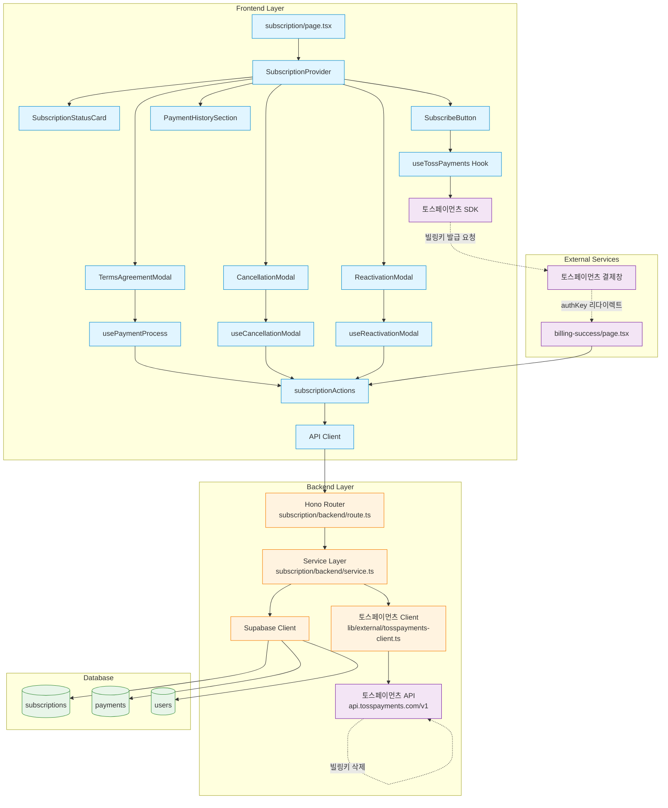

# 구독 관리 페이지 (Subscription) 구현 계획

## 개요

구독 관리 페이지(`/subscription`)는 Pro 구독 신청, 해지, 재활성화, 결제 정보 변경 등 구독 관련 모든 기능을 제공하는 복잡한 페이지입니다. 토스페이먼츠 SDK와 API를 통합하여 빌링키 기반 정기결제 시스템을 구현합니다.

### 주요 기능
- Pro 구독 신청 (토스페이먼츠 SDK 결제창 연동)
- 구독 상태 조회 및 표시
- 구독 해지 및 재활성화
- 결제 정보 변경
- 결제 내역 조회

### 관련 Use Cases
- [UC-002] Pro 구독 신청 (`/docs/usecases/002/spec.md`)
- [UC-006] Pro 구독 해지 (`/docs/usecases/006/spec.md`)

### 외부 서비스 연동
- **토스페이먼츠 SDK** (`@tosspayments/tosspayments-sdk`): 결제창 UI 및 빌링키 발급 authKey 수신
- **토스페이먼츠 API** (`https://api.tosspayments.com/v1`): 빌링키 발급, 자동결제, 빌링키 삭제

---

## 모듈 구조

### Frontend 모듈

#### 1. Context & State Management
- **위치**: `src/features/subscription/context/SubscriptionContext.tsx`
- **설명**: Context + useReducer를 사용한 복잡한 상태 관리 (Level 3)
- **상태**: 구독 정보, 결제 프로세스, 약관 동의, 모달, SDK, 로딩, 에러

#### 2. Hooks
- **위치**: `src/features/subscription/hooks/`
- **파일**:
  - `useSubscriptionContext.ts`: Context 접근 hook
  - `useSubscriptionQuery.ts`: React Query를 통한 구독 정보 조회
  - `usePaymentProcess.ts`: 결제 프로세스 관리
  - `useCancellationModal.ts`: 해지 모달 관리
  - `useReactivationModal.ts`: 재활성화 모달 관리
  - `useTossPayments.ts`: 토스페이먼츠 SDK 로딩 및 초기화

#### 3. Components
- **위치**: `src/features/subscription/components/`
- **파일**:
  - `SubscriptionStatusCard.tsx`: 구독 상태 카드 (뱃지, 다음 결제일, 카드 정보)
  - `SubscribeButton.tsx`: Pro 구독 시작 버튼
  - `TermsAgreementModal.tsx`: 약관 동의 모달
  - `CancellationModal.tsx`: 구독 해지 모달 (사유 선택, 최종 확인)
  - `ReactivationModal.tsx`: 구독 재활성화 모달
  - `PaymentHistorySection.tsx`: 결제 내역 섹션
  - `ChangeCardModal.tsx`: 결제 정보 변경 모달
  - `SubscriptionSkeleton.tsx`: 로딩 스켈레톤 UI

#### 4. Actions
- **위치**: `src/features/subscription/actions/`
- **파일**:
  - `subscriptionActions.ts`: 비동기 액션 함수들 (결제 처리, 구독 해지, 재활성화)

#### 5. Types & Constants
- **위치**: `src/features/subscription/lib/`
- **파일**:
  - `dto.ts`: Backend schema 재노출
  - `types.ts`: Frontend 전용 타입
  - `constants.ts`: 상수 (구독 가격, 해지 사유 옵션 등)

### Backend 모듈

#### 6. Hono Routes
- **위치**: `src/features/subscription/backend/route.ts`
- **엔드포인트**:
  - `GET /api/subscription`: 현재 구독 상태 조회
  - `POST /api/subscription/billing-key`: 빌링키 발급 및 초회 결제
  - `DELETE /api/subscription/cancel`: 구독 해지
  - `POST /api/subscription/reactivate`: 구독 재활성화
  - `POST /api/subscription/change-card`: 결제 정보 변경
  - `GET /api/subscription/payments`: 결제 내역 조회

#### 7. Service Layer
- **위치**: `src/features/subscription/backend/service.ts`
- **함수**:
  - `getSubscriptionByUserId()`: 사용자 구독 정보 조회
  - `issueBillingKey()`: 토스페이먼츠 빌링키 발급
  - `executeInitialPayment()`: 초회 결제 실행
  - `createSubscription()`: 구독 정보 생성 (트랜잭션)
  - `cancelSubscription()`: 구독 해지 (빌링키 삭제 + DB 업데이트)
  - `reactivateSubscription()`: 구독 재활성화
  - `changePaymentCard()`: 결제 카드 변경
  - `getPaymentHistory()`: 결제 내역 조회

#### 8. Schemas (Zod)
- **위치**: `src/features/subscription/backend/schema.ts`
- **스키마**:
  - `BillingKeyRequestSchema`: 빌링키 발급 요청
  - `CancellationRequestSchema`: 해지 요청
  - `ReactivationRequestSchema`: 재활성화 요청
  - `SubscriptionResponseSchema`: 구독 정보 응답
  - `PaymentHistoryResponseSchema`: 결제 내역 응답

#### 9. Error Codes
- **위치**: `src/features/subscription/backend/error.ts`
- **에러 코드**:
  - `ALREADY_SUBSCRIBED`: 이미 구독 중
  - `SUBSCRIPTION_NOT_FOUND`: 구독 없음
  - `BILLING_KEY_ISSUE_FAILED`: 빌링키 발급 실패
  - `INITIAL_PAYMENT_FAILED`: 초회 결제 실패
  - `PAYMENT_SERVICE_ERROR`: 토스페이먼츠 연동 오류
  - `ALREADY_CANCELLED`: 이미 해지됨
  - `UNAUTHORIZED`: 인증 실패

### 외부 서비스 통합 모듈

#### 10. 토스페이먼츠 클라이언트
- **위치**: `src/lib/external/tosspayments-client.ts`
- **설명**: 토스페이먼츠 API 호출을 캡슐화한 클라이언트 모듈
- **함수**:
  - `issueBillingKeyAPI()`: POST /v1/billing/authorizations/issue
  - `executePaymentAPI()`: POST /v1/billing/{billingKey}
  - `deleteBillingKeyAPI()`: DELETE /v1/billing/authorizations/billing-key/{billingKey}
  - `cancelPaymentAPI()`: POST /v1/payments/{paymentKey}/cancel
- **기능**:
  - Secret Key Base64 인코딩
  - 에러 처리 및 재시도 로직 (3회, exponential backoff)
  - 타임아웃 설정 (10초)

### 공통 모듈

#### 11. API Client 확장
- **위치**: `src/lib/remote/api-client.ts`
- **설명**: 기존 API 클라이언트에 토스페이먼츠 관련 타임아웃 설정 추가

#### 12. 환경 변수 타입
- **위치**: `src/backend/config/env.ts`
- **추가 변수**:
  - `NEXT_PUBLIC_TOSS_CLIENT_KEY`: 토스페이먼츠 클라이언트 키
  - `TOSS_SECRET_KEY`: 토스페이먼츠 시크릿 키 (서버 전용)

### Pages

#### 13. 구독 관리 메인 페이지
- **위치**: `src/app/subscription/page.tsx`
- **설명**: SubscriptionProvider로 감싸진 메인 페이지

#### 14. 빌링키 발급 성공 페이지
- **위치**: `src/app/subscription/billing-success/page.tsx`
- **설명**: 토스페이먼츠 successUrl로 리다이렉트되는 페이지, authKey 수신 및 결제 처리

#### 15. 빌링키 발급 실패 페이지
- **위치**: `src/app/subscription/billing-fail/page.tsx`
- **설명**: 토스페이먼츠 failUrl로 리다이렉트되는 페이지, 에러 메시지 표시

#### 16. 구독 완료 페이지
- **위치**: `src/app/subscription/success/page.tsx`
- **설명**: 구독 성공 메시지 및 다음 단계 안내

---

## 모듈 관계도 (Mermaid Diagram)



---

## 구현 계획

### Phase 1: 기본 인프라 구축

#### Task 1.1: 환경 변수 설정
- `src/backend/config/env.ts`에 토스페이먼츠 키 추가
- `.env.local` 예시:
  ```env
  NEXT_PUBLIC_TOSS_CLIENT_KEY=test_ck_...
  TOSS_SECRET_KEY=test_sk_...
  ```

#### Task 1.2: 토스페이먼츠 SDK 설치
```bash
npm install @tosspayments/tosspayments-sdk --save
```

#### Task 1.3: 토스페이먼츠 클라이언트 모듈 생성
- **파일**: `src/lib/external/tosspayments-client.ts`
- **구현 내용**:
  ```typescript
  import { z } from 'zod';

  const BASE_URL = 'https://api.tosspayments.com/v1';
  const TIMEOUT = 10000; // 10초
  const MAX_RETRIES = 3;

  // 응답 스키마
  const BillingKeyResponseSchema = z.object({
    billingKey: z.string(),
    customerKey: z.string(),
    method: z.string(),
    card: z.object({
      issuerCode: z.string(),
      number: z.string(),
      cardType: z.string(),
    }),
  });

  const PaymentResponseSchema = z.object({
    paymentKey: z.string(),
    orderId: z.string(),
    status: z.string(),
    approvedAt: z.string(),
    totalAmount: z.number(),
  });

  // 에러 타입
  export class TossPaymentsError extends Error {
    constructor(
      public code: string,
      message: string,
      public statusCode?: number,
    ) {
      super(message);
      this.name = 'TossPaymentsError';
    }
  }

  // Base64 인코딩 헬퍼
  function encodeSecretKey(secretKey: string): string {
    return Buffer.from(secretKey + ':').toString('base64');
  }

  // 재시도 로직
  async function fetchWithRetry(
    url: string,
    options: RequestInit,
    retries = MAX_RETRIES,
  ): Promise<Response> {
    for (let i = 0; i < retries; i++) {
      try {
        const response = await fetch(url, {
          ...options,
          signal: AbortSignal.timeout(TIMEOUT),
        });

        if (response.ok || response.status < 500) {
          return response;
        }

        if (i === retries - 1) throw new Error('Max retries exceeded');

        // Exponential backoff: 1s, 2s, 4s
        await new Promise(resolve => setTimeout(resolve, 1000 * Math.pow(2, i)));
      } catch (error) {
        if (i === retries - 1) throw error;
      }
    }
    throw new Error('Retry failed');
  }

  // 빌링키 발급
  export async function issueBillingKeyAPI(
    authKey: string,
    customerKey: string,
    secretKey: string,
  ) {
    const encodedKey = encodeSecretKey(secretKey);

    const response = await fetchWithRetry(
      `${BASE_URL}/billing/authorizations/issue`,
      {
        method: 'POST',
        headers: {
          'Authorization': `Basic ${encodedKey}`,
          'Content-Type': 'application/json',
        },
        body: JSON.stringify({ authKey, customerKey }),
      },
    );

    const data = await response.json();

    if (!response.ok) {
      throw new TossPaymentsError(
        data.code || 'BILLING_KEY_ISSUE_FAILED',
        data.message || 'Failed to issue billing key',
        response.status,
      );
    }

    return BillingKeyResponseSchema.parse(data);
  }

  // 자동결제 실행
  export async function executePaymentAPI(
    billingKey: string,
    payment: {
      customerKey: string;
      amount: number;
      orderId: string;
      orderName: string;
      customerEmail: string;
      customerName: string;
    },
    secretKey: string,
  ) {
    const encodedKey = encodeSecretKey(secretKey);

    const response = await fetchWithRetry(
      `${BASE_URL}/billing/${billingKey}`,
      {
        method: 'POST',
        headers: {
          'Authorization': `Basic ${encodedKey}`,
          'Content-Type': 'application/json',
        },
        body: JSON.stringify(payment),
      },
    );

    const data = await response.json();

    if (!response.ok) {
      throw new TossPaymentsError(
        data.code || 'PAYMENT_FAILED',
        data.message || 'Payment execution failed',
        response.status,
      );
    }

    return PaymentResponseSchema.parse(data);
  }

  // 빌링키 삭제
  export async function deleteBillingKeyAPI(
    billingKey: string,
    secretKey: string,
  ) {
    const encodedKey = encodeSecretKey(secretKey);

    const response = await fetchWithRetry(
      `${BASE_URL}/billing/authorizations/billing-key/${billingKey}`,
      {
        method: 'DELETE',
        headers: {
          'Authorization': `Basic ${encodedKey}`,
        },
      },
    );

    if (!response.ok && response.status !== 204) {
      const data = await response.json();
      throw new TossPaymentsError(
        data.code || 'BILLING_KEY_DELETE_FAILED',
        data.message || 'Failed to delete billing key',
        response.status,
      );
    }

    return { success: true };
  }

  // 결제 취소
  export async function cancelPaymentAPI(
    paymentKey: string,
    cancelReason: string,
    secretKey: string,
  ) {
    const encodedKey = encodeSecretKey(secretKey);

    const response = await fetchWithRetry(
      `${BASE_URL}/payments/${paymentKey}/cancel`,
      {
        method: 'POST',
        headers: {
          'Authorization': `Basic ${encodedKey}`,
          'Content-Type': 'application/json',
        },
        body: JSON.stringify({ cancelReason }),
      },
    );

    const data = await response.json();

    if (!response.ok) {
      throw new TossPaymentsError(
        data.code || 'CANCEL_FAILED',
        data.message || 'Payment cancellation failed',
        response.status,
      );
    }

    return data;
  }
  ```

**Unit Test (토스페이먼츠 클라이언트)**:
```typescript
// src/lib/external/__tests__/tosspayments-client.test.ts
describe('TossPayments Client', () => {
  it('should encode secret key correctly', () => {
    const encoded = encodeSecretKey('test_sk_123');
    expect(encoded).toBe(Buffer.from('test_sk_123:').toString('base64'));
  });

  it('should issue billing key successfully', async () => {
    // Mock fetch
    global.fetch = jest.fn().mockResolvedValue({
      ok: true,
      json: async () => ({
        billingKey: 'bil_123',
        customerKey: 'cus_123',
        method: '카드',
        card: { issuerCode: '61', number: '1234****5678', cardType: '신용' },
      }),
    });

    const result = await issueBillingKeyAPI('auth_123', 'cus_123', 'test_sk');
    expect(result.billingKey).toBe('bil_123');
  });

  it('should retry on 5xx errors', async () => {
    let attempts = 0;
    global.fetch = jest.fn().mockImplementation(() => {
      attempts++;
      if (attempts < 3) {
        return Promise.resolve({ ok: false, status: 500 });
      }
      return Promise.resolve({
        ok: true,
        json: async () => ({ billingKey: 'bil_123' }),
      });
    });

    await issueBillingKeyAPI('auth_123', 'cus_123', 'test_sk');
    expect(attempts).toBe(3);
  });

  it('should throw TossPaymentsError on 4xx errors', async () => {
    global.fetch = jest.fn().mockResolvedValue({
      ok: false,
      status: 400,
      json: async () => ({ code: 'INVALID_AUTH_KEY', message: 'Invalid authKey' }),
    });

    await expect(
      issueBillingKeyAPI('invalid', 'cus_123', 'test_sk')
    ).rejects.toThrow(TossPaymentsError);
  });
});
```

---

### Phase 2: Backend API 구현

#### Task 2.1: Zod Schema 정의
- **파일**: `src/features/subscription/backend/schema.ts`
- **내용**:
  ```typescript
  import { z } from 'zod';

  // 요청 스키마
  export const BillingKeyRequestSchema = z.object({
    authKey: z.string().min(1),
    customerKey: z.string().min(1),
  });

  export const CancellationRequestSchema = z.object({
    cancellation_reason: z.string().optional(),
    feedback: z.string().max(500).optional(),
  });

  export const ReactivationRequestSchema = z.object({
    option: z.enum(['existing_card', 'new_card']),
    authKey: z.string().optional(),
  });

  // 응답 스키마
  export const SubscriptionResponseSchema = z.object({
    subscription_id: z.string().uuid().nullable(),
    subscription_tier: z.enum(['free', 'pro']),
    subscription_status: z.enum(['active', 'pending_cancellation', 'cancelled', 'suspended']).nullable(),
    next_payment_date: z.string().nullable(),
    effective_until: z.string().nullable(),
    card_last_4digits: z.string().nullable(),
    card_type: z.string().nullable(),
    price: z.number(),
    auto_renewal: z.boolean(),
    monthly_analysis_count: z.number(),
    remaining_days: z.number().nullable(),
  });

  export const PaymentHistoryItemSchema = z.object({
    id: z.string().uuid(),
    order_id: z.string(),
    amount: z.number(),
    payment_method: z.string().nullable(),
    payment_status: z.string(),
    payment_type: z.string(),
    approved_at: z.string().nullable(),
    created_at: z.string(),
  });

  export const PaymentHistoryResponseSchema = z.object({
    payments: z.array(PaymentHistoryItemSchema),
    total_count: z.number(),
  });

  // DB Row 스키마
  export const SubscriptionRowSchema = z.object({
    id: z.string().uuid(),
    user_id: z.string().uuid(),
    billing_key: z.string().nullable(),
    card_last_4digits: z.string().nullable(),
    card_type: z.string().nullable(),
    subscription_status: z.string(),
    next_payment_date: z.string().nullable(),
    auto_renewal: z.boolean(),
    price: z.number(),
    cancelled_at: z.string().nullable(),
    effective_until: z.string().nullable(),
    created_at: z.string(),
    updated_at: z.string(),
  });

  export type BillingKeyRequest = z.infer<typeof BillingKeyRequestSchema>;
  export type CancellationRequest = z.infer<typeof CancellationRequestSchema>;
  export type ReactivationRequest = z.infer<typeof ReactivationRequestSchema>;
  export type SubscriptionResponse = z.infer<typeof SubscriptionResponseSchema>;
  export type PaymentHistoryResponse = z.infer<typeof PaymentHistoryResponseSchema>;
  export type SubscriptionRow = z.infer<typeof SubscriptionRowSchema>;
  ```

#### Task 2.2: Error Codes 정의
- **파일**: `src/features/subscription/backend/error.ts`
- **내용**:
  ```typescript
  export const subscriptionErrorCodes = {
    alreadySubscribed: 'ALREADY_SUBSCRIBED',
    subscriptionNotFound: 'SUBSCRIPTION_NOT_FOUND',
    billingKeyIssueFailed: 'BILLING_KEY_ISSUE_FAILED',
    initialPaymentFailed: 'INITIAL_PAYMENT_FAILED',
    paymentServiceError: 'PAYMENT_SERVICE_ERROR',
    alreadyCancelled: 'ALREADY_CANCELLED',
    unauthorized: 'UNAUTHORIZED',
    validationError: 'VALIDATION_ERROR',
    databaseError: 'DATABASE_ERROR',
  } as const;

  export type SubscriptionServiceError = typeof subscriptionErrorCodes[keyof typeof subscriptionErrorCodes];
  ```

#### Task 2.3: Service Layer 구현
- **파일**: `src/features/subscription/backend/service.ts`
- **주요 함수**:
  1. `getSubscriptionByUserId()`: 사용자 구독 조회
  2. `createSubscriptionWithPayment()`: 구독 생성 + 초회 결제 (트랜잭션)
  3. `cancelSubscriptionService()`: 구독 해지 (빌링키 삭제 + DB 업데이트)
  4. `reactivateSubscriptionService()`: 구독 재활성화
  5. `changePaymentCardService()`: 결제 카드 변경
  6. `getPaymentHistoryService()`: 결제 내역 조회

**구현 예시** (createSubscriptionWithPayment):
```typescript
import { SupabaseClient } from '@supabase/supabase-js';
import { success, failure, type HandlerResult } from '@/backend/http/response';
import { issueBillingKeyAPI, executePaymentAPI } from '@/lib/external/tosspayments-client';
import type { SubscriptionResponse } from './schema';
import { subscriptionErrorCodes, type SubscriptionServiceError } from './error';

const SUBSCRIPTION_PRICE = 9900;

export async function createSubscriptionWithPayment(
  client: SupabaseClient,
  userId: string,
  clerkUserId: string,
  authKey: string,
  secretKey: string,
  userEmail: string,
  userName: string,
): Promise<HandlerResult<SubscriptionResponse, SubscriptionServiceError, unknown>> {
  // 1. 기존 구독 확인
  const { data: existingSub } = await client
    .from('subscriptions')
    .select('id')
    .eq('user_id', userId)
    .eq('subscription_status', 'active')
    .maybeSingle();

  if (existingSub) {
    return failure(400, subscriptionErrorCodes.alreadySubscribed, '이미 Pro 구독 중입니다');
  }

  try {
    // 2. 빌링키 발급
    const billingKeyResult = await issueBillingKeyAPI(authKey, clerkUserId, secretKey);
    const { billingKey, card } = billingKeyResult;

    // 3. 초회 결제 실행
    const orderId = `SUB_${userId}_${Date.now()}`;
    const paymentResult = await executePaymentAPI(
      billingKey,
      {
        customerKey: clerkUserId,
        amount: SUBSCRIPTION_PRICE,
        orderId,
        orderName: 'Pro 요금제 월 구독료',
        customerEmail: userEmail,
        customerName: userName,
      },
      secretKey,
    );

    // 4. 트랜잭션 시작
    const { data, error } = await client.rpc('create_subscription_transaction', {
      p_user_id: userId,
      p_billing_key: billingKey,
      p_card_last_4digits: card.number.slice(-4),
      p_card_type: card.cardType,
      p_price: SUBSCRIPTION_PRICE,
      p_order_id: orderId,
      p_payment_key: paymentResult.paymentKey,
      p_approved_at: paymentResult.approvedAt,
    });

    if (error) {
      // 트랜잭션 실패 시 빌링키 삭제 (정리)
      await deleteBillingKeyAPI(billingKey, secretKey).catch(() => {});
      return failure(500, subscriptionErrorCodes.databaseError, error.message);
    }

    // 5. 성공 응답
    return success({
      subscription_id: data.subscription_id,
      subscription_tier: 'pro',
      subscription_status: 'active',
      next_payment_date: data.next_payment_date,
      effective_until: null,
      card_last_4digits: card.number.slice(-4),
      card_type: card.cardType,
      price: SUBSCRIPTION_PRICE,
      auto_renewal: true,
      monthly_analysis_count: 10,
      remaining_days: null,
    });

  } catch (error: any) {
    if (error.name === 'TossPaymentsError') {
      if (error.code === 'PAYMENT_FAILED') {
        return failure(400, subscriptionErrorCodes.initialPaymentFailed, error.message);
      }
      return failure(500, subscriptionErrorCodes.billingKeyIssueFailed, error.message);
    }
    return failure(500, subscriptionErrorCodes.paymentServiceError, '결제 처리 중 오류가 발생했습니다');
  }
}
```

**Supabase RPC 함수** (create_subscription_transaction):
```sql
-- supabase/migrations/0007_create_subscription_transaction.sql
CREATE OR REPLACE FUNCTION create_subscription_transaction(
  p_user_id UUID,
  p_billing_key TEXT,
  p_card_last_4digits VARCHAR(4),
  p_card_type VARCHAR(20),
  p_price INTEGER,
  p_order_id VARCHAR(100),
  p_payment_key VARCHAR(200),
  p_approved_at TIMESTAMPTZ
) RETURNS TABLE(subscription_id UUID, next_payment_date DATE) AS $$
DECLARE
  v_subscription_id UUID;
  v_next_payment_date DATE;
BEGIN
  -- 구독 생성
  INSERT INTO subscriptions (
    user_id,
    billing_key,
    card_last_4digits,
    card_type,
    subscription_status,
    next_payment_date,
    auto_renewal,
    price
  ) VALUES (
    p_user_id,
    p_billing_key,
    p_card_last_4digits,
    p_card_type,
    'active',
    CURRENT_DATE + INTERVAL '1 month',
    true,
    p_price
  ) RETURNING id, next_payment_date INTO v_subscription_id, v_next_payment_date;

  -- 사용자 정보 업데이트
  UPDATE users
  SET subscription_tier = 'pro',
      monthly_analysis_count = 10,
      updated_at = NOW()
  WHERE id = p_user_id;

  -- 결제 내역 저장
  INSERT INTO payments (
    user_id,
    subscription_id,
    order_id,
    payment_key,
    amount,
    payment_method,
    payment_status,
    payment_type,
    approved_at
  ) VALUES (
    p_user_id,
    v_subscription_id,
    p_order_id,
    p_payment_key,
    p_price,
    '카드',
    'completed',
    'subscription',
    p_approved_at
  );

  RETURN QUERY SELECT v_subscription_id, v_next_payment_date;
END;
$$ LANGUAGE plpgsql;
```

**Unit Test (Service Layer)**:
```typescript
describe('createSubscriptionWithPayment', () => {
  it('should create subscription successfully', async () => {
    const mockSupabase = {
      from: jest.fn().mockReturnThis(),
      select: jest.fn().mockReturnThis(),
      eq: jest.fn().mockReturnThis(),
      maybeSingle: jest.fn().mockResolvedValue({ data: null, error: null }),
      rpc: jest.fn().mockResolvedValue({
        data: { subscription_id: 'sub_123', next_payment_date: '2025-11-27' },
        error: null,
      }),
    };

    jest.spyOn(tossPayments, 'issueBillingKeyAPI').mockResolvedValue({
      billingKey: 'bil_123',
      card: { number: '1234****5678', cardType: '신용' },
    });

    jest.spyOn(tossPayments, 'executePaymentAPI').mockResolvedValue({
      paymentKey: 'pay_123',
      approvedAt: '2025-10-27T10:00:00+09:00',
    });

    const result = await createSubscriptionWithPayment(
      mockSupabase as any,
      'user_123',
      'clerk_123',
      'auth_123',
      'secret_key',
      'test@example.com',
      'Test User',
    );

    expect(result.ok).toBe(true);
    expect(result.data.subscription_status).toBe('active');
  });

  it('should return ALREADY_SUBSCRIBED if user has active subscription', async () => {
    const mockSupabase = {
      from: jest.fn().mockReturnThis(),
      select: jest.fn().mockReturnThis(),
      eq: jest.fn().mockReturnThis(),
      maybeSingle: jest.fn().mockResolvedValue({ data: { id: 'sub_123' }, error: null }),
    };

    const result = await createSubscriptionWithPayment(
      mockSupabase as any,
      'user_123',
      'clerk_123',
      'auth_123',
      'secret_key',
      'test@example.com',
      'Test User',
    );

    expect(result.ok).toBe(false);
    expect(result.error.code).toBe('ALREADY_SUBSCRIBED');
  });
});
```

#### Task 2.4: Hono Routes 구현
- **파일**: `src/features/subscription/backend/route.ts`
- **엔드포인트 구현**:

```typescript
import type { Hono } from 'hono';
import { respond, failure } from '@/backend/http/response';
import { getSupabase, getLogger, type AppEnv } from '@/backend/hono/context';
import {
  BillingKeyRequestSchema,
  CancellationRequestSchema,
  SubscriptionResponseSchema,
} from './schema';
import {
  createSubscriptionWithPayment,
  getSubscriptionByUserId,
  cancelSubscriptionService,
  getPaymentHistoryService,
} from './service';
import { subscriptionErrorCodes } from './error';

export const registerSubscriptionRoutes = (app: Hono<AppEnv>) => {
  // GET /api/subscription - 구독 상태 조회
  app.get('/subscription', async (c) => {
    const supabase = getSupabase(c);
    const logger = getLogger(c);

    // ✅ Clerk v6: auth()는 비동기 함수이므로 await 필수
    // Clerk JWT 미들웨어에서 이미 추출된 userId 사용
    // 미들웨어 구현 예시:
    // import { auth } from '@clerk/nextjs/server';
    // const { userId } = await auth();
    // c.set('userId', userId);
    const userId = c.get('userId');

    const result = await getSubscriptionByUserId(supabase, userId);

    if (!result.ok) {
      logger.error('Failed to fetch subscription', result.error);
    }

    return respond(c, result);
  });

  // POST /api/subscription/billing-key - 빌링키 발급 및 초회 결제
  app.post('/subscription/billing-key', async (c) => {
    const body = await c.req.json();
    const parsedBody = BillingKeyRequestSchema.safeParse(body);

    if (!parsedBody.success) {
      return respond(
        c,
        failure(
          400,
          subscriptionErrorCodes.validationError,
          'Invalid request body',
          parsedBody.error.format(),
        ),
      );
    }

    const supabase = getSupabase(c);
    const logger = getLogger(c);
    const config = c.get('config');

    // ✅ Clerk v6: Clerk JWT 미들웨어에서 이미 추출된 정보 사용
    const userId = c.get('userId');
    const clerkUserId = c.get('clerkUserId');
    const userEmail = c.get('userEmail');
    const userName = c.get('userName');

    const result = await createSubscriptionWithPayment(
      supabase,
      userId,
      clerkUserId,
      parsedBody.data.authKey,
      config.TOSS_SECRET_KEY,
      userEmail,
      userName,
    );

    if (!result.ok) {
      logger.error('Failed to create subscription', result.error);
    }

    return respond(c, result);
  });

  // DELETE /api/subscription/cancel - 구독 해지
  app.delete('/subscription/cancel', async (c) => {
    const body = await c.req.json();
    const parsedBody = CancellationRequestSchema.safeParse(body);

    if (!parsedBody.success) {
      return respond(
        c,
        failure(400, subscriptionErrorCodes.validationError, 'Invalid request body'),
      );
    }

    const supabase = getSupabase(c);
    const logger = getLogger(c);
    const config = c.get('config');
    const userId = c.get('userId');

    const result = await cancelSubscriptionService(
      supabase,
      userId,
      parsedBody.data.cancellation_reason,
      parsedBody.data.feedback,
      config.TOSS_SECRET_KEY,
    );

    if (!result.ok) {
      logger.error('Failed to cancel subscription', result.error);
    }

    return respond(c, result);
  });

  // GET /api/subscription/payments - 결제 내역 조회
  app.get('/subscription/payments', async (c) => {
    const supabase = getSupabase(c);
    const userId = c.get('userId');

    const result = await getPaymentHistoryService(supabase, userId);

    return respond(c, result);
  });
};
```

---

### Phase 3: Frontend State Management

#### Task 3.1: Context & Reducer 구현
- **파일**: `src/features/subscription/context/SubscriptionContext.tsx`
- **참고**: `/docs/pages/subscription/state_management.md`의 Flux 패턴 구현
- **구현 내용**: 8개 상태 관리, 25개 Action 처리

(상태 관리 문서에 이미 상세히 정의되어 있으므로 생략, 문서 참조)

#### Task 3.2: Custom Hooks 구현
- **파일**: `src/features/subscription/hooks/`
- **Hooks**:
  1. `useSubscriptionContext.ts`: Context 접근
  2. `useSubscription.ts`: 구독 정보만 구독
  3. `usePaymentProcess.ts`: 결제 프로세스 관리
  4. `useCancellationModal.ts`: 해지 모달 관리
  5. `useReactivationModal.ts`: 재활성화 모달 관리
  6. `useTossPayments.ts`: SDK 로딩

#### Task 3.3: Actions 구현
- **파일**: `src/features/subscription/actions/subscriptionActions.ts`
- **함수**:
  - `processPayment()`: 결제 처리
  - `cancelSubscription()`: 구독 해지
  - `reactivateSubscription()`: 구독 재활성화

---

### Phase 4: Frontend Components

#### Task 4.1: 메인 컴포넌트들
1. `SubscriptionStatusCard.tsx`: 구독 상태 카드
2. `SubscribeButton.tsx`: 구독 시작 버튼
3. `TermsAgreementModal.tsx`: 약관 동의 모달
4. `CancellationModal.tsx`: 해지 모달
5. `ReactivationModal.tsx`: 재활성화 모달
6. `PaymentHistorySection.tsx`: 결제 내역
7. `SubscriptionSkeleton.tsx`: 로딩 UI

**QA Sheet (SubscriptionStatusCard)**:
- [ ] Free 회원일 때 "Pro 구독하기" 버튼이 표시되는가?
- [ ] Pro 활성 회원일 때 다음 결제일, 카드 정보가 올바르게 표시되는가?
- [ ] 해지 예정 상태일 때 "해지 예정" 뱃지와 혜택 종료일이 표시되는가?
- [ ] 구독 해지 버튼 클릭 시 CancellationModal이 열리는가?
- [ ] 로딩 중일 때 스켈레톤 UI가 표시되는가?

**QA Sheet (TermsAgreementModal)**:
- [ ] 모든 약관 동의 시에만 "결제하기" 버튼이 활성화되는가?
- [ ] "결제하기" 버튼 클릭 시 토스페이먼츠 SDK가 로드되는가?
- [ ] SDK 로딩 중일 때 "결제 준비 중..." 메시지가 표시되는가?
- [ ] SDK 로딩 실패 시 에러 메시지가 표시되는가?
- [ ] requestBillingAuth() 호출 후 토스페이먼츠 결제창이 열리는가?

**QA Sheet (CancellationModal)**:
- [ ] 해지 사유 선택은 선택사항인가?
- [ ] "다음" 버튼 클릭 시 최종 확인 화면으로 전환되는가?
- [ ] 최종 확인 화면에서 혜택 종료일이 올바르게 표시되는가?
- [ ] "해지하기" 버튼 클릭 시 버튼이 비활성화되고 로딩 상태가 표시되는가?
- [ ] 해지 성공 시 모달이 자동으로 닫히고 성공 메시지가 표시되는가?
- [ ] 해지 실패 시 에러 메시지가 표시되고 재시도가 가능한가?

#### Task 4.2: Pages 구현
1. `src/app/subscription/page.tsx`: 메인 페이지
2. `src/app/subscription/billing-success/page.tsx`: 빌링키 발급 성공
3. `src/app/subscription/billing-fail/page.tsx`: 빌링키 발급 실패
4. `src/app/subscription/success/page.tsx`: 구독 완료

**구현 예시 (billing-success/page.tsx)**:
```typescript
'use client';

import { useEffect } from 'react';
import { useRouter, useSearchParams } from 'next/navigation';
import { useSubscriptionContext } from '@/features/subscription/hooks/useSubscriptionContext';
import { processPayment } from '@/features/subscription/actions/subscriptionActions';

export default function BillingSuccessPage() {
  const router = useRouter();
  const searchParams = useSearchParams();
  const { dispatch } = useSubscriptionContext();

  useEffect(() => {
    const authKey = searchParams.get('authKey');
    const customerKey = searchParams.get('customerKey');

    if (!authKey || !customerKey) {
      router.push('/subscription/billing-fail?code=MISSING_PARAMS');
      return;
    }

    processPayment(dispatch, authKey, customerKey).then((result) => {
      if (result.success) {
        router.push('/subscription/success');
      } else {
        router.push(`/subscription/billing-fail?code=${result.error.code}`);
      }
    });
  }, [searchParams, dispatch, router]);

  return (
    <div className="flex items-center justify-center min-h-screen">
      <div className="text-center">
        <div className="animate-spin rounded-full h-12 w-12 border-b-2 border-gray-900 mx-auto mb-4" />
        <p className="text-lg font-medium">결제 처리 중...</p>
        <p className="text-sm text-gray-500 mt-2">잠시만 기다려주세요</p>
      </div>
    </div>
  );
}
```

---

### Phase 5: Integration & Testing

#### Task 5.1: Hono App에 라우터 등록
- **파일**: `src/backend/hono/app.ts`
- **수정**:
  ```typescript
  import { registerSubscriptionRoutes } from '@/features/subscription/backend/route';

  export function createHonoApp() {
    const app = new Hono<AppEnv>();

    // ... 기존 미들웨어

    registerExampleRoutes(app);
    registerSubscriptionRoutes(app); // 추가

    return app;
  }
  ```

#### Task 5.2: 통합 테스트
1. **빌링키 발급 플로우** (E2E):
   - [ ] "Pro 구독하기" 버튼 클릭 → 약관 동의 모달 오픈
   - [ ] 모든 약관 동의 → "결제하기" 버튼 활성화
   - [ ] "결제하기" 버튼 클릭 → 토스페이먼츠 결제창 오픈
   - [ ] 카드 정보 입력 → successUrl로 리다이렉트
   - [ ] authKey로 빌링키 발급 → 초회 결제 실행
   - [ ] 구독 정보 DB 저장 → success 페이지 이동

2. **구독 해지 플로우** (E2E):
   - [ ] "구독 해지" 버튼 클릭 → 해지 모달 오픈
   - [ ] 해지 사유 선택 → 최종 확인 화면
   - [ ] "해지하기" 버튼 클릭 → 빌링키 삭제 API 호출
   - [ ] DB 업데이트 → 구독 상태 "해지 예정"으로 변경
   - [ ] UI 업데이트 → "구독 재활성화" 버튼 표시

---

## 필요한 Shadcn-ui 컴포넌트

다음 컴포넌트들을 설치해야 합니다:

```bash
npx shadcn@latest add card
npx shadcn@latest add button
npx shadcn@latest add dialog
npx shadcn@latest add checkbox
npx shadcn@latest add radio-group
npx shadcn@latest add badge
npx shadcn@latest add table
npx shadcn@latest add skeleton
npx shadcn@latest add toast
```

---

## 환경 변수

`.env.local` 파일에 다음 환경 변수를 추가해야 합니다:

```env
# 토스페이먼츠 키
NEXT_PUBLIC_TOSS_CLIENT_KEY=test_ck_...
TOSS_SECRET_KEY=test_sk_...
```

---

## Database Migration

다음 마이그레이션 파일들이 필요합니다:

1. `supabase/migrations/0007_create_subscription_transaction.sql`: RPC 함수
2. `supabase/migrations/0008_create_cancel_subscription_function.sql`: 구독 해지 RPC 함수

---

## 보안 고려사항

1. **빌링키 보안**:
   - 빌링키는 절대 Frontend로 전달하지 않음
   - DB에 암호화 저장 권장 (AES-256)

2. **인증/인가**:
   - 모든 API는 Clerk JWT 토큰 검증 필수
   - customerKey가 JWT의 user_id와 일치하는지 Backend에서 검증

3. **PCI DSS 준수**:
   - 카드 정보는 토스페이먼츠에서만 관리
   - 카드 전체 번호는 DB에 저장 금지 (마지막 4자리만)

4. **Rate Limiting**:
   - 동일 사용자 분당 최대 5회 구독 요청 제한
   - 동일 사용자 분당 최대 3회 해지 요청 제한

---

## 성능 최적화

1. **React Query 캐싱**:
   - 구독 정보: 5분 캐시
   - 결제 내역: 10분 캐시
   - 구독 상태 변경 시 즉시 invalidate

2. **코드 스플리팅**:
   - 토스페이먼츠 SDK는 동적 import
   - 모달 컴포넌트들은 lazy loading

3. **메모이제이션**:
   - Derived state는 useMemo로 캐싱
   - 이벤트 핸들러는 useCallback으로 메모이제이션

---

## 모니터링 & 로깅

1. **결제 성공률 추적** (목표: 95% 이상)
2. **토스페이먼츠 API 응답 시간 로깅**
3. **구독 전환율** (Free → Pro) 추적
4. **해지율** (Churn Rate) 모니터링
5. **에러 발생 시 Slack/이메일 알람**

---

## 향후 확장 고려사항

1. **프로모션 코드**: `paymentProcess` 상태에 `promoCode` 필드 추가
2. **연간 구독**: `subscription_type: 'monthly' | 'yearly'` 추가
3. **구독 일시정지**: `subscription_status`에 'paused' 상태 추가
4. **가족 플랜**: 다중 사용자 구독 관리
5. **환불 기능**: 7일 이내 자동 환불 처리

---

## 구현 순서 요약

1. **Phase 1**: 토스페이먼츠 클라이언트 모듈 생성 (외부 서비스 연동)
2. **Phase 2**: Backend API 구현 (Service Layer, Routes, Schemas)
3. **Phase 3**: Frontend State Management (Context, Reducer, Actions)
4. **Phase 4**: Frontend Components (UI 컴포넌트, Pages)
5. **Phase 5**: Integration & Testing (E2E 테스트, 통합 테스트)

각 Phase는 순차적으로 진행하되, Phase 1과 Phase 2는 병렬로 진행 가능합니다.
