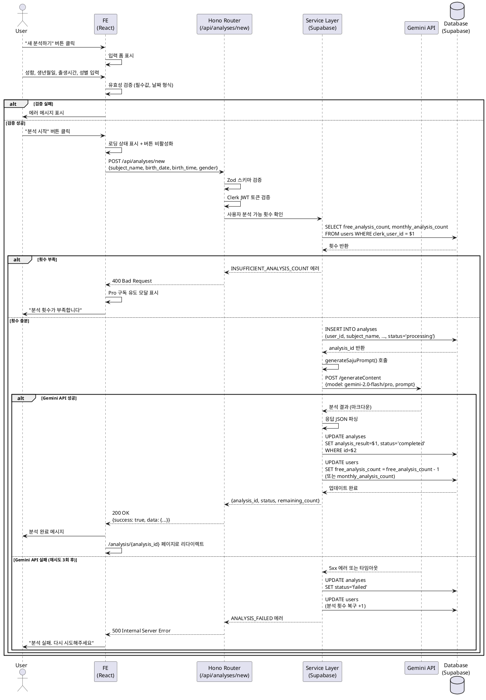

# Use Case: 새 사주 분석하기

## Primary Actor
로그인된 사용자 (무료 회원 또는 Pro 회원)

## Precondition
- 사용자가 Clerk를 통해 Google OAuth 로그인을 완료한 상태
- 무료 회원: `free_analysis_count > 0`
- Pro 회원: `monthly_analysis_count > 0`
- 사용자가 대시보드 또는 분석 목록 페이지에 접근 가능

## Trigger
사용자가 대시보드에서 "새 분석하기" 버튼을 클릭

## Main Scenario

### 1. 분석 입력 폼 진입
- 사용자가 "새 분석하기" 버튼 클릭
- 시스템이 `/analysis/new` 페이지로 이동
- 시스템이 사용자의 남은 분석 횟수를 화면에 표시

### 2. 분석 정보 입력
- 사용자가 다음 정보를 입력:
  - **성함** (필수, 텍스트 입력, 2-50자)
  - **생년월일** (필수, 날짜 선택기, 과거 날짜만 허용)
  - **출생시간** (선택, 시/분 드롭다운)
  - **성별** (필수, 라디오 버튼: 남성/여성)

### 3. 입력값 유효성 검증 (Frontend)
- 필수 필드 누락 여부 확인
- 생년월일이 미래 날짜가 아닌지 확인
- 성함 길이 제한 (2-50자) 확인
- 검증 실패 시 에러 메시지 표시

### 4. 분석 요청 전송 (POST /api/analyses/new)
- Frontend가 Hono Backend로 분석 요청 전송
- 요청 본문:
  ```json
  {
    "subject_name": "홍길동",
    "birth_date": "1990-01-15",
    "birth_time": "14:30",
    "gender": "male"
  }
  ```

### 5. 백엔드 요청 검증 (Hono Router)
- Zod 스키마로 요청 데이터 검증
- Supabase 서버 클라이언트로 사용자 인증 확인
- 사용자 분석 가능 횟수 확인:
  - 무료 회원: `users.free_analysis_count > 0`
  - Pro 회원: `users.monthly_analysis_count > 0`
- 횟수 부족 시 `400 Bad Request` 응답 (에러 코드: `INSUFFICIENT_ANALYSIS_COUNT`)

### 6. 분석 레코드 생성 (Service Layer)
- `analyses` 테이블에 새 레코드 INSERT:
  ```sql
  INSERT INTO analyses (
    user_id, subject_name, birth_date, birth_time, gender,
    ai_model, status
  ) VALUES (
    $1, $2, $3, $4, $5,
    'gemini-2.0-flash' (무료) 또는 'gemini-2.0-pro' (Pro),
    'processing'
  ) RETURNING id;
  ```

### 7. Gemini API 호출
- `generateSajuPrompt()` 함수로 프롬프트 생성:
  - 입력: 성함, 생년월일, 출생시간, 성별
  - 요구사항: 천간지지 계산, 오행 분석, 대운/세운 해석, 성격/재운/건강운/연애운 분석
- Gemini API 호출:
  - 무료 회원: `gemini-2.0-flash` 모델
  - Pro 회원: `gemini-2.0-pro` 모델
- 타임아웃: 30초

### 8. 분석 결과 저장
- Gemini API 응답을 JSON으로 파싱:
  ```json
  {
    "heavenly_stems": {...},
    "five_elements": {...},
    "fortune_flow": {...},
    "interpretation": {
      "personality": "...",
      "wealth": "...",
      "health": "...",
      "love": "..."
    }
  }
  ```
- `analyses` 테이블 UPDATE:
  ```sql
  UPDATE analyses
  SET analysis_result = $1,
      status = 'completed',
      updated_at = NOW()
  WHERE id = $2;
  ```

### 9. 분석 횟수 차감
- `users` 테이블 UPDATE:
  - 무료 회원: `free_analysis_count = free_analysis_count - 1`
  - Pro 회원: `monthly_analysis_count = monthly_analysis_count - 1`

### 10. 응답 반환
- 백엔드가 성공 응답 반환:
  ```json
  {
    "success": true,
    "data": {
      "analysis_id": "uuid",
      "status": "completed",
      "remaining_count": 2
    }
  }
  ```

### 11. 결과 페이지 이동
- Frontend가 `/analysis/{analysis_id}` 페이지로 자동 리다이렉트
- 분석 결과 상세 화면 표시

## Edge Cases

### 1. 분석 횟수 부족
- **상황**: 사용자의 분석 가능 횟수가 0인 경우
- **처리**:
  - 백엔드가 `400 Bad Request` 응답 (에러 코드: `INSUFFICIENT_ANALYSIS_COUNT`)
  - Frontend가 Pro 구독 유도 모달 표시
  - "Pro 구독하러 가기" 버튼 클릭 시 `/subscription` 페이지로 이동

### 2. Gemini API 호출 실패
- **상황**: Gemini API가 오류 응답을 반환하거나 타임아웃 발생
- **처리**:
  - 백엔드가 최대 3회 재시도 (exponential backoff)
  - 3회 실패 시 `analyses.status = 'failed'` 업데이트
  - 백엔드가 `500 Internal Server Error` 응답
  - 차감된 분석 횟수 복구 (`+1`)
  - Frontend가 에러 메시지 표시 및 재시도 버튼 제공

### 3. Gemini API 타임아웃 (30초 초과)
- **상황**: Gemini API 응답이 30초 내에 도착하지 않음
- **처리**:
  - 백그라운드 작업으로 전환 (분석 계속 진행)
  - Frontend에 "분석이 예상보다 오래 걸리고 있습니다" 메시지 표시
  - 대시보드로 리다이렉트, "분석 중" 상태 표시
  - 분석 완료 시 이메일 또는 앱 내 알림 발송

### 4. 중복 요청 방지
- **상황**: 사용자가 "분석 시작" 버튼을 여러 번 클릭
- **처리**:
  - Frontend가 첫 요청 후 버튼 비활성화
  - 백엔드가 동일 사용자의 `status = 'processing'` 분석 존재 여부 확인
  - 진행 중인 분석이 있으면 `409 Conflict` 응답
  - Frontend가 "이미 분석이 진행 중입니다" 메시지 표시

### 5. 부적절한 입력값 (욕설/비속어)
- **상황**: 사용자가 성함에 욕설이나 비속어를 입력
- **처리**:
  - 백엔드가 간단한 필터링 로직 적용 (선택적 구현)
  - 감지 시 `400 Bad Request` 응답 (에러 코드: `INAPPROPRIATE_INPUT`)
  - Frontend가 "적절한 이름을 입력해주세요" 메시지 표시

### 6. 네트워크 오류
- **상황**: 클라이언트와 서버 간 네트워크 연결 실패
- **처리**:
  - Frontend가 3회 재시도 (1초, 2초, 4초 간격)
  - 최종 실패 시 "네트워크 오류가 발생했습니다" 메시지 표시
  - 재시도 버튼 제공

### 7. 데이터베이스 오류
- **상황**: Supabase 연결 실패 또는 쿼리 오류
- **처리**:
  - 백엔드가 트랜잭션 롤백
  - `500 Internal Server Error` 응답
  - 에러 로깅 및 모니터링 시스템에 알림
  - Frontend가 "일시적 오류가 발생했습니다" 메시지 표시

### 8. 세션 만료
- **상황**: 사용자의 Clerk 세션이 만료된 상태에서 분석 요청
- **처리**:
  - 백엔드가 `401 Unauthorized` 응답
  - Frontend가 자동으로 로그인 페이지로 리다이렉트
  - 로그인 후 이전 입력값 복원 (localStorage 활용)

## Business Rules

### 분석 횟수 관리
- **무료 회원**: 가입 시 3회 제공, 소진 후 추가 불가
- **Pro 회원**: 월 10회 제공, 매월 1일 00:00(KST) 자동 초기화
- 미사용 횟수는 다음 달로 이월되지 않음
- 분석 실패 시 차감된 횟수 복구

### AI 모델 선택
- **무료 회원**: `gemini-2.0-flash` (빠른 응답, 기본 정확도)
- **Pro 회원**: `gemini-2.0-pro` (높은 정확도, 상세 분석)
- 구독 등급은 분석 요청 시점 기준으로 판단

### External Service Integration

#### Gemini API
- **엔드포인트**: Google AI Studio API
- **인증**: API Key 방식 (환경변수 `GEMINI_API_KEY`)
- **모델**:
  - 무료: `gemini-2.0-flash`
  - Pro: `gemini-2.0-pro`
- **프롬프트 생성**: `requirements.md`의 `generateSajuPrompt()` 참조
- **타임아웃**: 30초
- **재시도 정책**: 최대 3회, Exponential Backoff (1s, 2s, 4s)
- **Rate Limiting**: 분당 최대 5회 요청 (애플리케이션 레벨 제어)
- **응답 형식**: 마크다운 텍스트 → JSON 파싱 후 저장
- **에러 처리**:
  - 4xx 에러: 분석 실패 처리, 횟수 복구
  - 5xx 에러: 재시도 후 최종 실패 시 횟수 복구
  - 타임아웃: 백그라운드 처리 전환

### 데이터 저장
- 모든 분석 요청은 `analyses` 테이블에 기록됨
- `status` 필드:
  - `'processing'`: 분석 진행 중
  - `'completed'`: 분석 완료
  - `'failed'`: 분석 실패
- 분석 결과는 영구 보관 (사용자 탈퇴 시 CASCADE 삭제)

### 입력값 제약
- **성함**: 2-50자, 공백 포함 가능
- **생년월일**: 1900년 이후 ~ 오늘 날짜
- **출생시간**: 00:00 ~ 23:59 (선택)
- **성별**: 'male' 또는 'female'

### 보안 및 권한
- 모든 API 요청은 Clerk JWT 토큰 인증 필요
- 사용자는 본인의 분석 결과만 조회 가능 (user_id 검증)
- Rate Limiting: 동일 사용자 분당 최대 5회 요청

### 성능 및 모니터링
- Gemini API 응답 시간 로깅
- 분석 실패율 모니터링 (10% 이상 시 알람)
- 평균 분석 소요 시간: 5-15초 (목표)

## API Specification

### POST /api/analyses/new

**Request Headers:**
```
Authorization: Bearer {clerk_jwt_token}
Content-Type: application/json
```

**Request Body (Zod Schema):**
```typescript
{
  subject_name: string (min: 2, max: 50),
  birth_date: string (ISO 8601 date, 과거 날짜만),
  birth_time?: string (HH:mm 형식, optional),
  gender: 'male' | 'female'
}
```

**Success Response (200 OK):**
```json
{
  "success": true,
  "data": {
    "analysis_id": "uuid",
    "status": "completed",
    "remaining_count": 2
  }
}
```

**Error Responses:**

- **400 Bad Request** (분석 횟수 부족):
```json
{
  "success": false,
  "error": {
    "code": "INSUFFICIENT_ANALYSIS_COUNT",
    "message": "분석 가능 횟수가 부족합니다"
  }
}
```

- **400 Bad Request** (유효성 검증 실패):
```json
{
  "success": false,
  "error": {
    "code": "VALIDATION_ERROR",
    "message": "입력값이 올바르지 않습니다",
    "details": {
      "birth_date": "미래 날짜는 입력할 수 없습니다"
    }
  }
}
```

- **401 Unauthorized** (인증 실패):
```json
{
  "success": false,
  "error": {
    "code": "UNAUTHORIZED",
    "message": "로그인이 필요합니다"
  }
}
```

- **409 Conflict** (중복 요청):
```json
{
  "success": false,
  "error": {
    "code": "ANALYSIS_IN_PROGRESS",
    "message": "이미 진행 중인 분석이 있습니다"
  }
}
```

- **500 Internal Server Error** (Gemini API 실패):
```json
{
  "success": false,
  "error": {
    "code": "ANALYSIS_FAILED",
    "message": "분석 처리 중 오류가 발생했습니다"
  }
}
```

### GET /api/analyses/{id}

**Request Headers:**
```
Authorization: Bearer {clerk_jwt_token}
```

**Success Response (200 OK):**
```json
{
  "success": true,
  "data": {
    "id": "uuid",
    "subject_name": "홍길동",
    "birth_date": "1990-01-15",
    "birth_time": "14:30",
    "gender": "male",
    "ai_model": "gemini-2.0-flash",
    "analysis_result": {
      "heavenly_stems": {...},
      "five_elements": {...},
      "fortune_flow": {...},
      "interpretation": {
        "personality": "...",
        "wealth": "...",
        "health": "...",
        "love": "..."
      }
    },
    "status": "completed",
    "created_at": "2025-10-26T14:30:00Z"
  }
}
```

**Error Responses:**

- **403 Forbidden** (권한 없음):
```json
{
  "success": false,
  "error": {
    "code": "FORBIDDEN",
    "message": "이 분석 결과에 접근할 권한이 없습니다"
  }
}
```

- **404 Not Found** (분석 없음):
```json
{
  "success": false,
  "error": {
    "code": "ANALYSIS_NOT_FOUND",
    "message": "분석 결과를 찾을 수 없습니다"
  }
}
```

## Sequence Diagram



## Related Use Cases
- [UC-002] 분석 결과 상세 조회
- [UC-003] Pro 구독 신청
- [UC-004] 분석 이력 조회 (대시보드)

## Notes
- 이 유스케이스는 MVP 핵심 기능으로, 서비스의 주요 가치를 제공합니다.
- Gemini API 안정성과 응답 속도가 사용자 경험에 직접적인 영향을 미치므로, 철저한 에러 처리와 재시도 로직이 필수입니다.
- 분석 횟수 차감은 트랜잭션으로 처리하여 동시성 문제를 방지해야 합니다.
- 향후 분석 결과 캐싱, 유사 분석 재사용 등의 최적화 고려 가능합니다.
