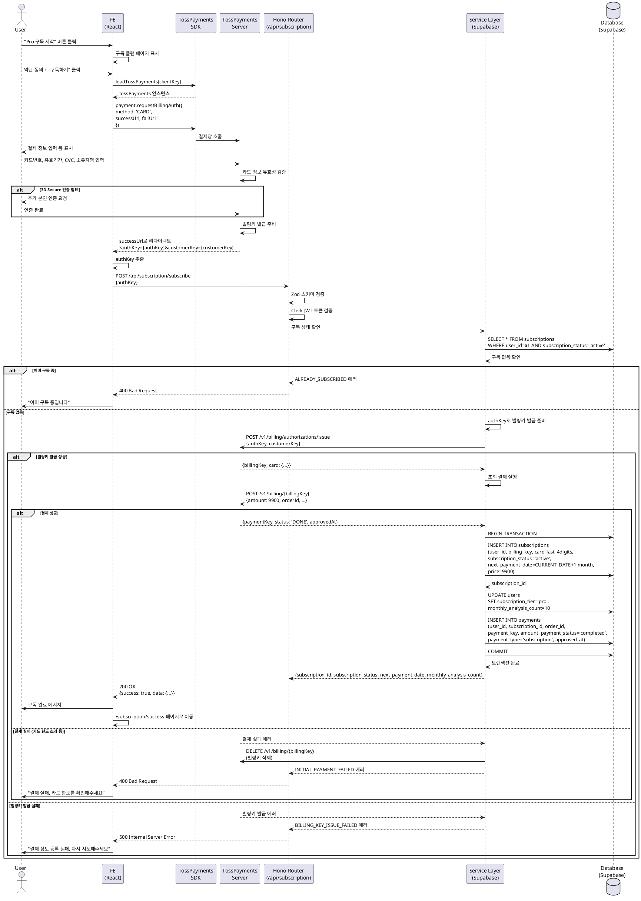

# Use Case: Pro 구독 신청

## Primary Actor
로그인된 무료 회원 (Free User)

## Precondition
- 사용자가 Clerk를 통해 Google OAuth 로그인을 완료한 상태
- 사용자의 `subscription_tier = 'free'`
- 사용자가 아직 Pro 구독을 보유하지 않음 (`subscriptions` 테이블에 해당 사용자의 활성 구독 없음)
- 토스페이먼츠 결제 서비스가 정상 작동 중

## Trigger
- 구독 관리 페이지(`/subscription`)에서 "Pro 구독 시작" 버튼 클릭
- 또는 분석 횟수 소진 시 표시되는 구독 유도 모달에서 "Pro 구독하기" 버튼 클릭

## Main Scenario

### 1. 구독 플랜 선택 화면 진입
- 사용자가 "Pro 구독 시작" 버튼 클릭
- 시스템이 `/subscription/plans` 페이지로 이동
- Pro 플랜 정보 표시:
  - 월 9,900원
  - 월 10회 프리미엄 분석 제공
  - gemini-2.0-pro 모델 사용
  - 매월 자동 갱신

### 2. 결제 정보 입력 시작
- 사용자가 "구독하기" 버튼 클릭
- 시스템이 약관 동의 확인 (필수):
  - 전자금융거래 이용약관
  - 개인정보 제3자 제공 동의
  - 자동결제 동의
- 약관 동의 후 "결제하기" 버튼 활성화

### 3. 토스페이먼츠 결제창 호출 (Frontend)
- Frontend가 토스페이먼츠 SDK 로드:
  ```typescript
  const tossPayments = await loadTossPayments(TOSS_CLIENT_KEY);
  const payment = tossPayments.payment({
    customerKey: clerk_user_id
  });
  ```
- `requestBillingAuth()` 호출:
  ```typescript
  await payment.requestBillingAuth({
    method: 'CARD',
    successUrl: `${origin}/subscription/billing-success`,
    failUrl: `${origin}/subscription/billing-fail`,
    customerName: user.name,
    customerEmail: user.email
  });
  ```
- 토스페이먼츠 결제창이 새 창 또는 리다이렉트로 표시됨

### 4. 카드 정보 입력 (사용자)
- 사용자가 토스페이먼츠 결제창에서 입력:
  - 카드번호 (16자리)
  - 유효기간 (MM/YY)
  - CVC (3자리)
  - 카드 소유자명
  - 생년월일 (6자리)
- 필요시 3D Secure 인증 진행
- 입력 완료 후 "확인" 버튼 클릭

### 5. 빌링키 발급 요청 (토스페이먼츠)
- 토스페이먼츠가 카드 정보 유효성 검증
- 카드사 승인 확인
- 빌링키 발급 성공 시 `successUrl`로 리다이렉트:
  ```
  /subscription/billing-success?authKey={authKey}&customerKey={customerKey}
  ```

### 6. 빌링키 발급 API 호출 (Backend)
- Frontend가 `authKey`와 `customerKey`를 Backend로 전송
- Backend Hono Router가 요청 수신:
  - **POST /api/subscription/billing-key**
  - 요청 본문:
    ```json
    {
      "authKey": "토스페이먼츠에서 발급한 authKey",
      "customerKey": "clerk_user_id"
    }
    ```

### 7. 토스페이먼츠 빌링키 발급 (Service Layer)
- Service가 토스페이먼츠 API 호출:
  ```
  POST https://api.tosspayments.com/v1/billing/authorizations/issue
  Authorization: Basic {base64(SECRET_KEY:)}
  Content-Type: application/json

  {
    "authKey": "{authKey}",
    "customerKey": "{clerk_user_id}"
  }
  ```
- 토스페이먼츠 응답:
  ```json
  {
    "billingKey": "abc123XYZ==",
    "customerKey": "clerk_user_id",
    "method": "카드",
    "card": {
      "issuerCode": "61",
      "number": "123456******7890",
      "cardType": "신용"
    }
  }
  ```

### 8. 초회 결제 실행
- Service가 발급받은 `billingKey`로 즉시 결제:
  ```
  POST https://api.tosspayments.com/v1/billing/{billingKey}

  {
    "customerKey": "{clerk_user_id}",
    "amount": 9900,
    "orderId": "SUB_{user_id}_{timestamp}",
    "orderName": "Pro 요금제 월 구독료",
    "customerEmail": "{user.email}",
    "customerName": "{user.name}"
  }
  ```
- 토스페이먼츠 응답:
  ```json
  {
    "paymentKey": "pay_1234567890",
    "orderId": "SUB_{user_id}_{timestamp}",
    "status": "DONE",
    "approvedAt": "2025-10-26T15:45:00+09:00",
    "totalAmount": 9900
  }
  ```

### 9. 구독 정보 생성 (Database)
- `subscriptions` 테이블에 INSERT:
  ```sql
  INSERT INTO subscriptions (
    user_id,
    billing_key,
    card_last_4digits,
    card_type,
    subscription_status,
    next_payment_date,
    auto_renewal,
    price
  ) VALUES (
    $1,  -- user_id
    'abc123XYZ==',  -- billing_key
    '7890',  -- card_last_4digits
    '신용',  -- card_type
    'active',
    CURRENT_DATE + INTERVAL '1 month',  -- next_payment_date
    true,
    9900
  ) RETURNING id;
  ```

### 10. 사용자 정보 업데이트
- `users` 테이블 UPDATE:
  ```sql
  UPDATE users
  SET subscription_tier = 'pro',
      monthly_analysis_count = 10,
      updated_at = NOW()
  WHERE id = $1;
  ```

### 11. 결제 내역 저장
- `payments` 테이블에 INSERT:
  ```sql
  INSERT INTO payments (
    user_id,
    subscription_id,
    order_id,
    payment_key,
    amount,
    payment_method,
    payment_status,
    payment_type,
    approved_at
  ) VALUES (
    $1,  -- user_id
    $2,  -- subscription_id
    'SUB_{user_id}_{timestamp}',
    'pay_1234567890',
    9900,
    '카드',
    'completed',
    'subscription',
    '2025-10-26T15:45:00+09:00'
  ) RETURNING id;
  ```

### 12. 성공 응답 반환
- Backend가 Frontend로 응답:
  ```json
  {
    "success": true,
    "data": {
      "subscription_id": "uuid",
      "subscription_status": "active",
      "next_payment_date": "2025-11-26",
      "monthly_analysis_count": 10
    }
  }
  ```

### 13. 구독 완료 페이지 표시
- Frontend가 `/subscription/success` 페이지로 리다이렉트
- 구독 완료 메시지 표시:
  - "Pro 구독이 완료되었습니다!"
  - 다음 결제일 안내
  - 월 10회 분석 가능 안내
- 확인 이메일 발송 (토스페이먼츠 자동 발송)
- "분석 시작하기" 버튼으로 대시보드 이동

## Edge Cases

### 1. 이미 구독 중인 사용자
- **상황**: 사용자가 이미 활성 Pro 구독을 보유한 상태에서 재구독 시도
- **처리**:
  - Backend가 구독 상태 확인 (Precondition 검증)
  - `400 Bad Request` 응답 (에러 코드: `ALREADY_SUBSCRIBED`)
  - Frontend가 "이미 Pro 구독 중입니다" 메시지 표시
  - 구독 관리 페이지로 리다이렉트

### 2. 카드 정보 유효성 검증 실패
- **상황**: 토스페이먼츠가 카드 정보 검증 실패 (잘못된 카드번호, 유효기간 만료 등)
- **처리**:
  - 토스페이먼츠가 `failUrl`로 리다이렉트
  - Frontend가 에러 메시지 추출 (쿼리 파라미터 `code`, `message`)
  - "카드 정보를 확인해주세요" 메시지 표시
  - 결제 정보 재입력 유도

### 3. 카드 한도 초과 또는 잔액 부족
- **상황**: 초회 결제 실행 시 카드 한도 초과 또는 체크카드 잔액 부족
- **처리**:
  - 토스페이먼츠 결제 API가 실패 응답 반환
  - Backend가 발급받은 빌링키 삭제 (토스페이먼츠 API 호출)
  - `400 Bad Request` 응답 (에러 코드: `PAYMENT_FAILED`)
  - Frontend가 "결제에 실패했습니다. 카드 한도를 확인해주세요" 메시지 표시
  - 다른 결제수단 사용 유도

### 4. 3D Secure 인증 실패
- **상황**: 카드사의 추가 인증(3D Secure) 실패
- **처리**:
  - 토스페이먼츠가 `failUrl`로 리다이렉트
  - Frontend가 "본인 인증에 실패했습니다" 메시지 표시
  - 재시도 버튼 제공

### 5. 빌링키 발급 실패
- **상황**: `authKey`로 빌링키 발급 API 호출 실패 (authKey 만료, 네트워크 오류 등)
- **처리**:
  - Backend가 토스페이먼츠 API 에러 응답 수신
  - `500 Internal Server Error` 응답 (에러 코드: `BILLING_KEY_ISSUE_FAILED`)
  - Frontend가 "결제 정보 등록에 실패했습니다" 메시지 표시
  - 처음부터 다시 시도 유도

### 6. 초회 결제 실패 후 빌링키 정리
- **상황**: 빌링키는 발급되었으나 초회 결제 실패
- **처리**:
  - Backend가 트랜잭션 롤백
  - 발급받은 빌링키 삭제 API 호출 (정리)
  - `subscriptions` 테이블 INSERT 롤백
  - `users` 테이블 업데이트 롤백
  - `400 Bad Request` 응답 (에러 코드: `INITIAL_PAYMENT_FAILED`)
  - Frontend가 "결제에 실패했습니다. 다시 시도해주세요" 메시지 표시

### 7. 중복 요청 방지
- **상황**: 사용자가 "구독하기" 버튼을 여러 번 클릭
- **처리**:
  - Frontend가 첫 요청 후 버튼 비활성화
  - Backend가 동일 `authKey` 재사용 감지 시 에러 반환 (토스페이먼츠 정책)
  - `409 Conflict` 응답
  - Frontend가 "이미 처리 중입니다" 메시지 표시

### 8. 네트워크 오류
- **상황**: 토스페이먼츠 API 호출 중 네트워크 타임아웃 또는 연결 실패
- **처리**:
  - Backend가 3회 재시도 (Exponential Backoff: 1s, 2s, 4s)
  - 최종 실패 시 트랜잭션 롤백
  - `500 Internal Server Error` 응답 (에러 코드: `NETWORK_ERROR`)
  - Frontend가 "일시적 오류가 발생했습니다. 잠시 후 다시 시도해주세요" 메시지 표시

### 9. 데이터베이스 오류
- **상황**: Supabase 연결 실패 또는 쿼리 오류
- **처리**:
  - Backend가 트랜잭션 롤백
  - 발급받은 빌링키 삭제 (정리)
  - `500 Internal Server Error` 응답
  - 에러 로깅 및 모니터링 시스템 알림
  - Frontend가 "시스템 오류가 발생했습니다" 메시지 표시

### 10. 세션 만료
- **상황**: 사용자의 Clerk 세션이 만료된 상태에서 구독 요청
- **처리**:
  - Backend가 `401 Unauthorized` 응답
  - Frontend가 자동으로 로그인 페이지로 리다이렉트
  - 로그인 후 구독 페이지로 자동 복귀

## Business Rules

### 구독 가격 정책
- **월 구독료**: 9,900원 (VAT 포함)
- **결제 주기**: 매월 동일 날짜 (예: 10월 26일 구독 → 매월 26일 자동 결제)
- **일할 계산**: 없음 (구독일부터 다음 결제일까지 전체 혜택 제공)
- **프로모션 코드**: MVP에서는 미지원 (향후 확장 가능)

### 분석 횟수 정책
- Pro 구독 완료 즉시 `monthly_analysis_count = 10` 부여
- 매월 결제일에 자동으로 10회로 초기화
- 무료 체험 횟수(`free_analysis_count`)는 유지 (Pro 해지 후 재사용 가능)

### 자동 갱신 정책
- 기본값: `auto_renewal = true`
- 매월 `next_payment_date`에 자동으로 결제 실행
- 결제 실패 시 3회 재시도 (1일 간격)
- 3회 실패 시 구독 자동 해지 (`subscription_status = 'suspended'`)

### 환불 정책
- **7일 이내**: 전액 환불 (단, 분석 사용 이력 없을 경우)
- **7일 이후**: 환불 불가 (단, 다음 결제일까지 혜택 유지)
- 환불 요청 시 `payments` 테이블에 `payment_type = 'refund'` 레코드 생성

### 빌링키 관리
- 빌링키는 `subscriptions` 테이블에 암호화 저장 (권장)
- 구독 해지 시 즉시 삭제 (토스페이먼츠 API 호출)
- 카드 변경 시 기존 빌링키 삭제 후 신규 발급

### External Service Integration

#### 토스페이먼츠 SDK (Frontend)
- **라이브러리**: `@tosspayments/tosspayments-sdk`
- **버전**: SDK v2 (2024.12 LTS)
- **초기화**:
  ```typescript
  const tossPayments = await loadTossPayments(NEXT_PUBLIC_TOSS_CLIENT_KEY);
  ```
- **사용 메서드**: `requestBillingAuth()`
- **리다이렉트 URL**:
  - `successUrl`: `/subscription/billing-success?authKey={authKey}&customerKey={customerKey}`
  - `failUrl`: `/subscription/billing-fail?code={code}&message={message}`

#### 토스페이먼츠 API (Backend)
- **Base URL**: `https://api.tosspayments.com/v1`
- **인증 방식**: Basic Auth (`SecretKey:` Base64 인코딩)
- **필수 헤더**:
  ```
  Authorization: Basic {encoded_key}
  Content-Type: application/json
  ```
- **주요 엔드포인트**:
  1. **빌링키 발급**: `POST /billing/authorizations/issue`
  2. **자동결제**: `POST /billing/{billingKey}`
  3. **빌링키 삭제**: `DELETE /billing/{billingKey}` (구독 해지 시)
- **에러 처리**:
  - 4xx 에러: 사용자 입력 오류, 재시도 불필요
  - 5xx 에러: 토스페이먼츠 서버 오류, 재시도 필요
  - 타임아웃: 3회 재시도 후 실패 처리
- **참고 문서**: `/docs/external/tosspayments.md`

### 데이터 저장
- 모든 구독 및 결제 트랜잭션은 DB에 기록됨
- `subscriptions.billing_key`: 토스페이먼츠 빌링키 (암호화 권장)
- `payments` 테이블:
  - `payment_status`: 'pending', 'completed', 'failed', 'cancelled'
  - `payment_type`: 'subscription' (정기결제), 'refund' (환불)
- 트랜잭션 처리:
  - 빌링키 발급 → 초회 결제 → 구독 생성 → 사용자 업데이트 → 결제 내역 저장
  - 어느 단계든 실패 시 전체 롤백

### 보안 및 권한
- 토스페이먼츠 Secret Key는 서버 환경변수에만 저장 (`TOSS_SECRET_KEY`)
- Client Key는 프론트엔드에 노출 가능 (`NEXT_PUBLIC_TOSS_CLIENT_KEY`)
- 빌링키는 절대 Frontend로 전달하지 않음
- 모든 API 요청은 Clerk JWT 토큰 인증 필요
- PCI DSS 준수: 카드 정보는 토스페이먼츠에서만 관리, DB에 저장 금지

### 성능 및 모니터링
- 토스페이먼츠 API 응답 시간 로깅
- 결제 성공률 모니터링 (95% 이상 목표)
- 결제 실패 원인 분석 (카드 한도, 네트워크 오류 등)
- 평균 구독 완료 시간: 30초 이내 (목표)

## API Specification

### POST /api/subscription/billing-key

빌링키 발급 및 초회 결제 실행

**Request Headers:**
```
Authorization: Bearer {clerk_jwt_token}
Content-Type: application/json
```

**Request Body (Zod Schema):**
```typescript
{
  authKey: string (required),
  customerKey: string (required, clerk_user_id와 일치 필수)
}
```

**Success Response (200 OK):**
```json
{
  "success": true,
  "data": {
    "subscription_id": "uuid",
    "subscription_status": "active",
    "next_payment_date": "2025-11-26",
    "monthly_analysis_count": 10,
    "card_last_4digits": "7890",
    "card_type": "신용"
  }
}
```

**Error Responses:**

- **400 Bad Request** (이미 구독 중):
```json
{
  "success": false,
  "error": {
    "code": "ALREADY_SUBSCRIBED",
    "message": "이미 Pro 구독 중입니다"
  }
}
```

- **400 Bad Request** (초회 결제 실패):
```json
{
  "success": false,
  "error": {
    "code": "INITIAL_PAYMENT_FAILED",
    "message": "결제에 실패했습니다. 카드 정보를 확인해주세요"
  }
}
```

- **401 Unauthorized** (인증 실패):
```json
{
  "success": false,
  "error": {
    "code": "UNAUTHORIZED",
    "message": "로그인이 필요합니다"
  }
}
```

- **500 Internal Server Error** (빌링키 발급 실패):
```json
{
  "success": false,
  "error": {
    "code": "BILLING_KEY_ISSUE_FAILED",
    "message": "결제 정보 등록에 실패했습니다"
  }
}
```

### GET /api/subscription/status

현재 사용자의 구독 상태 조회

**Request Headers:**
```
Authorization: Bearer {clerk_jwt_token}
```

**Success Response (200 OK):**
```json
{
  "success": true,
  "data": {
    "subscription_tier": "pro",
    "subscription_status": "active",
    "monthly_analysis_count": 7,
    "next_payment_date": "2025-11-26",
    "card_last_4digits": "7890",
    "auto_renewal": true
  }
}
```

**Success Response (구독 없음):**
```json
{
  "success": true,
  "data": {
    "subscription_tier": "free",
    "free_analysis_count": 3
  }
}
```

### POST /api/subscription/subscribe

통합 구독 신청 엔드포인트 (빌링키 발급 + 초회 결제)

**Request Headers:**
```
Authorization: Bearer {clerk_jwt_token}
Content-Type: application/json
```

**Request Body (Zod Schema):**
```typescript
{
  authKey: string (required)
}
```

**Success Response (200 OK):**
```json
{
  "success": true,
  "data": {
    "subscription_id": "uuid",
    "subscription_status": "active",
    "next_payment_date": "2025-11-26",
    "monthly_analysis_count": 10
  }
}
```

## Sequence Diagram



## Related Use Cases
- [UC-001] 새 사주 분석하기 (구독 후 프리미엄 분석 이용)
- [UC-003] Pro 구독 해지
- [UC-004] 결제 정보 변경 (카드 변경)
- [UC-005] 정기결제 자동 처리 (시스템 백그라운드)

## Notes
- 이 유스케이스는 서비스의 수익화 핵심 기능으로, 결제 성공률이 매우 중요합니다.
- 토스페이먼츠 SDK v2는 Next.js 14~15와 호환성이 확인되었으며, LTS 버전입니다.
- 빌링키 발급과 초회 결제를 하나의 트랜잭션으로 처리하여 데이터 일관성을 보장해야 합니다.
- 결제 실패 시 발급받은 빌링키를 반드시 삭제하여 불필요한 데이터가 남지 않도록 해야 합니다.
- 향후 프로모션 코드, 연간 구독 등의 확장 가능성을 고려한 테이블 설계가 필요합니다.
