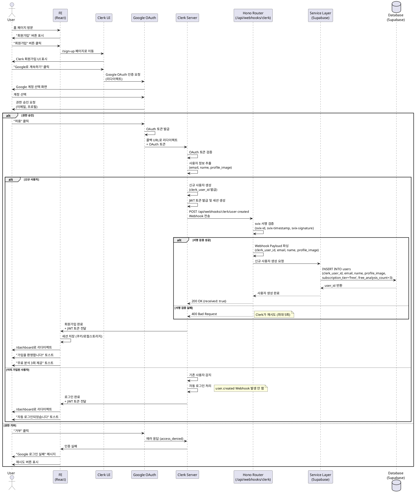

# Use Case: 회원가입

## Primary Actor
미로그인 사용자 (신규 방문자)

## Precondition
- 사용자가 Google 계정을 보유하고 있음
- Clerk OAuth 서비스가 정상 작동 중
- Clerk Webhook 엔드포인트가 정상 작동 중
- 사용자가 애플리케이션 홈 페이지에 접근 가능

## Trigger
사용자가 홈 페이지에서 "회원가입" 버튼을 클릭

## Main Scenario

### 1. 회원가입 페이지 진입
- 사용자가 홈 페이지에서 "회원가입" 버튼 클릭
- 시스템이 Clerk 회원가입 페이지로 이동 (`/sign-up`)
- Clerk UI 컴포넌트가 로드되어 표시됨

### 2. Google OAuth 선택
- 사용자가 Clerk 화면에서 "Google로 계속하기" 버튼 클릭
- Clerk가 Google OAuth 인증 플로우 시작
- Google 계정 선택 화면으로 리다이렉트

### 3. Google 계정 선택 및 권한 승인
- 사용자가 사용할 Google 계정 선택
- Google이 요청하는 권한 확인:
  - 이메일 주소 읽기
  - 기본 프로필 정보 읽기 (이름, 프로필 이미지)
- 사용자가 "허용" 버튼 클릭

### 4. Google OAuth 토큰 검증 (Clerk)
- Google이 OAuth 토큰 발급
- 사용자가 Clerk 콜백 URL로 리다이렉트
- Clerk가 Google OAuth 토큰 검증
- 토큰 검증 성공 시 사용자 정보 추출:
  - 이메일 주소 (`email`)
  - 이름 (`name`)
  - 프로필 이미지 URL (`profile_image`)

### 5. Clerk 사용자 생성
- Clerk가 내부 사용자 데이터베이스에 신규 사용자 생성
- Clerk User ID (`clerk_user_id`) 생성
- JWT 토큰 발급 및 세션 생성

### 6. Clerk Webhook 트리거 (user.created)
- Clerk가 `user.created` 이벤트 Webhook 전송
- 대상 엔드포인트: `POST /api/webhooks/clerk/user-created`
- Webhook Payload:
  ```json
  {
    "type": "user.created",
    "data": {
      "id": "user_2XXXxxxXXXxxx",
      "email_addresses": [
        {
          "email_address": "user@example.com",
          "id": "idn_xxx"
        }
      ],
      "first_name": "홍",
      "last_name": "길동",
      "image_url": "https://img.clerk.com/...",
      "created_at": 1698765432000
    }
  }
  ```

### 7. Webhook 서명 검증 (Backend)
- Hono Router가 Webhook 요청 수신
- Svix 라이브러리로 서명 검증:
  - `svix-id` 헤더 확인
  - `svix-timestamp` 헤더 확인
  - `svix-signature` 헤더 확인
  - `CLERK_WEBHOOK_SIGNING_SECRET` 환경변수로 서명 검증
- 검증 실패 시 `400 Bad Request` 응답 반환 (처리 중단)

### 8. 사용자 정보 추출 및 파싱
- Webhook Payload에서 사용자 정보 추출:
  - `clerk_user_id`: `data.id`
  - `email`: `data.email_addresses[0].email_address`
  - `name`: `data.first_name + ' ' + data.last_name`
  - `profile_image`: `data.image_url`

### 9. 신규 사용자 생성 (Database)
- Service Layer가 `users` 테이블에 INSERT:
  ```sql
  INSERT INTO users (
    clerk_user_id,
    email,
    name,
    profile_image,
    subscription_tier,
    free_analysis_count,
    monthly_analysis_count
  ) VALUES (
    'user_2XXXxxxXXXxxx',
    'user@example.com',
    '홍길동',
    'https://img.clerk.com/...',
    'free',
    3,
    0
  ) RETURNING id;
  ```

### 10. Webhook 응답 반환
- Backend가 성공 응답 반환:
  ```json
  {
    "received": true
  }
  ```
- HTTP 상태 코드: `200 OK`

### 11. 대시보드로 리다이렉트 (Frontend)
- Clerk가 회원가입 완료 후 자동으로 리다이렉트
- 목적지: `NEXT_PUBLIC_CLERK_AFTER_SIGN_UP_URL` 환경변수 (`/dashboard`)
- 환영 메시지 토스트 표시: "가입을 환영합니다!"
- 무료 체험 안내 토스트 표시: "무료 분석 3회가 제공되었습니다"

## Edge Cases

### 1. 이미 가입된 이메일로 재가입 시도
- **상황**: 사용자가 이미 가입한 Google 계정으로 회원가입 시도
- **처리**:
  - Clerk가 자동으로 기존 계정 감지
  - 회원가입 대신 자동 로그인 처리
  - `user.created` Webhook 발생하지 않음
  - 대시보드로 자동 이동
  - "이미 가입된 계정입니다. 자동으로 로그인되었습니다" 메시지 표시

### 2. Google OAuth 인증 실패
- **상황**: Google 계정 선택 또는 권한 승인 거부
- **처리**:
  - Google이 Clerk 콜백 URL로 에러 응답 전달
  - Clerk가 에러 메시지 표시: "Google 로그인에 실패했습니다"
  - 사용자에게 재시도 버튼 제공
  - 다시 "Google로 계속하기" 버튼 표시

### 3. Google OAuth 토큰 검증 실패
- **상황**: Google이 발급한 토큰이 유효하지 않거나 만료됨
- **처리**:
  - Clerk가 토큰 검증 실패 감지
  - 에러 페이지 표시: "인증에 실패했습니다"
  - 처음부터 다시 시도 유도
  - 로그 기록 및 모니터링 알람

### 4. Clerk Webhook 전송 실패
- **상황**: Clerk가 Webhook 전송 시도했으나 Backend 엔드포인트 오류
- **처리**:
  - Clerk가 자동으로 재시도 (최대 5회, Exponential Backoff)
  - Backend가 `200 OK` 응답할 때까지 재시도
  - 5회 실패 시 Clerk Dashboard의 Webhook Logs에 실패 기록
  - 사용자는 Clerk 세션은 생성되었으나 DB에 레코드 없음
  - 다음 로그인 시 `user.updated` Webhook으로 동기화 가능

### 5. Webhook 서명 검증 실패
- **상황**: `svix-signature` 헤더가 올바르지 않거나 Secret Key가 틀림
- **처리**:
  - Backend가 `400 Bad Request` 응답
  - Webhook 요청 거부 (보안 위험)
  - 에러 로그 기록: "Invalid webhook signature"
  - 관리자에게 알람 (잠재적 공격 시도)
  - Clerk Dashboard에서 Secret Key 재확인 필요

### 6. 데이터베이스 오류
- **상황**: Supabase 연결 실패 또는 쿼리 오류
- **처리**:
  - Backend가 `500 Internal Server Error` 응답
  - Clerk가 자동으로 Webhook 재시도
  - 에러 로깅 및 모니터링 시스템 알림
  - 데이터베이스 복구 후 재시도로 정상 처리

### 7. 중복 Webhook 수신
- **상황**: 네트워크 지연으로 동일 `user.created` 이벤트 중복 수신
- **처리**:
  - Backend가 `clerk_user_id` UNIQUE 제약조건으로 중복 INSERT 방지
  - PostgreSQL이 UNIQUE 위반 에러 반환
  - Backend가 에러를 무시하고 `200 OK` 응답 (멱등성 보장)
  - 로그 기록: "Duplicate webhook ignored"

### 8. 네트워크 타임아웃
- **상황**: Clerk → Backend Webhook 전송 중 네트워크 타임아웃
- **처리**:
  - Clerk가 타임아웃 감지 (30초)
  - 자동으로 재시도 큐에 추가
  - Backend가 응답하면 정상 처리
  - 최대 5회 재시도 후 실패 기록

### 9. Google 계정에 이메일이 없는 경우
- **상황**: Google 계정에 이메일 정보가 없거나 비공개 설정됨
- **처리**:
  - Clerk가 이메일 필수 정책에 따라 회원가입 거부
  - "이메일 정보가 필요합니다" 에러 메시지 표시
  - 사용자에게 Google 계정 설정 확인 유도

### 10. 프로필 이미지 로드 실패
- **상황**: Google 프로필 이미지 URL이 유효하지 않거나 접근 불가
- **처리**:
  - Clerk가 기본 아바타 이미지로 대체
  - 사용자 생성 정상 진행
  - `profile_image` 필드에 기본 이미지 URL 저장
  - 사용자가 나중에 프로필 이미지 직접 업로드 가능

## Business Rules

### 회원가입 방식
- **OAuth 전용**: 이메일/비밀번호 방식 미지원, Google OAuth만 허용
- **자동 로그인**: 회원가입 완료 즉시 로그인 상태로 전환
- **필수 정보**: 이메일, 이름은 필수 (Google 계정에서 자동 추출)
- **선택 정보**: 프로필 이미지는 선택 (없을 경우 기본 이미지 사용)

### 초기 무료 체험 제공
- 모든 신규 사용자에게 `free_analysis_count = 3` 자동 부여
- `subscription_tier = 'free'` 기본 설정
- `monthly_analysis_count = 0` (Pro 구독 시에만 사용)

### 리다이렉트 정책
- 회원가입 완료 후 무조건 `/dashboard`로 이동
- 이전 페이지 URL 저장 없음 (첫 가입이므로)
- 환영 메시지 및 무료 체험 안내 토스트 표시

### External Service Integration

#### Clerk SDK (Frontend)
- **라이브러리**: `@clerk/nextjs`
- **버전**: v6.x 이상 (2025년 기준 최신 안정 버전)
- **필수 환경변수**:
  - `NEXT_PUBLIC_CLERK_PUBLISHABLE_KEY`: Clerk Publishable Key
  - `CLERK_SECRET_KEY`: Clerk Secret Key (서버용)
  - `NEXT_PUBLIC_CLERK_SIGN_UP_URL`: `/sign-up`
  - `NEXT_PUBLIC_CLERK_AFTER_SIGN_UP_URL`: `/dashboard`
- **주요 컴포넌트**: `<SignUp />` (회원가입 UI)
- **Middleware**: `clerkMiddleware()` (모든 라우트 보호)
- **참고 문서**: `/docs/external/clerkSDK.md`

#### Clerk Webhook (Backend)
- **이벤트 유형**: `user.created`
- **서명 검증**: Svix 라이브러리 (`svix` npm 패키지)
- **필수 환경변수**: `CLERK_WEBHOOK_SIGNING_SECRET` (`whsec_...` 형식)
- **헤더 검증**:
  - `svix-id`: 이벤트 고유 ID
  - `svix-timestamp`: 이벤트 발생 시각
  - `svix-signature`: HMAC 서명
- **재시도 정책**: 최대 5회, Exponential Backoff
- **타임아웃**: 30초
- **멱등성 보장**: `clerk_user_id` UNIQUE 제약으로 중복 방지
- **참고 문서**: `/docs/external/clerkwebhook.md`

#### Google OAuth
- **OAuth Provider**: Google
- **스코프**:
  - `openid` (기본)
  - `email` (이메일 주소)
  - `profile` (이름, 프로필 이미지)
- **인증 플로우**: Authorization Code Flow (Clerk가 자동 처리)
- **토큰 관리**: Clerk가 토큰 저장 및 갱신 담당

### 데이터 저장
- 모든 사용자 정보는 `users` 테이블에 저장
- `clerk_user_id`: UNIQUE 제약 (중복 방지)
- `email`: NOT NULL (필수)
- `name`: NULL 허용 (Google 계정에 없을 수 있음)
- `profile_image`: NULL 허용 (기본 이미지 사용)
- `created_at`: 자동 설정 (NOW())
- `updated_at`: Trigger로 자동 갱신

### 보안 및 권한
- Webhook 서명 검증 필수 (Svix)
- `CLERK_WEBHOOK_SIGNING_SECRET` 절대 노출 금지
- Clerk Secret Key는 서버 환경변수에만 저장
- Publishable Key는 Frontend 노출 가능
- HTTPS 통신 필수 (Clerk 정책)

### 성능 및 모니터링
- Webhook 응답 시간: 5초 이내 (목표)
- Clerk Webhook 성공률: 99% 이상 (Clerk의 재시도로 보장)
- 데이터베이스 INSERT 성공률: 100% (목표)
- 회원가입 완료까지 평균 시간: 10-20초

## API Specification

### POST /api/webhooks/clerk/user-created

Clerk `user.created` 이벤트 Webhook 수신

**Request Headers:**
```
svix-id: msg_xxxxxxxxxxxxx
svix-timestamp: 1698765432
svix-signature: v1,xxxxxxxxxxxxxxxxxxxxx
Content-Type: application/json
```

**Request Body:**
```json
{
  "type": "user.created",
  "data": {
    "id": "user_2XXXxxxXXXxxx",
    "email_addresses": [
      {
        "email_address": "user@example.com",
        "id": "idn_xxx"
      }
    ],
    "first_name": "홍",
    "last_name": "길동",
    "image_url": "https://img.clerk.com/...",
    "created_at": 1698765432000
  }
}
```

**Success Response (200 OK):**
```json
{
  "received": true
}
```

**Error Responses:**

- **400 Bad Request** (서명 검증 실패):
```json
{
  "error": "Invalid signature"
}
```

- **500 Internal Server Error** (데이터베이스 오류):
```json
{
  "error": "Database error"
}
```

### GET /api/auth/session

현재 로그인된 사용자의 세션 정보 조회

**Request Headers:**
```
Authorization: Bearer {clerk_jwt_token}
```

**Success Response (200 OK):**
```json
{
  "success": true,
  "data": {
    "user_id": "uuid",
    "clerk_user_id": "user_2XXXxxxXXXxxx",
    "email": "user@example.com",
    "name": "홍길동",
    "profile_image": "https://img.clerk.com/...",
    "subscription_tier": "free",
    "free_analysis_count": 3
  }
}
```

**Error Responses:**

- **401 Unauthorized** (인증 실패):
```json
{
  "success": false,
  "error": {
    "code": "UNAUTHORIZED",
    "message": "로그인이 필요합니다"
  }
}
```

### POST /api/auth/validate

JWT 토큰 유효성 검증

**Request Headers:**
```
Authorization: Bearer {clerk_jwt_token}
```

**Success Response (200 OK):**
```json
{
  "success": true,
  "data": {
    "valid": true,
    "clerk_user_id": "user_2XXXxxxXXXxxx",
    "email": "user@example.com"
  }
}
```

**Error Responses:**

- **401 Unauthorized** (토큰 만료):
```json
{
  "success": false,
  "error": {
    "code": "TOKEN_EXPIRED",
    "message": "토큰이 만료되었습니다"
  }
}
```

- **401 Unauthorized** (유효하지 않은 토큰):
```json
{
  "success": false,
  "error": {
    "code": "INVALID_TOKEN",
    "message": "유효하지 않은 토큰입니다"
  }
}
```

## Sequence Diagram



## Related Use Cases
- [UC-004] 로그인 (이미 가입된 사용자의 재로그인)
- [UC-001] 새 사주 분석하기 (회원가입 후 첫 분석)
- [UC-002] Pro 구독 신청 (무료 체험 후 유료 전환)

## Notes
- 이 유스케이스는 서비스의 진입점으로, 사용자 온보딩 경험이 매우 중요합니다.
- Clerk Webhook의 안정성과 멱등성이 데이터 일관성 보장의 핵심입니다.
- Google OAuth만 지원하므로, Google 계정이 없는 사용자는 가입 불가합니다.
- 향후 다른 OAuth Provider (카카오, 네이버 등) 추가 고려 가능합니다.
- Clerk의 재시도 메커니즘 덕분에 일시적 네트워크 오류에도 강건합니다.
