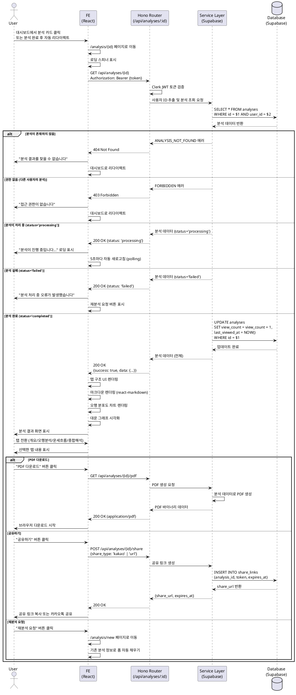

# Use Case: 분석 결과 조회

## Primary Actor
로그인된 사용자 (분석 결과 소유자)

## Precondition
- 사용자가 Clerk를 통해 Google OAuth 로그인을 완료한 상태
- 사용자가 이전에 생성한 분석 결과가 `analyses` 테이블에 존재
- 분석 상태가 `'completed'` (완료)

## Trigger
- 대시보드의 분석 목록에서 특정 분석 카드 클릭
- 또는 분석 완료 후 자동 리다이렉트로 `/analysis/[id]` 접근
- 또는 직접 URL 입력으로 `/analysis/[id]` 접근

## Main Scenario

### 1. 분석 결과 페이지 접근
- 사용자가 대시보드에서 특정 분석 카드 클릭
- 또는 "새 분석하기" 완료 후 자동 리다이렉트
- Frontend가 `/analysis/[id]` 페이지로 이동
- 로딩 스피너 표시

### 2. 분석 데이터 조회 요청 (GET /api/analyses/{id})
- Frontend가 Hono Backend로 조회 요청 전송
- 요청 헤더에 Clerk JWT 토큰 포함

### 3. 백엔드 권한 검증 (Hono Router)
- Clerk JWT 토큰 검증으로 사용자 인증 확인
- Supabase에서 분석 데이터 조회:
  ```sql
  SELECT * FROM analyses
  WHERE id = $1 AND user_id = $2
  ```
- 권한 검증:
  - 분석이 존재하지 않으면 `404 Not Found`
  - 다른 사용자의 분석이면 `403 Forbidden`

### 4. 분석 결과 데이터 반환 (Service Layer)
- 조회수 업데이트:
  ```sql
  UPDATE analyses
  SET view_count = view_count + 1,
      last_viewed_at = NOW()
  WHERE id = $1
  ```
- 분석 데이터 응답:
  ```json
  {
    "success": true,
    "data": {
      "id": "uuid",
      "subject_name": "홍길동",
      "birth_date": "1990-01-15",
      "birth_time": "14:30",
      "gender": "male",
      "ai_model": "gemini-2.0-flash",
      "analysis_result": {
        "heavenly_stems": {...},
        "five_elements": {...},
        "fortune_flow": {...},
        "interpretation": {
          "personality": "...",
          "wealth": "...",
          "health": "...",
          "love": "..."
        }
      },
      "status": "completed",
      "view_count": 3,
      "created_at": "2025-10-26T14:30:00Z",
      "last_viewed_at": "2025-10-26T15:00:00Z"
    }
  }
  ```

### 5. 분석 결과 화면 렌더링 (Frontend)
- 탭 구조 UI 표시:
  - **개요 (Overview)**: 기본 정보 (이름, 생년월일, 성별, 출생시간, 천간지지)
  - **오행분석 (Elements)**: 오행 분포도 차트 및 해석
  - **운세흐름 (Fortune)**: 대운/세운 타임라인 및 해석
  - **종합해석 (Interpretation)**: 성격/재운/건강운/연애운 마크다운 렌더링

### 6. 마크다운 렌더링 처리
- `analysis_result` JSON 데이터에서 각 섹션 추출
- 마크다운 라이브러리(react-markdown 등)로 HTML 변환
- 오행 분포도, 대운 그래프 등 시각화 차트 렌더링

### 7. 액션 버튼 제공
- **PDF 다운로드**: 분석 결과를 PDF로 저장
- **공유하기**: 카카오톡 공유 또는 URL 복사
- **재분석 요청**: `/analysis/new` 페이지로 이동하여 동일 정보로 새 분석

## Edge Cases

### 1. 분석 결과가 존재하지 않음 (404)
- **상황**: URL의 분석 ID가 데이터베이스에 없음
- **처리**:
  - 백엔드가 `404 Not Found` 응답
  - Frontend가 404 에러 페이지 표시
  - "분석 결과를 찾을 수 없습니다" 메시지
  - 대시보드로 돌아가기 버튼 제공

### 2. 권한 없음 (403)
- **상황**: 다른 사용자의 분석 결과에 접근 시도
- **처리**:
  - 백엔드가 `403 Forbidden` 응답
  - Frontend가 에러 메시지 표시: "이 분석 결과에 접근할 권한이 없습니다"
  - 자동으로 대시보드로 리다이렉트

### 3. 처리 중인 분석 (status='processing')
- **상황**: 분석이 아직 완료되지 않음
- **처리**:
  - Frontend가 로딩 상태 표시
  - "분석이 진행 중입니다..." 메시지
  - 5초마다 자동 새로고침 (polling) 또는 WebSocket 실시간 업데이트
  - 완료 시 자동으로 결과 표시

### 4. 분석 실패 건 (status='failed')
- **상황**: 분석이 실패한 상태
- **처리**:
  - Frontend가 에러 상태 UI 표시
  - "분석 처리 중 오류가 발생했습니다" 메시지
  - "재분석 요청" 버튼 제공 (분석 횟수 복구 필요)
  - 고객 지원 문의 링크

### 5. 마크다운 파싱 오류
- **상황**: `analysis_result` JSON이 손상되었거나 형식이 잘못됨
- **처리**:
  - Frontend가 원본 텍스트 그대로 표시 (fallback)
  - "일부 내용이 올바르게 표시되지 않을 수 있습니다" 경고 메시지
  - 관리자에게 오류 로그 전송

### 6. 삭제된 분석
- **상황**: 사용자가 분석을 삭제한 후 URL로 접근
- **처리**:
  - 백엔드가 `404 Not Found` 응답
  - Frontend가 "삭제된 분석입니다" 메시지
  - 대시보드로 리다이렉트

### 7. 세션 만료
- **상황**: 사용자의 Clerk 세션이 만료된 상태에서 조회 요청
- **처리**:
  - 백엔드가 `401 Unauthorized` 응답
  - Frontend가 자동으로 로그인 페이지로 리다이렉트
  - 로그인 후 원래 분석 페이지로 자동 복귀 (redirect URL 저장)

### 8. 네트워크 오류
- **상황**: 클라이언트와 서버 간 네트워크 연결 실패
- **처리**:
  - Frontend가 3회 재시도 (1초, 2초, 4초 간격)
  - 최종 실패 시 "네트워크 오류가 발생했습니다" 메시지
  - 재시도 버튼 제공

## Business Rules

### 데이터 조회 권한
- 사용자는 본인이 생성한 분석 결과만 조회 가능
- 분석 결과는 `user_id` 기반으로 권한 검증
- 공유 링크를 통한 타인 공유 기능은 향후 확장 가능 (MVP에서는 미포함)

### 조회수 관리
- 동일 사용자가 여러 번 조회해도 조회수 증가 (제한 없음)
- `view_count`는 사용자 통계 용도로 활용
- `last_viewed_at`은 마지막 조회 시간 기록

### 탭 구조 UI
- **개요 (Overview)**:
  - 기본 정보: 이름, 생년월일, 성별, 출생시간
  - 천간지지 계산 결과 표시
  - 분석 일시, AI 모델 정보
- **오행분석 (Elements)**:
  - 오행(목, 화, 토, 금, 수) 분포도 차트 (레이더 차트 또는 바 차트)
  - 각 오행별 강약 해석
- **운세흐름 (Fortune)**:
  - 대운/세운 타임라인 시각화
  - 각 시기별 운세 변화 해석
- **종합해석 (Interpretation)**:
  - 성격 분석
  - 재운 분석
  - 건강운 분석
  - 연애운 분석

### 마크다운 렌더링
- `analysis_result` JSON 내 텍스트는 마크다운 형식
- `react-markdown` 라이브러리 사용
- 코드 블록, 강조, 목록 등 기본 마크다운 문법 지원
- XSS 방지를 위한 sanitization 적용

### 데이터 보관
- 분석 결과는 영구 보관 (사용자 삭제 전까지)
- 사용자 탈퇴 시 `ON DELETE CASCADE`로 자동 삭제
- 백업 정책: 데이터베이스 daily 백업

### 성능 최적화
- 분석 결과 캐싱 (브라우저 레벨, 5분)
- 이미지 lazy loading
- 차트 데이터 prefetch
- SSR/SSG 적용 고려 (Next.js)

## API Specification

### GET /api/analyses/{id}

**Request Headers:**
```
Authorization: Bearer {clerk_jwt_token}
Content-Type: application/json
```

**Path Parameters:**
- `id` (uuid, required): 조회할 분석 ID

**Success Response (200 OK):**
```json
{
  "success": true,
  "data": {
    "id": "uuid",
    "subject_name": "홍길동",
    "birth_date": "1990-01-15",
    "birth_time": "14:30",
    "gender": "male",
    "ai_model": "gemini-2.0-flash",
    "analysis_result": {
      "heavenly_stems": {
        "year": "庚午",
        "month": "丙寅",
        "day": "辛卯",
        "hour": "甲申"
      },
      "five_elements": {
        "wood": 3,
        "fire": 2,
        "earth": 1,
        "metal": 2,
        "water": 1
      },
      "fortune_flow": {
        "major_luck": [...],
        "annual_luck": [...]
      },
      "interpretation": {
        "personality": "# 성격 분석\n...",
        "wealth": "# 재운 분석\n...",
        "health": "# 건강운 분석\n...",
        "love": "# 연애운 분석\n..."
      }
    },
    "status": "completed",
    "view_count": 3,
    "created_at": "2025-10-26T14:30:00Z",
    "last_viewed_at": "2025-10-26T15:00:00Z"
  }
}
```

**Error Responses:**

- **401 Unauthorized** (인증 실패):
```json
{
  "success": false,
  "error": {
    "code": "UNAUTHORIZED",
    "message": "로그인이 필요합니다"
  }
}
```

- **403 Forbidden** (권한 없음):
```json
{
  "success": false,
  "error": {
    "code": "FORBIDDEN",
    "message": "이 분석 결과에 접근할 권한이 없습니다"
  }
}
```

- **404 Not Found** (분석 없음):
```json
{
  "success": false,
  "error": {
    "code": "ANALYSIS_NOT_FOUND",
    "message": "분석 결과를 찾을 수 없습니다"
  }
}
```

- **500 Internal Server Error** (서버 오류):
```json
{
  "success": false,
  "error": {
    "code": "INTERNAL_SERVER_ERROR",
    "message": "일시적 오류가 발생했습니다"
  }
}
```

### GET /api/analyses/{id}/pdf

**Request Headers:**
```
Authorization: Bearer {clerk_jwt_token}
```

**Path Parameters:**
- `id` (uuid, required): 조회할 분석 ID

**Success Response (200 OK):**
- Content-Type: `application/pdf`
- Content-Disposition: `attachment; filename="saju_analysis_{subject_name}_{date}.pdf"`
- PDF 바이너리 데이터

**Error Responses:**
- 401, 403, 404 응답은 GET /api/analyses/{id}와 동일

### POST /api/analyses/{id}/share

**Request Headers:**
```
Authorization: Bearer {clerk_jwt_token}
Content-Type: application/json
```

**Path Parameters:**
- `id` (uuid, required): 공유할 분석 ID

**Request Body:**
```json
{
  "share_type": "kakao" | "url"
}
```

**Success Response (200 OK):**
```json
{
  "success": true,
  "data": {
    "share_url": "https://example.com/share/abc123xyz",
    "expires_at": "2025-11-02T15:00:00Z"
  }
}
```

**Error Responses:**
- 401, 403, 404 응답은 GET /api/analyses/{id}와 동일

## Sequence Diagram



## Related Use Cases
- [UC-001] 새 사주 분석하기
- [UC-003] 분석 이력 조회 (대시보드)
- [UC-005] 분석 결과 PDF 다운로드
- [UC-006] 분석 결과 공유

## Notes
- 이 유스케이스는 사용자가 분석 결과를 확인하는 핵심 화면입니다.
- 탭 구조로 정보를 분류하여 가독성을 높이고, 사용자가 원하는 정보를 빠르게 찾을 수 있도록 합니다.
- 마크다운 렌더링 시 XSS 공격 방지를 위해 sanitization을 반드시 적용해야 합니다.
- 조회수는 사용자 통계 및 인기 분석 파악에 활용될 수 있습니다.
- PDF 다운로드와 공유 기능은 선택적 구현으로, MVP에서는 우선순위가 낮을 수 있습니다.
- 향후 분석 결과에 대한 사용자 평가(별점, 피드백) 기능 추가 고려 가능합니다.
