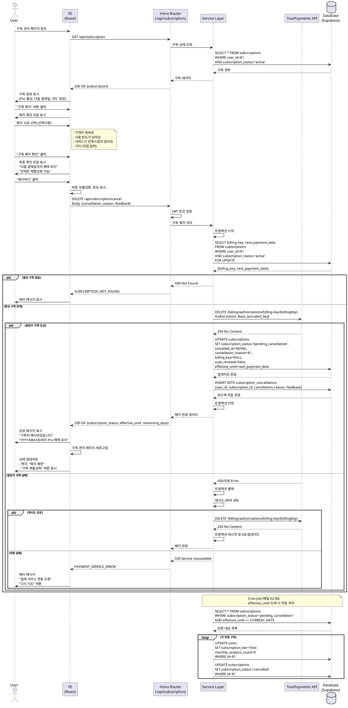

# Use Case: Pro 구독 해지

## Primary Actor
Pro 구독 중인 사용자

## Precondition
- 사용자가 Clerk를 통해 Google OAuth 로그인을 완료한 상태
- 사용자의 세션이 유효함
- 사용자가 Pro 구독 상태 (`subscription_tier = 'pro'`, `subscription_status = 'active'`)
- 구독 관리 페이지(`/subscription`)에 접근 가능

## Trigger
- 구독 관리 페이지에서 "구독 해지" 버튼 클릭
- 또는 다음 결제 전 구독 중단을 원하는 경우

## Main Scenario

### 1. 구독 관리 페이지 접속
- 사용자가 네비게이션 또는 대시보드에서 "구독 관리" 클릭
- 시스템이 `/subscription` 페이지로 이동
- 현재 구독 상태 표시 (Pro 활성, 다음 결제일, 카드 정보)

### 2. 구독 해지 버튼 클릭
- 사용자가 "구독 해지" 버튼 클릭
- Frontend가 해지 확인 모달 표시

### 3. 해지 사유 선택 (선택사항)
- 모달에서 해지 사유 선택 옵션 표시:
  - 가격이 비싸요
  - 사용 빈도가 낮아요
  - 서비스가 만족스럽지 않아요
  - 기타 (직접 입력 가능)
- 사용자가 해지 사유 선택 또는 입력 (선택사항)

### 4. 해지 안내 및 최종 확인
- 모달에서 해지 시 주의사항 안내:
  - "다음 결제일(YYYY-MM-DD)까지 Pro 혜택이 유지됩니다"
  - "해지 후에도 결제일 전까지 언제든 재활성화할 수 있습니다"
  - "해지 후 무료 회원으로 전환되며, 무료 분석 횟수는 0회입니다"
- 사용자가 "구독 해지 확인" 버튼 클릭
- 최종 확인 모달 표시
- 사용자가 "해지하기" 버튼 클릭

### 5. 구독 상태 확인 (GET /api/subscription)
- Frontend가 현재 구독 상태 확인 API 호출
- Backend가 사용자의 구독 정보 조회:
  ```sql
  SELECT
    s.id,
    s.billing_key,
    s.subscription_status,
    s.next_payment_date,
    s.card_last_4digits
  FROM subscriptions s
  WHERE s.user_id = $1
    AND s.subscription_status = 'active';
  ```
- 구독 상태가 `active`가 아니면 에러 반환

### 6. 구독 해지 처리 (DELETE /api/subscription/cancel)
- Frontend가 구독 해지 API 호출
- 요청 본문:
  ```json
  {
    "cancellation_reason": "가격이 비싸요",
    "feedback": "월 요금이 부담스러워요" // 선택사항
  }
  ```

### 7. Service Layer: 구독 해지 트랜잭션
- Backend가 트랜잭션 시작

#### 7.1. 토스페이먼츠 빌링키 삭제
- Service Layer가 토스페이먼츠 API 호출:
  ```
  DELETE https://api.tosspayments.com/v1/billing/authorizations/billing-key/{billingKey}
  ```
- 헤더:
  ```
  Authorization: Basic {encoded_secret_key}
  ```
- 성공 응답 (204 No Content) 확인
- 실패 시 트랜잭션 롤백 및 에러 반환

#### 7.2. 구독 정보 업데이트
- `subscriptions` 테이블 업데이트:
  ```sql
  UPDATE subscriptions
  SET
    subscription_status = 'pending_cancellation',
    cancelled_at = NOW(),
    cancellation_reason = $1,
    billing_key = NULL,
    auto_renewal = false,
    effective_until = next_payment_date,
    updated_at = NOW()
  WHERE user_id = $2
    AND subscription_status = 'active';
  ```

#### 7.3. 해지 피드백 저장 (선택사항)
- `cancellation_feedback` 데이터 저장 (analytics 용도):
  ```sql
  INSERT INTO subscription_cancellations (
    user_id,
    subscription_id,
    cancellation_reason,
    feedback,
    cancelled_at
  ) VALUES ($1, $2, $3, $4, NOW());
  ```

- Backend가 트랜잭션 커밋

### 8. 해지 확인 이메일 발송
- Service Layer가 이메일 발송 (향후 구현):
  - 수신자: 사용자 이메일
  - 제목: "[VMC5] Pro 구독이 해지되었습니다"
  - 내용:
    - 해지 일시
    - 혜택 유지 기간 (effective_until)
    - 재활성화 방법 안내
    - 무료 회원 전환 안내

### 9. Frontend: 해지 완료 처리
- Backend가 해지 완료 응답 반환:
  ```json
  {
    "success": true,
    "data": {
      "subscription_status": "pending_cancellation",
      "effective_until": "2025-11-26",
      "remaining_days": 15,
      "message": "구독이 해지되었습니다. 2025-11-26까지 Pro 혜택이 유지됩니다."
    }
  }
  ```
- Frontend가 성공 메시지 표시:
  - "구독이 해지되었습니다"
  - "YYYY-MM-DD까지 Pro 혜택이 유지됩니다"
  - "언제든 재활성화할 수 있습니다"
- 구독 관리 페이지 새로고침
- 구독 상태 업데이트:
  - 상태 뱃지: "해지 예정" (노란색)
  - "구독 재활성화" 버튼 표시
  - 다음 결제일 대신 "혜택 종료일" 표시

### 10. 혜택 종료일 도래 시 (시스템 자동 처리)
- Supabase Cron Job (매일 02:00 실행)이 만료 대상 조회:
  ```sql
  SELECT user_id, id
  FROM subscriptions
  WHERE subscription_status = 'pending_cancellation'
    AND effective_until <= CURRENT_DATE;
  ```
- 각 사용자에 대해:
  - `users` 테이블 업데이트:
    ```sql
    UPDATE users
    SET
      subscription_tier = 'free',
      monthly_analysis_count = 0,
      updated_at = NOW()
    WHERE id = $1;
    ```
  - `subscriptions` 테이블 업데이트:
    ```sql
    UPDATE subscriptions
    SET
      subscription_status = 'cancelled',
      updated_at = NOW()
    WHERE id = $1;
    ```

## Edge Cases

### 1. 이미 해지된 구독
- **상황**: 사용자가 이미 해지한 구독을 다시 해지 시도
- **처리**:
  - Backend가 구독 상태 확인
  - `subscription_status != 'active'` 인 경우
  - `400 Bad Request` 응답:
    ```json
    {
      "success": false,
      "error": {
        "code": "ALREADY_CANCELLED",
        "message": "이미 해지된 구독입니다"
      }
    }
    ```
  - Frontend가 에러 메시지 표시
  - 구독 관리 페이지로 리다이렉트

### 2. 토스페이먼츠 빌링키 삭제 실패
- **상황**: 토스페이먼츠 API 호출 실패 (네트워크 오류, 타임아웃 등)
- **처리**:
  - Backend가 3회 재시도 (1초, 2초, 4초 간격)
  - 최종 실패 시 트랜잭션 롤백
  - `503 Service Unavailable` 응답:
    ```json
    {
      "success": false,
      "error": {
        "code": "PAYMENT_SERVICE_ERROR",
        "message": "결제 서비스 연동 오류가 발생했습니다. 잠시 후 다시 시도해주세요."
      }
    }
    ```
  - Frontend가 에러 메시지 표시
  - "다시 시도" 버튼 제공
  - 에러 로깅 및 모니터링 알람

### 3. 결제일 당일 해지
- **상황**: 사용자가 다음 결제일 당일(00:00~23:59)에 해지 시도
- **처리**:
  - 정상적으로 해지 처리
  - 단, `effective_until = next_payment_date` (당일)
  - 다음 날부터 무료 회원 전환
  - 모달에 추가 안내:
    - "오늘 자정까지 Pro 혜택이 유지됩니다"
    - "다음 결제는 진행되지 않습니다"

### 4. 환불 요청 (7일 이내 구독)
- **상황**: 구독 시작 후 7일 이내에 해지하며 환불 요청
- **처리** (향후 구현):
  - 구독 시작일(`subscriptions.created_at`) 확인
  - 7일 이내인 경우 환불 가능 안내 모달 표시
  - 사용자가 환불 요청 시 별도 API 호출
  - 토스페이먼츠 결제 취소 API 호출:
    ```
    POST /v1/payments/{paymentKey}/cancel
    Body: { "cancelReason": "고객 구독 해지" }
    ```
  - 환불 완료 시 즉시 무료 회원 전환
- **현재**: 환불 기능 미구현, 고객 지원 팀 안내

### 5. 빌링키 삭제 후 DB 업데이트 실패
- **상황**: 토스페이먼츠 빌링키 삭제는 성공했으나 DB 업데이트 실패
- **처리**:
  - 트랜잭션 롤백 불가능 (외부 API 호출은 이미 완료)
  - 에러 로깅 및 긴급 알람 전송
  - 수동 복구 필요 (관리자 개입)
  - 사용자에게 고객 지원 안내:
    ```json
    {
      "success": false,
      "error": {
        "code": "SYSTEM_ERROR",
        "message": "일시적 오류가 발생했습니다. 고객센터로 문의해주세요."
      }
    }
    ```
  - 복구 프로세스:
    - 관리자가 빌링키 삭제 확인
    - DB 수동 업데이트
    - 사용자에게 해지 완료 이메일 발송

### 6. 네트워크 오류 (클라이언트)
- **상황**: Frontend에서 API 호출 중 네트워크 오류
- **처리**:
  - Frontend가 3회 재시도 (exponential backoff)
  - 최종 실패 시 에러 메시지 표시
  - "다시 시도" 버튼 제공
  - 사용자가 재시도 시 구독 상태 먼저 확인:
    - 이미 해지되었으면 성공 메시지 표시
    - 아직 활성 상태면 해지 재시도

### 7. 동시 해지 요청 (중복 클릭)
- **상황**: 사용자가 해지 버튼을 여러 번 빠르게 클릭
- **처리**:
  - Frontend에서 버튼 비활성화 (첫 클릭 후)
  - 로딩 상태 표시
  - Backend에서 트랜잭션 격리 수준으로 중복 방지
  - 두 번째 요청은 `ALREADY_CANCELLED` 에러 반환

### 8. 재활성화 후 재해지
- **상황**: 사용자가 구독을 해지했다가 재활성화한 후 다시 해지
- **처리**:
  - 제한 없이 허용
  - 동일한 해지 프로세스 진행
  - 단, 재활성화 후 즉시 해지하는 경우:
    - 모달에 안내 메시지 추가
    - "구독을 재활성화하신 지 얼마 되지 않았습니다. 정말 해지하시겠습니까?"
  - 빈번한 해지/재활성화 패턴 감지 시 analytics 기록

### 9. 구독 정보 없음 (데이터 불일치)
- **상황**: `users.subscription_tier = 'pro'`이지만 `subscriptions` 테이블에 활성 구독이 없음
- **처리**:
  - Backend가 데이터 불일치 감지
  - `404 Not Found` 응답:
    ```json
    {
      "success": false,
      "error": {
        "code": "SUBSCRIPTION_NOT_FOUND",
        "message": "구독 정보를 찾을 수 없습니다. 고객센터로 문의해주세요."
      }
    }
    ```
  - 에러 로깅 및 긴급 알람
  - 수동 데이터 복구 필요

### 10. 인증 오류
- **상황**: JWT 토큰 만료 또는 변조
- **처리**:
  - Backend가 Clerk JWT 검증 실패
  - `401 Unauthorized` 응답
  - Frontend가 자동 로그아웃
  - 로그인 페이지로 리다이렉트

## Business Rules

### 구독 해지 정책
- 구독 해지 시 즉시 자동 결제 중지
- 토스페이먼츠 빌링키는 해지 즉시 삭제
- 다음 결제일까지 Pro 혜택 유지 (`effective_until = next_payment_date`)
- 혜택 종료일 이후 자동으로 무료 회원 전환
- 해지 후 무료 회원의 `free_analysis_count = 0` (신규 가입 시와 다름)

### 재활성화 가능 기간
- 혜택 종료일(`effective_until`) 전까지 언제든 재활성화 가능
- 재활성화 시 새 카드 등록 또는 기존 카드 재사용 선택
- 재활성화 시 기존 `next_payment_date` 유지
- 재활성화 제한 없음 (횟수 제한 없이 허용)

### 환불 정책 (향후 구현)
- 구독 시작 후 7일 이내 해지 시 전액 환불 가능
- 단, 월 분석 횟수를 1회 이상 사용한 경우 환불 불가
- 환불 승인 시 즉시 무료 회원 전환 (혜택 유지 없음)
- 환불 처리는 토스페이먼츠 결제 취소 API 사용

### 해지 사유 수집
- 해지 사유 선택은 선택사항 (필수 아님)
- 수집된 해지 사유는 서비스 개선에 활용
- 개인정보 포함 시 암호화 저장
- 통계 목적으로 집계 (개인 식별 불가)

### 빌링키 관리
- 해지 시 토스페이먼츠 빌링키 즉시 삭제
- 빌링키 삭제 실패 시 해지 처리 중단 (트랜잭션 롤백)
- 삭제된 빌링키는 복구 불가능
- 재활성화 시 새 빌링키 발급 필요

### External Service Integration

#### 토스페이먼츠 API (Backend)
- **API 버전**: v1
- **Base URL**: `https://api.tosspayments.com/v1`
- **인증 방식**: Basic Auth (`SecretKey:` Base64 인코딩)

**빌링키 삭제 API:**
```
DELETE /billing/authorizations/billing-key/{billingKey}
```

**요청 헤더:**
```
Authorization: Basic {encoded_secret_key}
```

**성공 응답 (204 No Content):**
- 본문 없음
- 빌링키가 성공적으로 삭제됨

**에러 응답 (400 Bad Request):**
```json
{
  "code": "BILLING_KEY_NOT_FOUND",
  "message": "존재하지 않는 빌링키입니다."
}
```

**에러 응답 (500 Internal Server Error):**
```json
{
  "code": "INTERNAL_SERVER_ERROR",
  "message": "서버 오류가 발생했습니다."
}
```

**구현 예시:**
```typescript
// Service Layer
async function deleteBillingKey(billingKey: string): Promise<void> {
  const secretKey = process.env.TOSS_SECRET_KEY;
  const encodedKey = Buffer.from(secretKey + ':').toString('base64');

  const response = await fetch(
    `https://api.tosspayments.com/v1/billing/authorizations/billing-key/${billingKey}`,
    {
      method: 'DELETE',
      headers: {
        'Authorization': `Basic ${encodedKey}`,
      },
    }
  );

  if (!response.ok) {
    const errorData = await response.json();
    throw new Error(`빌링키 삭제 실패: ${errorData.message}`);
  }

  // 204 No Content (성공)
}
```

**재시도 정책:**
- 타임아웃: 10초
- 재시도 횟수: 최대 3회
- 재시도 간격: 1초, 2초, 4초 (exponential backoff)
- 최종 실패 시 에러 로깅 및 트랜잭션 롤백

**참고 문서**: `/docs/external/tosspayments.md`

### 데이터 보관
- 해지된 구독 정보는 영구 보관 (`subscription_status = 'cancelled'`)
- 해지 사유 및 피드백은 통계 목적으로 보관
- 사용자 탈퇴 시 CASCADE 삭제

### 보안 및 권한
- 본인의 구독만 해지 가능
- JWT 토큰으로 사용자 인증
- 모든 API 요청은 HTTPS 강제
- Rate Limiting: 동일 사용자 분당 최대 5회 해지 시도

### 모니터링
- 해지 요청 성공률 추적 (목표: 95% 이상)
- 토스페이먼츠 API 응답 시간 모니터링
- 해지 사유 통계 집계 (주간/월간)
- 해지 후 재활성화 비율 추적
- 에러 발생 시 즉시 알람 (Slack, 이메일)

## API Specification

### GET /api/subscription

현재 구독 상태 조회

**Request Headers:**
```
Authorization: Bearer {clerk_jwt_token}
```

**Success Response (200 OK):**
```json
{
  "success": true,
  "data": {
    "subscription_id": "uuid",
    "subscription_status": "active",
    "subscription_tier": "pro",
    "next_payment_date": "2025-11-26",
    "card_last_4digits": "1234",
    "card_type": "신용",
    "price": 9900,
    "auto_renewal": true
  }
}
```

**Error Responses:**

- **404 Not Found** (구독 없음):
```json
{
  "success": false,
  "error": {
    "code": "SUBSCRIPTION_NOT_FOUND",
    "message": "활성 구독이 없습니다"
  }
}
```

### DELETE /api/subscription/cancel

구독 해지 (빌링키 삭제 + 구독 상태 변경)

**Request Headers:**
```
Authorization: Bearer {clerk_jwt_token}
```

**Request Body:**
```json
{
  "cancellation_reason": "가격이 비싸요",
  "feedback": "월 요금이 부담스러워요" // 선택사항
}
```

**Validation:**
- `cancellation_reason`: 선택사항, enum ('가격이 비싸요', '사용 빈도가 낮아요', '서비스가 만족스럽지 않아요', '기타')
- `feedback`: 선택사항, string (최대 500자)

**Success Response (200 OK):**
```json
{
  "success": true,
  "data": {
    "subscription_status": "pending_cancellation",
    "effective_until": "2025-11-26",
    "remaining_days": 15,
    "message": "구독이 해지되었습니다. 2025-11-26까지 Pro 혜택이 유지됩니다."
  }
}
```

**Error Responses:**

- **400 Bad Request** (이미 해지됨):
```json
{
  "success": false,
  "error": {
    "code": "ALREADY_CANCELLED",
    "message": "이미 해지된 구독입니다"
  }
}
```

- **404 Not Found** (구독 없음):
```json
{
  "success": false,
  "error": {
    "code": "SUBSCRIPTION_NOT_FOUND",
    "message": "활성 구독을 찾을 수 없습니다"
  }
}
```

- **503 Service Unavailable** (토스페이먼츠 연동 실패):
```json
{
  "success": false,
  "error": {
    "code": "PAYMENT_SERVICE_ERROR",
    "message": "결제 서비스 연동 오류가 발생했습니다. 잠시 후 다시 시도해주세요."
  }
}
```

### GET /api/subscription/cancellation-reasons

해지 사유 옵션 목록 조회

**Request Headers:**
```
Authorization: Bearer {clerk_jwt_token}
```

**Success Response (200 OK):**
```json
{
  "success": true,
  "data": {
    "reasons": [
      {
        "value": "가격이 비싸요",
        "label": "가격이 비싸요"
      },
      {
        "value": "사용 빈도가 낮아요",
        "label": "사용 빈도가 낮아요"
      },
      {
        "value": "서비스가 만족스럽지 않아요",
        "label": "서비스가 만족스럽지 않아요"
      },
      {
        "value": "기타",
        "label": "기타 (직접 입력)"
      }
    ]
  }
}
```

### POST /api/subscription/feedback

해지 피드백 제출 (선택사항, 향후 분석 용도)

**Request Headers:**
```
Authorization: Bearer {clerk_jwt_token}
```

**Request Body:**
```json
{
  "subscription_id": "uuid",
  "cancellation_reason": "가격이 비싸요",
  "feedback": "월 요금이 부담스러워요",
  "rating": 3 // 1-5
}
```

**Success Response (201 Created):**
```json
{
  "success": true,
  "message": "소중한 의견 감사합니다"
}
```

## Sequence Diagram



## Related Use Cases
- [UC-003] Pro 구독 신청
- [UC-005] 구독 재활성화
- [UC-007] 결제 정보 변경 (카드 변경)

## Notes
- 구독 해지는 사용자 이탈의 주요 접점이므로, 해지 프로세스를 매끄럽게 진행하면서도 재활성화를 유도하는 UX가 중요합니다.
- 해지 사유 수집은 서비스 개선의 중요한 데이터이지만, 필수가 아닌 선택사항으로 하여 사용자 부담을 최소화합니다.
- 토스페이먼츠 빌링키 삭제는 외부 API 호출이므로 실패 가능성을 고려한 견고한 에러 핸들링이 필수입니다.
- 해지 후에도 결제일까지 Pro 혜택을 유지하여 사용자 만족도를 높이고, 재활성화 가능성을 높입니다.
- 향후 환불 기능 구현 시 결제 내역과 연동하여 자동화된 환불 처리가 가능하도록 설계합니다.
