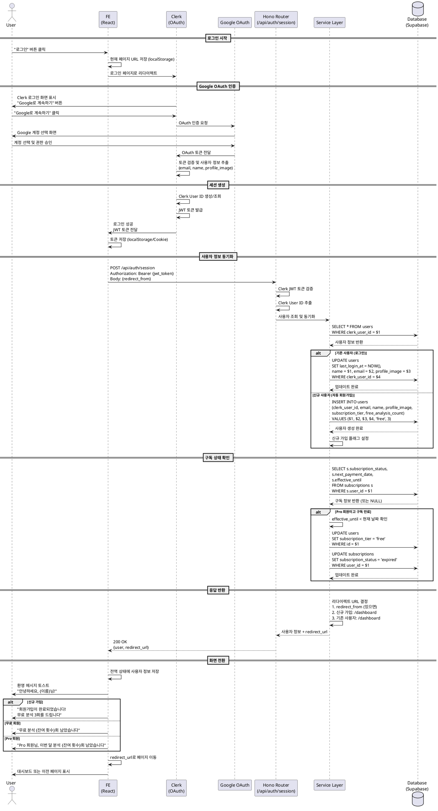

# Use Case: 로그인

## Primary Actor
비회원 또는 세션이 만료된 사용자

## Precondition
- 사용자가 Google 계정을 보유하고 있음
- Clerk 인증 서비스가 정상 작동 중
- Google OAuth 서비스가 정상 작동 중
- 사용자가 이전에 회원가입을 완료한 상태 (Clerk ID가 데이터베이스에 존재)

## Trigger
- 홈 페이지 또는 모든 페이지에서 "로그인" 버튼 클릭
- 보호된 페이지 접근 시 자동으로 로그인 페이지로 리다이렉트

## Main Scenario

### 1. 로그인 페이지 진입
- 사용자가 "로그인" 버튼 클릭
- 시스템이 현재 페이지 URL을 저장 (리다이렉트용)
- 시스템이 Clerk 로그인 페이지로 이동

### 2. Google OAuth 선택
- Clerk 로그인 화면에서 "Google로 계속하기" 버튼 표시
- 사용자가 "Google로 계속하기" 선택
- Clerk가 Google OAuth 인증 흐름 시작

### 3. Google 계정 선택 및 인증
- Google 계정 선택 화면 표시
- 사용자가 로그인할 Google 계정 선택
- Google이 사용자 인증 진행
- 권한 승인 화면 표시 (최초 로그인 시)
- 사용자가 권한 승인

### 4. OAuth 토큰 검증 (Clerk)
- Google이 OAuth 토큰을 Clerk로 전달
- Clerk가 토큰 유효성 검증
- Clerk가 사용자 정보 추출:
  - 이메일 주소
  - 이름
  - 프로필 이미지 URL
- Clerk가 Clerk User ID 생성 또는 조회

### 5. 사용자 조회 및 검증 (POST /api/auth/session)
- Frontend가 Hono Backend로 세션 생성 요청
- Backend가 Clerk JWT 토큰에서 Clerk User ID 추출
- Service Layer가 데이터베이스에서 사용자 조회:
  ```sql
  SELECT
    id,
    clerk_user_id,
    email,
    name,
    profile_image,
    subscription_tier,
    free_analysis_count,
    monthly_analysis_count,
    created_at
  FROM users
  WHERE clerk_user_id = $1;
  ```

### 6. 사용자 정보 업데이트
- Service Layer가 사용자 정보 동기화:
  ```sql
  UPDATE users
  SET
    last_login_at = NOW(),
    name = $1, -- Clerk에서 받은 최신 이름
    email = $2, -- Clerk에서 받은 최신 이메일
    profile_image = $3, -- Clerk에서 받은 최신 프로필 이미지
    updated_at = NOW()
  WHERE clerk_user_id = $4;
  ```

### 7. 구독 상태 확인
- Service Layer가 사용자의 구독 정보 조회:
  ```sql
  SELECT
    s.subscription_status,
    s.next_payment_date,
    s.effective_until
  FROM subscriptions s
  WHERE s.user_id = $1;
  ```
- Pro 회원인 경우:
  - `next_payment_date`와 현재 날짜 비교
  - `effective_until`과 현재 날짜 비교
  - 만료된 경우 무료 회원으로 전환:
    ```sql
    UPDATE users
    SET subscription_tier = 'free'
    WHERE id = $1;

    UPDATE subscriptions
    SET subscription_status = 'expired'
    WHERE user_id = $1;
    ```

### 8. 세션 생성 및 JWT 토큰 발급
- Clerk가 세션 생성
- Clerk가 JWT 토큰 발급 (유효기간: 1시간)
- Frontend가 토큰을 로컬 스토리지 또는 쿠키에 저장
- 세션 정보:
  - User ID (Clerk)
  - 세션 ID
  - 만료 시간

### 9. 리다이렉트 URL 결정
- Backend가 사용자 정보와 함께 리다이렉트 URL 반환:
  ```json
  {
    "success": true,
    "data": {
      "user": {
        "id": "uuid",
        "name": "홍길동",
        "email": "user@example.com",
        "subscription_tier": "free",
        "remaining_count": 3
      },
      "redirect_url": "/dashboard" // 또는 이전 페이지 URL
    }
  }
  ```
- 리다이렉트 URL 우선순위:
  1. 저장된 이전 페이지 URL (있는 경우)
  2. 없으면 `/dashboard`

### 10. 로그인 완료 및 리다이렉트
- Frontend가 사용자 정보를 전역 상태에 저장
- Frontend가 지정된 URL로 리다이렉트
- 환영 메시지 토스트 표시:
  - "안녕하세요, {이름}님!"
- 구독 상태에 따른 안내:
  - 무료 회원: "무료 분석 {잔여 횟수}회 남았습니다"
  - Pro 회원: "Pro 회원님, 이번 달 분석 {잔여 횟수}회 남았습니다"

### 11. 사용자 정보 조회 (GET /api/auth/me)
- Frontend가 필요 시 현재 사용자 정보 조회
- Backend가 Clerk JWT 토큰 검증 후 사용자 정보 반환

## Edge Cases

### 1. 미가입 사용자 로그인 시도
- **상황**: Clerk에는 계정이 있지만 데이터베이스에는 사용자 정보가 없는 경우
- **처리**:
  - Backend가 사용자 조회 시 결과 없음 감지
  - 자동으로 회원가입 프로세스 진행:
    ```sql
    INSERT INTO users (
      clerk_user_id,
      email,
      name,
      profile_image,
      subscription_tier,
      free_analysis_count
    ) VALUES (
      $1, $2, $3, $4, 'free', 3
    ) RETURNING id;
    ```
  - 환영 메시지: "회원가입이 완료되었습니다! 무료 분석 3회를 드립니다"
  - 대시보드로 리다이렉트

### 2. Google OAuth 인증 실패
- **상황**: Google 인증 중 사용자가 취소하거나 에러 발생
- **처리**:
  - Clerk가 에러 메시지와 함께 로그인 페이지로 리다이렉트
  - Frontend가 에러 메시지 표시: "로그인에 실패했습니다. 다시 시도해주세요"
  - "다시 시도하기" 버튼 제공
  - 에러 로그 기록

### 3. 탈퇴한 사용자의 재로그인
- **상황**: 이전에 탈퇴한 사용자가 다시 로그인 시도
- **처리**:
  - Backend가 `users.deleted_at IS NOT NULL` 감지
  - 재가입 안내 모달 표시: "이전에 탈퇴한 계정입니다. 재가입하시겠습니까?"
  - "재가입하기" 버튼 클릭 시:
    ```sql
    UPDATE users
    SET
      deleted_at = NULL,
      free_analysis_count = 3,
      subscription_tier = 'free',
      updated_at = NOW()
    WHERE clerk_user_id = $1;
    ```
  - 대시보드로 리다이렉트

### 4. 정지된 계정
- **상황**: 관리자에 의해 계정이 정지된 상태
- **처리**:
  - Backend가 `users.status = 'suspended'` 감지
  - 로그인 차단, 에러 응답 반환
  - Frontend가 정지 사유 표시:
    - "계정이 정지되었습니다"
    - 정지 사유: "서비스 약관 위반"
    - 지원 문의: "자세한 내용은 support@example.com으로 문의하세요"
  - 로그아웃 처리

### 5. 세션 만료 후 재로그인
- **상황**: 사용자의 Clerk 세션이 만료된 상태
- **처리**:
  - Frontend가 보호된 API 호출 시 `401 Unauthorized` 수신
  - 자동으로 로그인 페이지로 리다이렉트
  - 현재 페이지 URL 저장 (로그인 후 복귀용)
  - 안내 메시지: "세션이 만료되었습니다. 다시 로그인해주세요"
  - 로그인 완료 후 저장된 페이지로 리다이렉트

### 6. 네트워크 오류
- **상황**: 로그인 중 네트워크 연결 실패
- **처리**:
  - Frontend가 재시도 로직 적용 (최대 3회)
  - 최종 실패 시 에러 메시지 표시: "네트워크 오류가 발생했습니다"
  - "다시 시도하기" 버튼 제공
  - 오프라인 감지 시 즉시 안내: "인터넷 연결을 확인해주세요"

### 7. 데이터베이스 오류
- **상황**: 사용자 정보 조회 중 Supabase 연결 실패
- **처리**:
  - Backend가 `500 Internal Server Error` 응답
  - 에러 로깅 및 모니터링 시스템에 알림
  - Frontend가 에러 페이지 표시: "일시적 오류가 발생했습니다"
  - "새로고침" 버튼 제공
  - Clerk 세션은 유지 (재시도 가능)

### 8. 동시 로그인 (다중 기기)
- **상황**: 사용자가 여러 기기에서 동시에 로그인
- **처리**:
  - 제한 없이 허용 (Clerk 기본 동작)
  - 각 기기마다 별도 세션 생성
  - 모든 기기에서 동일한 사용자 데이터 접근
  - 분석 횟수 등 공유 리소스는 동시성 제어 적용

### 9. 프로필 정보 동기화 실패
- **상황**: Clerk에서 받은 최신 정보로 업데이트 실패
- **처리**:
  - 로그인은 성공 처리 (기존 정보 사용)
  - 백그라운드에서 동기화 재시도 (최대 3회)
  - 최종 실패 시 에러 로깅
  - 사용자에게는 영향 없음 (다음 로그인 시 재시도)

### 10. 구독 상태 확인 오류
- **상황**: 구독 정보 조회 실패
- **처리**:
  - 로그인은 성공 처리
  - 기본값으로 `subscription_tier = 'free'` 가정
  - 백그라운드에서 재확인
  - 에러 로그 기록
  - 사용자가 구독 페이지 접근 시 재확인

## Business Rules

### 인증 방식
- Google OAuth 단일 로그인 방식 (SSO)
- 이메일/비밀번호 로그인은 지원하지 않음
- Clerk를 통한 인증 위임
- JWT 토큰 기반 세션 관리

### 세션 관리
- JWT 토큰 유효기간: 1시간
- 자동 갱신: Frontend가 토큰 만료 5분 전 자동 갱신
- 세션 만료 시 자동 로그아웃 및 재로그인 유도
- "로그인 상태 유지" 옵션: Clerk 기본 설정 (7일)

### 사용자 정보 동기화
- 로그인 시 Clerk에서 받은 최신 정보로 자동 업데이트:
  - 이름 (name)
  - 이메일 (email)
  - 프로필 이미지 (profile_image)
- `last_login_at` 필드 자동 갱신
- 동기화 실패 시 기존 정보 유지

### 구독 상태 확인
- 로그인 시 Pro 구독 만료 여부 자동 확인
- 만료 조건:
  - `effective_until < 현재 날짜` (해지 후 혜택 종료일)
  - `next_payment_date < 현재 날짜` AND `subscription_status = 'pending_cancellation'`
- 만료 시 자동으로 무료 회원 전환
- 구독 상태 변경 시 사용자에게 알림 표시

### 리다이렉트 정책
- 보호된 페이지 접근 시 로그인 요구 → 로그인 후 원래 페이지로 복귀
- 직접 로그인 시 → 대시보드로 이동
- 첫 로그인 (회원가입) → 대시보드로 이동 + 환영 메시지

### External Service Integration

#### Clerk SDK (Frontend & Backend)
- **SDK 버전**: `@clerk/nextjs` v6 이상
- **인증 방식**: Google OAuth
- **세션 관리**: Clerk 내장 세션 관리
- **JWT 토큰**: Clerk가 발급 및 검증
- **미들웨어**: `clerkMiddleware()`로 모든 라우트 보호

**Frontend 설정:**
```tsx
// app/layout.tsx
import { ClerkProvider } from '@clerk/nextjs';

export default function RootLayout({ children }) {
  return (
    <ClerkProvider>
      <html>
        <body>{children}</body>
      </html>
    </ClerkProvider>
  );
}
```

**로그인 페이지:**
```tsx
// app/(auth)/sign-in/[[...sign-in]]/page.tsx
import { SignIn } from '@clerk/nextjs';

export default function SignInPage() {
  return <SignIn />;
}
```

**Backend 인증 확인:**
```tsx
// Hono Router에서 사용
import { auth } from '@clerk/nextjs/server';

export default async function handler() {
  const { userId } = await auth(); // await 필수 (v6+)

  if (!userId) {
    return Response.json({ error: 'Unauthorized' }, { status: 401 });
  }

  // userId로 사용자 조회
}
```

**환경 변수 (.env.local):**
```
NEXT_PUBLIC_CLERK_PUBLISHABLE_KEY=pk_test_...
CLERK_SECRET_KEY=sk_test_...
NEXT_PUBLIC_CLERK_SIGN_IN_URL=/sign-in
NEXT_PUBLIC_CLERK_SIGN_UP_URL=/sign-up
NEXT_PUBLIC_CLERK_AFTER_SIGN_IN_URL=/dashboard
NEXT_PUBLIC_CLERK_AFTER_SIGN_UP_URL=/dashboard
```

**Middleware 설정 (middleware.ts):**
```ts
import { clerkMiddleware } from '@clerk/nextjs/server';

export default clerkMiddleware();

export const config = {
  matcher: ["/((?!.*\\..*|_next).*)", "/", "/(api|trpc)(.*)"],
};
```

**공개 라우트 설정:**
```ts
import { clerkMiddleware } from '@clerk/nextjs/server';

export default clerkMiddleware({
  publicRoutes: ["/", "/sign-in", "/sign-up"],
  ignoredRoutes: ["/api/public"]
});
```

**사용자 정보 조회 (Frontend):**
```tsx
import { useUser } from '@clerk/nextjs';

export default function MyComponent() {
  const { user, isLoaded, isSignedIn } = useUser();

  if (!isLoaded) return <div>Loading...</div>;
  if (!isSignedIn) return <div>Please sign in</div>;

  return <div>Hello, {user.fullName}!</div>;
}
```

**사용자 정보 조회 (Backend):**
```tsx
import { currentUser } from '@clerk/nextjs/server';

export default async function handler() {
  const user = await currentUser();

  if (!user) {
    return Response.json({ error: 'Unauthorized' }, { status: 401 });
  }

  return Response.json({
    id: user.id,
    email: user.emailAddresses[0].emailAddress,
    name: user.fullName,
    imageUrl: user.imageUrl,
  });
}
```

**프로필 정보 동기화:**
```tsx
// Clerk에서 받은 정보로 데이터베이스 업데이트
const user = await currentUser();

await supabase
  .from('users')
  .update({
    email: user.emailAddresses[0].emailAddress,
    name: user.fullName,
    profile_image: user.imageUrl,
    last_login_at: new Date().toISOString(),
  })
  .eq('clerk_user_id', user.id);
```

**참고 문서**: `/docs/external/clerkSDK.md`

#### Google OAuth
- **제공자**: Google
- **권한 범위**:
  - `email`: 이메일 주소 접근
  - `profile`: 기본 프로필 정보 접근
- **Clerk를 통해 자동 처리** (직접 API 호출 불필요)
- **사용자 데이터**:
  - 이메일 주소 (필수)
  - 이름 (선택)
  - 프로필 이미지 URL (선택)

### 보안 및 권한
- 모든 보호된 페이지는 Clerk Middleware로 인증 확인
- JWT 토큰은 HTTPS를 통해서만 전송
- CORS 정책: 허용된 도메인만 API 접근 가능
- Rate Limiting: 동일 IP에서 분당 최대 10회 로그인 시도

### 데이터 저장
- `users.last_login_at`: 마지막 로그인 시간 자동 갱신
- 로그인 이력은 별도 `login_logs` 테이블에 기록 (향후 구현)
- 로그인 실패 시도도 로깅 (보안 모니터링)

### 성능 및 모니터링
- 로그인 성공률 추적 (목표: 98% 이상)
- 평균 로그인 소요 시간 모니터링 (목표: 3초 이하)
- 로그인 실패율 10% 이상 시 알람
- Clerk API 응답 시간 추적

## API Specification

### POST /api/auth/session

사용자 세션 생성 및 정보 동기화

**Request Headers:**
```
Authorization: Bearer {clerk_jwt_token}
Content-Type: application/json
```

**Request Body:**
```json
{
  "redirect_from": "/analysis/new" // 선택사항: 로그인 전 페이지 URL
}
```

**Success Response (200 OK):**
```json
{
  "success": true,
  "data": {
    "user": {
      "id": "uuid",
      "clerk_user_id": "user_2a...",
      "email": "user@example.com",
      "name": "홍길동",
      "profile_image": "https://img.clerk.com/...",
      "subscription_tier": "free",
      "free_analysis_count": 3,
      "monthly_analysis_count": 0,
      "last_login_at": "2025-10-27T14:30:00Z"
    },
    "redirect_url": "/dashboard"
  }
}
```

**Error Responses:**

- **401 Unauthorized** (Clerk 토큰 없음/유효하지 않음):
```json
{
  "success": false,
  "error": {
    "code": "UNAUTHORIZED",
    "message": "로그인이 필요합니다"
  }
}
```

- **403 Forbidden** (계정 정지):
```json
{
  "success": false,
  "error": {
    "code": "ACCOUNT_SUSPENDED",
    "message": "계정이 정지되었습니다",
    "reason": "서비스 약관 위반"
  }
}
```

- **500 Internal Server Error** (데이터베이스 오류):
```json
{
  "success": false,
  "error": {
    "code": "DATABASE_ERROR",
    "message": "일시적 오류가 발생했습니다"
  }
}
```

### GET /api/auth/me

현재 로그인된 사용자 정보 조회

**Request Headers:**
```
Authorization: Bearer {clerk_jwt_token}
```

**Success Response (200 OK):**
```json
{
  "success": true,
  "data": {
    "user": {
      "id": "uuid",
      "email": "user@example.com",
      "name": "홍길동",
      "profile_image": "https://img.clerk.com/...",
      "subscription_tier": "free",
      "free_analysis_count": 3,
      "monthly_analysis_count": 0,
      "created_at": "2025-10-01T00:00:00Z",
      "last_login_at": "2025-10-27T14:30:00Z"
    },
    "subscription": {
      "status": null,
      "next_payment_date": null
    }
  }
}
```

**Error Responses:**

- **401 Unauthorized**:
```json
{
  "success": false,
  "error": {
    "code": "UNAUTHORIZED",
    "message": "로그인이 필요합니다"
  }
}
```

### PUT /api/auth/sync

프로필 정보 수동 동기화 (Clerk → Database)

**Request Headers:**
```
Authorization: Bearer {clerk_jwt_token}
```

**Success Response (200 OK):**
```json
{
  "success": true,
  "data": {
    "synced_fields": ["email", "name", "profile_image"],
    "updated_at": "2025-10-27T14:30:00Z"
  }
}
```

**Error Responses:**

- **401 Unauthorized**:
```json
{
  "success": false,
  "error": {
    "code": "UNAUTHORIZED",
    "message": "로그인이 필요합니다"
  }
}
```

- **500 Internal Server Error** (동기화 실패):
```json
{
  "success": false,
  "error": {
    "code": "SYNC_FAILED",
    "message": "프로필 동기화에 실패했습니다"
  }
}
```

## Sequence Diagram



## Related Use Cases
- [UC-001] 회원가입
- [UC-003] 로그아웃
- [UC-004] 대시보드 (분석 이력 조회)
- [UC-005] Pro 구독 신청

## Notes
- 이 유스케이스는 서비스의 모든 기능 사용을 위한 필수 전제조건입니다.
- Clerk를 통한 간편 로그인으로 사용자 진입 장벽을 최소화합니다.
- Google OAuth만 지원하여 복잡도를 낮추고 사용자 경험을 단순화합니다.
- 로그인 시 자동으로 프로필 정보를 동기화하여 데이터 일관성을 유지합니다.
- 구독 상태를 자동으로 확인하여 만료된 Pro 회원을 무료로 전환합니다.
- 미가입 사용자가 로그인 시도 시 자동으로 회원가입을 처리하여 UX를 개선합니다.
- 세션 관리는 Clerk에 위임하여 보안과 안정성을 확보합니다.
- 로그인 실패 및 성공 이벤트를 모니터링하여 보안 이슈를 조기에 감지합니다.
